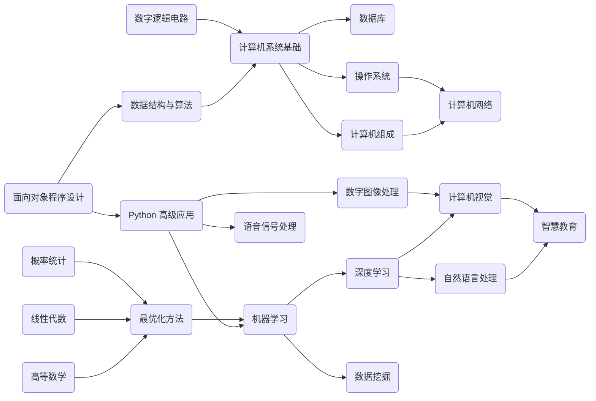
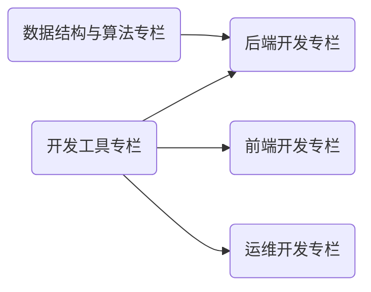

    

本网站以「AI/CS 学科笔记」与「开发技术文章」为基础，旨在构建一个 **开放知识社群 (Open Wiki Community)**。内容按照 Markdown 格式撰写，站点采用 MkDocs 框架编译，云端基于 GitHub Pages 与 Aliyun OSS 双平台部署。如果您觉得内容不错，欢迎⭐。访问链接：

- 高速访问：<https://wiki.dwj601.cn/>
- 永久链接：<https://explorer-dong.github.io/>

<h2>站点预览 (Site Preview)</h2>

<caption> 拓扑图 1. AI / CS 学科笔记 </caption>

 
 

<caption> 拓扑图 2. 开发技术文章 </caption>

  
