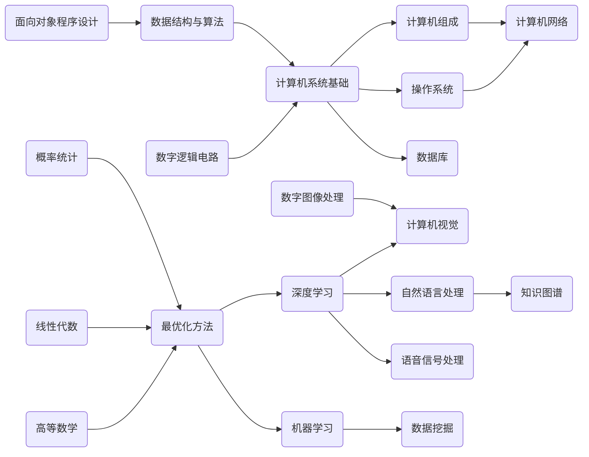
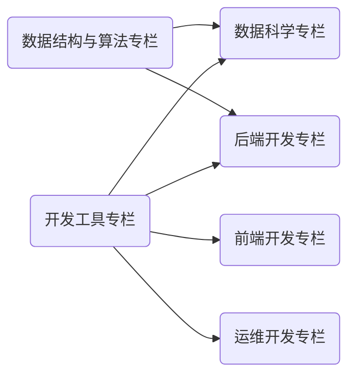

    

本网站以「AI/CS 学科基础笔记」与「工程实践技术文章」为基础，旨在构建一个 **开放知识社群 (Open Wiki Community)**。内容按照 Markdown 撰写，站点采用 MkDocs 编译，云端基于 Aliyun OSS 部署。如果您觉得内容不错，欢迎⭐！访问链接：<https://wiki.dwj601.cn/>。

## 站点预览 / Site Preview

<caption> 拓扑图 1. AI/CS 学科基础笔记 </caption>

 
 

<caption> 拓扑图 2. 工程实践技术文章 </caption>

  

## 贡献名单 / Contributors

## 星标历史 / Star History

