## 前言

```mermaid
graph LR
  A(部署 Hexo)
  S1(基于 GitHub Pages)
  S2(基于自己的云服务器)
  m1(基于 hexo-deploy-git)
  m2(基于 GitHub Actions)
  m3(基于 Git Hooks)
  A --> S1
  A --> S2
  S1 --> m1
  S1 --> m2
  S2 --> m3
```



## 基于 hexo-deploy-git

该方法在「Hexo 建站指南」中已详细介绍，不再赘述，见：<https://blog.dwj601.cn/FrontEnd/Hexo/build-your-own-website-with-hexo/#部署云端>。

## 基于 GitHub Actions

该方法可以利用 GitHub Actions 的 CI/CD 功能，省去「本地构建」与「手动部署」的操作，让 GitHub 平台帮助我们完成这两步操作，从而让我们只需要像维护项目代码一样专注于内容创作与版本管理，而无需关心其他任何事情。下面以「源码和站点同属一个仓库」的情景为例介绍具体地操作与工作流配置。

1）创建一个空 GitHub 仓库、创建一个鉴权 token（该 token 可以让 GitHub Actions 以你的身份操作你的仓库）、赋予 GitHub Actions 读写权限

创建一个鉴权 token：`头像 >> Settings >> Developer settings >> Personal access tokens >> Tokens (classic)`


赋予 GitHub Actions 读写权限：`Settings >> Actions >> General >> Workflow permissions`


2）初始化一个博客项目

```bash
hexo init
```

3）编辑 _config.yml 文件中的 url 字段

```yaml
url: https://explorer-dong.github.io/demo-github-actions
```

4）创建工作流文件 .github/workflows/bot.yml 并编辑如下内容

```yaml
name: Build and Deploy
on: [push]
jobs:
  build-and-deploy:
    runs-on: ubuntu-latest
    steps:
      # 相当于 git clone 到服务器
      - name: Checkout 🛎️
        uses: actions/checkout@v4
        with:
          persist-credentials: false

      # 安装依赖并生成页面
      - name: Install and Build 🔧
        run: |
          npm install -g hexo-cli --save
          npm install
          hexo generate

      # 部署
      - name: Deploy 🚀
        uses: JamesIves/github-pages-deploy-action@v4
        with:
          token: ${{ secrets.GITHUB_TOKEN }}
          branch: gh-pages   # 存储站点的分支
          folder: public     # 构建出来的待部署的站点文件夹名称
```

5）初始化 Git 版本管理并连接到远程仓库

```bash
# 初始化
git init
git add .
git commit -m 'init'

# 连接远程仓库
git remote add origin https://github.com/Explorer-Dong/demo-github-actions.git

# 首次推送
git push -u origin main
```

6）在 GitHub Pages 上配置站点托管分支 `Settings >> Pages >> Build and deployment`


GitHub Pages 按照上述工作流的指令，检测到 push 后开始执行，即 checkout、generate 和 deploy。等待所有流程结束后，重新加载 `https://<username>.github.io/<project>/` 就可以发现站点已经托管成功了！

## 基于 Git Hooks

由于 Github Pages 服务使用的服务器在美丽国，不用魔法访问速度过慢，国内平替 Gitee Pages 已经停止服务了。故综合考虑还是部署到国内服务器上。当然这前提是你应已拥有一台国内备案的 [云服务器](https://www.aliyun.com/product/ecs?userCode=jpec1z57) 和一个 [域名](https://wanwang.aliyun.com/domain/)。如果觉得备案太麻烦，可以考虑入手一台 [香港云服务器](https://www.aliyun.com/product/ecs?userCode=jpec1z57)。下面将基于 Git Hooks 工具，介绍如何将自己的 Hexo 静态博客项目部署到阿里云服务器上并持续集成、持续部署。

### 云平台端

1）域名解析。我们需要将自己的域名指向自己的服务器 IP，下图中记录值即你的云服务器 IP 地址


### 服务器端

使用终端连接工具连接到服务器后开始下面的操作。常用连接工具比如 MobaXterm。

#### Git Hooks

1）新建服务器用户。由于 root 用户的权限过大不够安全，因此我们创建一个新用户并赋予持续集成的权限

```bash
# 创建新用户。名称任取，假设就叫 git
useradd git

# 修改新用户密码。后续采用 SSH 免密通信，因此这个密码无所谓
passwd git

# 编辑 /etc/sudoers 文件，在 root ALL=(ALL:ALL) ALL 后追加一句
git ALL=(ALL:ALL) ALL
```

2）创建 Git Hooks。与 Github Pages 自动部署的工作流逻辑类似，我们将静态文件推送到云服务器后，需要让云服务器帮我们持续部署。我们可以借助 Git Hooks 的功能来实现

```bash
# 创建一个 git 裸仓库
mkdir /home/repo/blog.git
cd /home/repo/blog.git
git init --bare

# 创建 hooks 文件用来监视仓库状态
cd hooks
touch post-receive

# 编辑 hooks 文件，在 post-receive 文件中输入以下内容
# --work-tree 表示站点路径
# --git-dir   表示仓库路径
git --work-tree=/home/www/blog --git-dir=/home/repo/blog.git checkout -f

# 为 hooks 文件授予可执行权限
chmod +x /home/repo/blog.git/hooks/post-receive

# 将仓库目录的所有权移交给 git 用户
chown -R git:git /home/repo

# 将站点目录的所有权移交给 git 用户
chown -R git:git /home/www/blog
```

#### SSH

为了绝对的自动化 CD，就需要避免所有的人为干预，例如要避免本地机与云主机通信时手动输入密码的操作，可以借助 SSH 来规避这个问题。

1）本地生成密钥（公钥 + 私钥），连按三次回车即可生成默认配置的密钥（如果本地已经有密钥对了，这一步可以跳过）

```bash
ssh-keygen
```


2）在 `/home/git` 目录下右键新建名为 `.ssh` 的文件夹，并在该文件夹内新建名为 `authorized_keys` 的文本文件，将之前生成的公钥文件中的所有内容复制进去，保存。

3）修改文件/文件夹的权限与属主

```bash
chmod 600 /home/git/.ssh/authorized_keys
chmod 700 /home/git/.ssh
chown -R git:git /home/git/.ssh
```

现在我们可以在本地测试 ssh 连接

```bash
ssh git@xxx.xxx.xxx.xxx  # 填你的服务器 ip 地址
```

首次连接需要输入一个 `yes` 用来在本地存储主机信息。如果不需要输入密码就进入了命令行界面，表示 ssh 通信建立成功！


#### Nginx

Nginx 实现了主机虚拟化的功能，即一台主机可以通过 Nginx 的分发功能对外提供多种服务。如果需要向外提供 https 服务，还需要准备一个 [SSL 证书](https://www.aliyun.com/product/cas?userCode=jpec1z57)。然后在服务器上下载安装 Nginx 并编辑 nginx.conf 文件（以我的配置为例）

```nginx
server {
    listen 443 ssl;
    server_name blog.dwj601.cn;  # 修改为你自己的域名

    ssl_certificate      /etc/nginx/ssl/blog.dwj601.cn.pem;  # 修改为你自己的 ssl 证书路径
    ssl_certificate_key  /etc/nginx/ssl/blog.dwj601.cn.key;  # 修改为你自己的 ssl 证书路径

    ssl_session_cache    shared:SSL:1m;
    ssl_session_timeout  5m;
    ssl_ciphers  HIGH:!aNULL:!MD5;
    ssl_prefer_server_ciphers  on;

    location / {
        root /home/www/blog;  # 修改为你自己的站点路径
    }
}
```

### 本地机端

我们在本地的 Hexo 项目中，编辑 `_config.yml` 文件。

url 字段修改为自己的域名：

```yaml
url: https://blog.dwj601.cn
```

deploy 字段配置如下：


最后我们在本地只需要执行 `hexo clean && hexo generate && hexo deploy` 即可实现一步部署到自己的服务器！

部署后可以进入服务器的 `--work-tree` 目录，检查站点是否被 checkout 过来。下图表示 checkout 成功：


### 原理

**Hexo 持续部署的原理**。如下图所示（我自己画的，如有不对请及时矫正）


**Git Hooks 的定义与工作原理**。可以将其类比 github workflows，可以在我们做出某些行为的前后自动执行一些我们预设定的任务。此处使用到的就是 post-receive 任务，[原文](https://git-scm.com/docs/githooks#post-receive) 是这样解释的：

> This hook is invoked by [git-receive-pack[1\]](https://www.git-scm.com/docs/git-receive-pack) when it reacts to `git push` and updates reference(s) in its repository. It executes on the remote repository once after all the refs have been updated.

即当其接收到 push 任务并且存储库的索引被更新后，该钩子就会执行其中的内容。我们利用该功能，在将我们的站点 hexo deploy 到服务器后，hooks 检测到 git 索引更新了，就执行 checkout 命令推送上来的站点 checkout 到指定的站点托管目录下，从而实现了持续集成的功能。

**SSH 的定义与工作原理**。可以简单的将其理解为一种用来连接本地客户端与远程服务器的通信隧道。下面是 [较为官方](https://info.support.huawei.com/info-finder/encyclopedia/zh/SSH.html) 的解释：

> SSH（Secure Shell，安全外壳）是一种网络安全协议，通过加密和认证机制实现安全的访问和文件传输等业务。传统远程登录和文件传输方式，例如 Telnet、FTP，使用明文传输数据，存在很多的安全隐患。随着人们对网络安全的重视，这些方式已经慢慢不被接受。SSH 协议通过对网络数据进行加密和验证，在不安全的网络环境中提供了安全的网络服务。作为 Telnet 和其他不安全远程 shell 协议的安全替代方案，目前 SSH 协议已经被全世界广泛使用，大多数设备都支持 SSH 功能。

用一张图来更加清晰直观的理解：


### 参考

[基于 Hexo 的静态博客网站搭建并部署至云服务器](https://www.glimound.com/build-hexo-blog/)

[Linux chmod 命令](https://www.runoob.com/linux/linux-comm-chmod.html)

[Linux chown 命令](https://www.runoob.com/linux/linux-comm-chown.html)

[Git Hooks](https://githooks.com/)

[githooks - Hooks used by Git](https://git-scm.com/docs/githooks)

[什么是 SSH？](https://info.support.huawei.com/info-finder/encyclopedia/zh/SSH.html)
