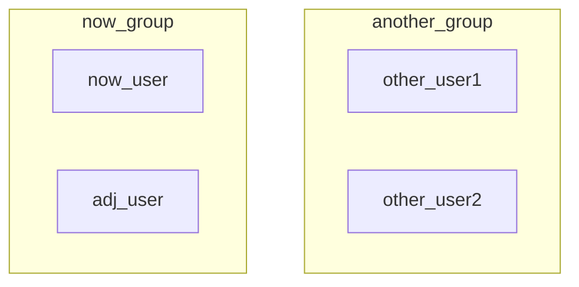

## 前言

尝试在 Windows11 上使用 wget 通过一个 url 下载一个 js 静态文件。但是发现本地 bash 使用 wget 命令报错：command not found。于是借 wget 之名展开”古老“的 shell 之旅。

**Shell 是什么**？我们用 GLM4 总结一下：

> Shell 的准确定义是：在操作系统中，Shell 是一个程序，它提供了一个用户界面，允许用户通过命令行输入指令来与操作系统交互。它充当用户与操作系统内核之间的中介，处理用户的输入，解释这些输入为操作系统可以理解和执行的操作，并返回执行结果。

也就是说 shell 是一个命令解释器。可以将其理解为人机交互的中间层，通过解析字符串命令与操作系统交互，进而完成系统资源的调用与处理。可以将「解析命令并调用系统资源完成任务」这个过程简单地理解为：shell 解析输入 $\to$ shell 调用对应的 C 函数向 OS 发起请求 $\xrightarrow[]{\text{API}}$ OS 接受请求并执行相关底层操作 $\to$ OS 返回执行结果给 C 函数 $\to$ shell 接受 C 函数返回结果并显示提示信息。

**为什么用 Bash Shell**？常见的命令解释器有：Bash (Bourne Again Shell)、Sh (Bourne Shell)、Zsh (Z Shell) 等。其中 Bash 是最流行的跨平台 Shell 之一。虽然它是 GNU/Linux 和 macOS 的默认 Shell，但也可以在 Windows 上通过 Windows Subsystem for Linux (WSL) 或第三方工具如 Git Bash 来运行。

**文章标题为什么不叫 GNU/Linux 基础**？在我看来，GNU/Linux 基础的内容更多应当偏向于讲解  GNU/Linux 的理论知识，然而目前主流的讲解 GNU/Linux 基础的内容均偏向于指导大家如何使用 shell 与操作系统交互，那这与 python 等解释型编程语言有什么区别？python 是用 python 解释器与操作系统交互，相关的教程默认都叫「Python 基础」，shell 是用 shell 解释器与操作系统交互，那为什么不叫「Shell 基础」呢？

注：本文基于 Windows11 的 Git Bash 命令解释器配合 Ubuntu22.04 的 Bash 命令解释器展开。两个平台的 Bash 版本信息如下：

Windows11 **Git Bash** Version Info:

```bash
$ bash --version
GNU bash, version 5.2.26(1)-release (x86_64-pc-msys)
Copyright (C) 2022 Free Software Foundation, Inc.
License GPLv3+: GNU GPL version 3 or later <http://gnu.org/licenses/gpl.html>

This is free software; you are free to change and redistribute it.
There is NO WARRANTY, to the extent permitted by law.
```

GNU/Linux **Bash** Version Info:

```bash
root@dwj2:~# bash --version
GNU bash，版本 5.1.16(1)-release (x86_64-pc-linux-gnu)
Copyright (C) 2020 Free Software Foundation, Inc.
许可证 GPLv3+：GNU GPL 许可证第三版或者更新版本 <http://gnu.org/licenses/gpl.html>

本软件是自由软件，您可以自由地更改和重新发布。
在法律许可的情况下特此明示，本软件不提供任何担保。
```

## Shell 基本命令

在开始之前，我们可以使用 `echo $SHELL` 命令查看当前的命令解释器是什么：

```bash
root@dwj2:~# echo $SHELL
/bin/bash
```

### 常用命令

#### 改变目录 cd

```bash
cd ../
```

`../` 表示上一级，`./` 表示当前一级（也可以不写），`/` 表示从根目录开始。

#### 打印目录内容 ls

```bash
ls
```

- `-l` 参数即 long listing format，表示打印详细信息。
- `-h` 参数即 human-readable，会使得结果更加可读，例如占用存储空间加上单位等等。

#### 打印当前路径 pwd

```bash
pwd
```

#### 打印当前用户名

```bash
whoami
```

#### 创建文件夹 mkdir

```bash
mkdir <FolderName>
```

#### 创建文件 touch

```bash
touch <FileName>
```

#### 复制 cp

```bash
cp [option] <source> <target>
```

- `-r` 表示递归复制，`-i` 用来当出现重名文件时进行提示。
- source 表示被拷贝的资源。
- target 表示拷贝后的资源名称或者路径。

#### 移动 mv

```bash
mv [option] <source> <target>
```

- `-i` 用来当出现重名文件时进行提示。
- source 表示被移动的资源。
- target 表示移动后的资源名称或者路径（可以以此进行重命名）。

#### 删除 rm

```bash
rm [option] <source>
```

- `-i` 需要一个一个确认，`-f` 表示强制删除，`-r` 表示递归删除。

#### 打印 echo

```bash
echo "hello"
```

- 将 echo 后面紧跟着的内容打印到命令行解释器中。可以用来查看环境变量的具体值。

- 也可以配合输出重定向符号 `>` 将信息打印到文件中实现创建新文件的作用。例如 `echo "hello" > file.txt` 用于创建 file.txt 文件并且在其中写下 `hello` 信息。

#### 查看 cat

```bash
cat [option] <source>
```

- `-n` 或 `--number` 表示将 source 中的内容打印出来的同时带上行号。
- 也可以配合输出重定位符号 `>` 将信息输出到文件中。例如 `cat -n a.txt > b.txt` 表示将 a.txt 文件中的内容带上行号输出到 b.txt 文件中。

#### 分页查看 more

```bash
more <source>
```

与 `cat` 类似，只不过可以分页展示。按空格键下一页，`b` 键上一页，`q` 键退出。

可以配合管道符 `|` (将左边的输出作为右边的输入) 与别的命令组合从而实现分页展示，例如 `tree | more` 表示分页打印文件目录。

#### 输出重定向

标准输出（stdout）默认是显示器。

`>` 表示创建或覆盖，`>>` 表示追加。

### 重要命令

#### 查找 find *

```bash
find <path> <expression>
```

- `-maxdepth <num>`, `-mindepth <num>`: 最大、最小搜索深度。

#### 匹配 grep *

```bash
grep [option] <pattern> <source>
```

使用正则表达式在指定文件中进行模式匹配。

- `-n` 显示行号，`-i` 忽略大小写，`-r` 递归搜索，`-c` 打印匹配数量。

## 用户与权限管理

在 Windows 中，我们对用户和权限的概念接触的并不多，因为很多东西都默认设置好了。但是在 GNU/Linux 中，很多文件的权限都需要自己配置和定义，因此「用户与权限管理」的操作方法十分重要。我们从现象入手逐个进行讲解。

首先以 root 用户身份登录并进入 `/opt/OS/task2/` 目录，然后创建一个测试文件 `root_file.txt` 和一个测试文件夹 `root_folder`。使用 `ls -l` 命令列出当前目录下所有文件的详细信息：


可以看到一共有 $6$ 列信息，从左到右依次为：用户访问权限、与文件链接的个数、文件属主、文件属组、文件大小、最后修改日期、文件/目录名。$2-5$ 列的信息都很显然，第 $1$ 列信息一共有 $10$ 个字符，其中第 $1$ 个字符表示当前文件的类型，共有如下几种：

|   文件类型   | 符号 |
| :----------: | :--: |
|   普通文件   | `-`  |
|     目录     | `d`  |
| 字符设备文件 | `c`  |
|  块设备文件  | `b`  |
|   符号链接   | `l`  |
| 本地域套接口 | `s`  |
|   有名管道   | `p`  |

第 $2-10$ 共 $9$ 个字符分 $3$ 个一组，分别表示「属主 user 权限、属组 group 权限、其他用户 other 权限」，下面分别介绍「用户和组」以及「权限管理」两个概念。

### 关于用户和组

首先我们需要明确用户和组这两个概念的定义：

- **文件用户（user/u）**：文件的拥有者。
- **所属组（group/g）**：与该文件关联的用户组，组内成员享有特定的权限。
- **其他用户（others/o）**：系统中不属于拥有者或组的其他用户。

举个例子。对于当前用户 `now_user` 以及当前用户所在的组 `now_group`，同组用户 `adj_user` 和其他用户 `other_user` 可以形象的理解为以下的集合关系：



### 关于权限管理

一共有 3 种权限，如下表所示：

|      |    文件    |               目录               |
| :--: | :--------: | :------------------------------: |
| `r`  | 可查看文件 |         能列出目录下内容         |
| `w`  | 可修改文件 | 能在目录中创建、删除和重命名文件 |
| `x`  | 可执行文件 |            能进入目录            |

那么我们平时看到的关于权限还有数字的配置，是怎么回事呢？其实是对上述字符配置的八进制数字化。读 $r$ 对应 $4$，写 $w$ 对应 $2$，可执行 $x$ 对应 $1$，例如如果一个文件对于所有用户都拥有可读、可写、可执行权限，那么就是 `rwxrwxrwx`，对应到数字就是 $777$。

### 相关命令

下面罗列一些用户与权限管理相关的命令，打 $*$ 表示重要命令。

#### 提升权限 sudo

```bash
sudo ...
```

使用 sudo 前缀可以使得当前用户的权限提升到 root 权限，如果是 root 用户则无需添加。

#### 查看当前用户 whoami

```bash
whoami
```

打印当前用户名。

#### 创建用户 useradd

```bash
useradd <username>
```

添加用户。

#### 删除用户 userdel

```bash
userdel <username>
```

删除用户。

- `-r` 表示同时删除数据信息。

#### 修改用户信息 usermod

```bash
usermod
```

- 使用 `-h` 参数查看所有用法。

#### 修改用户密码 passwd

```bash
passwd <username>
```

#### 切换用户 su

```bash
su <username>
```

添加 `-` 参数则直接进入 `/home/<username>/` 目录（如果有的话）。

#### 查看当前用户所属组 groups

```bash
groups
```

#### 创建用户组 groupadd

```bash
groupadd
```

#### 删除用户组 groupdel

```bash
groupdel
```

#### 改变属主 chown *

```bash
chown <user> <filename>
```

将指定文件 filename 更改属主为 user。

#### 改变属组 chgrp *

```bash
chgrp <group> <filename>
```

将指定文件 filename 更改属组为 group。

#### 改变权限 chmod *

```bash
chmod <option> <filename>
```

将文件 filename 更改所有用户对应的权限。举个例子就知道了：让 `demo.py` 文件只能让所有者拥有可读、可写和可执行权限，其余任何用户都只有可读和可写权限。

```bash
# 写法一
chmod u=rwx,go=rw demo.py

# 写法二
chmod 766 demo.py
```

至于为什么数字表示法会用 $4,2,1$，是因为 $4,2,1$ 刚好对应了二进制的 $001, 010, 100$，三者的组合可以完美的表示出 $[0,7]$ 范围内的任何一个数。

#### 默认权限 umask

```bash
umask
```

- `-S` 显示字符型默认权限

直接使用 `umask` 会显示 $4$ 位八进制数，第一位是当前用户的 $uid$，后三位分别表示当前用户创建文件时的默认权限的补，例如 $0022$ 表示当前用户 $uid$ 为 $0$，创建的文件/目录默认权限为 $777-022=755$。

可能是出于安全考虑，文件默认不允许拥有可执行权限，因此如果 `umask` 显示为 $0022$，则创建的文件默认权限为 $644$，即每一位都 $-1$ 以确保是偶数。



**一、添加 4 个用户：alice、bob、john、mike**

首先需要确保当前是 root 用户，使用 `su root` 切换到 root 用户。然后在创建用户时同时创建该用户对应的目录：

```bash
useradd -d /home/alice -m alice
useradd -d /home/bob -m bob
useradd -d /home/john -m john
useradd -d /home/mike -m mike
```


**二、为 alice 设置密码**

```bash
passwd alice
```


**三、创建用户组 workgroup 并将 alice、bob、john 加入**

- 创建用户组：

    ```bash
    groupadd workgroup
    ```

- 添加到新组：

    ```bash
    usermod -a -G workgroup alice
    usermod -a -G workgroup bob
    usermod -a -G workgroup john
    ```

    - `-a`：是 `--append` 的缩写，表示将用户添加到一个组，而不会移除她已有的其他组。这个选项必须与 `-G` 一起使用
    - `-G`：指定要添加用户的附加组（即用户可以属于多个组），这里是 workgroup

- 将 workgroup 作为各自的主组：

    ```bash
    usermod -g workgroup alice
    usermod -g workgroup bob
    usermod -g workgroup john
    ```

    - `-g`：用于指定用户的主组（primary group）。主组是当用户创建文件或目录时默认分配的组


**四、创建 `/home/work` 目录并将其属主改为 alice，属组改为 workgroup**

```bash
# 创建目录
mkdir work

# 修改属主和属组
chown alice:workgroup work

# 或者
chown alice.workgroup work
```


**五、修改 work 目录的权限**

使得属组内的用户对该目录具有所有权限，属组外的用户对该目录没有任何权限。

```bash
# 写法一
chmod ug+rwx,o-rwx work

# 写法二
chmod 770 work
```


**六、权限功能测试**

以 bob 用户身份在 work 目录下创建 `bob.txt` 文件。可以看到符合默认创建文件的权限格式 $644$：


同组用户与不同组用户关于「目录/文件」的 `rw` 权限测试。

- 关于 $770$ 目录。由于 work 目录被 bob 创建时权限设置为了 $770$，bob 用户与 john 用户属于同一个组 workgroup，因此 john 因为 $g=7$ 可以进入 work 目录进行操作，而 bob 用户与 mike 用户不属于同一个组，因此 mike 因为 $o=0$ 无法进入 work 目录，更不用说查看或者修改 work 目录中的文件了。
- 关于 $644$ 文件。现在 john 由于 $770$ 中的第二个 $7$ 进入了 work 目录。由文件默认的 $644$ 权限可以知道：john 因为第一个 $4$ 可以读文件，但是不可以写文件，因此如下图所示，可以执行 `cat` 查看文件内容，但是不可以执行 `echo` 编辑文件内容。至于 mike，可以看到无论起始是否在 work 目录，都没有权限 `cd` 到 work 目录或者 `ls` 查看 work 目录中的内容。




## 进程管理与调试

在熟悉了 bash shell 的基本命令以及 GNU/Linux 中用户与权限管理的基本概念后，我们就可以开始尝试管理 GNU/Linux 中的程序了。当然每一个程序在开始运行后都会成为一个或多个进程，因此接下来简单介绍一下 GNU/Linux 的进程管理。最后再通过调试一个 C 程序来熟悉 GNU 调试工具 gdb (GNU Debugger) 的使用。

### 进程管理相关命令

查看进程状态 ps

```bash
ps
```

动态查看进程状态 top

```bash
top
```

杀死某个进程 kill

```bash
kill -9 <PID>
```



**一、编写一个 shell 程序 `badproc.sh` 使其不断循环**

```bash
#! /bin/bash
while echo "I'm making files!"
do
    mkdir adir
    cd adir
    touch afile
    sleep 10s
done
```


**二、为 `badproc.sh` 增加可执行权限**

```bash
chmod u+x badproc.sh
```


**三、在后台执行 `badproc.sh`**

```bash
./badproc.sh &
```

- `&` 表示后台执行


**四、利用 `ps` 命令查看其进程号**

```bash
ps aux | grep badproc
```


**五、利用 `kill` 命令杀死该进程**

```bash
kill -9 <PID>
```


**六、删除 `badproc.sh` 程序运行时创建的目录和文件**




### gdb 调试相关命令

基本命令参考 GNU OF GDB 官网：<https://www.gnu.org/software/gdb/>。常用的如下：

开始运行

```bash
r
```

- r 即 run

设置断点

```bash
break <line>
```

- line 即行号

运行到下一个断点

```bash
c
```

- c 即 continue



**一、创建 `fork.c` 文件**

```c
#include <stdio.h>
#include <stdlib.h>
#include <unistd.h>
#include <sys/types.h>
#include <sys/wait.h>

int main() {
    /* fork another process */
    pid_t  pid;
    pid = fork();

    if (pid < 0) {
        /* error occurred */
        fprintf(stderr, "Fork Failed");
        exit(-1);
    } else if (pid == 0) {
        /* child process */
        printf("This is child process, pid=%d\n", getpid());
        execlp("/bin/ls", "ls", NULL);
        printf("Child process finished\n"); /*这句话不会被打印，除非execlp调用未成功*/
    } else {
        /* parent process */
        /* parent will wait for the child to complete */
        printf("This is parent process, pid=%d\n", getpid());
        wait (NULL);
        printf ("Child Complete\n");
        exit(0);
    }
}
```


这段程序首先通过调用 `fork()` 函数创建一个子进程，并通过 `pid` 信息来判断当前进程是父进程还是子进程。在并发的逻辑下，执行哪一个进程的逻辑是未知的。

**二、编译运行 `fork.c` 文件**


从上述运行结果可以看出：并发时，首先执行父进程的逻辑，然后才执行子进程的逻辑。

**三、gdb 调试**

在 fork 创建子进程后追踪子进程：

```bash
gdb fork
set follow-fork-mode child
catch exec
```


运行到第一个断点时分别观察父进程 1510168 和子进程 1510171：


运行到第二个断点时观察子进程 1510171：


从上述子进程的追踪结果可以看出，在父进程结束之后，子进程成功执行了 `pid == 0` 的逻辑并开始调用 `ls` 工具。



## GNU/Linux 编程

这里的 GNU/Linux 编程对应的高级语言是 C/C++ 编程语言。本部分主要是为了熟悉 C/C++ 编程中的 **静态链接** 与 **动态链接** 逻辑。

### GCC 基础

相比于在 Windows 进行 C/C++ 编程时需要自己额外安装编译器集合 MSVC (Microsoft Visual C++) 或 MinGW (Minimalist GNU for Windows)，GNU/Linux 发行版 Ubuntu22.04 已经默认配置好了编译器集合 GCC (GNU Compiler Collection)，我们可以利用 GCC 提供的前端工具 gcc 等快捷地使用编译器集合中的所有工具。具体命令可以参考 GCC 官方在线文档：<https://gcc.gnu.org/onlinedocs/>。

我们可以使用 `gcc --version` 命令查看当前的 GCC 版本：

```bash
root@dwj2:/opt/OS/task4# gcc --version
gcc (Ubuntu 11.4.0-1ubuntu1~22.04) 11.4.0
Copyright (C) 2021 Free Software Foundation, Inc.
This is free software; see the source for copying conditions.  There is NO
warranty; not even for MERCHANTABILITY or FITNESS FOR A PARTICULAR PURPOSE.
```

因此我们选择版本最相近的手册 [gcc-11.5.0](https://gcc.gnu.org/onlinedocs/gcc-11.5.0/gcc/) 进行阅读。对于最基本的编译操作和理论，已经在 [计算机系统基础](https://blog.dwj601.cn/GPA/4th-term/SysBasic/#3-1-程序转换概述) 课程中有所学习，就不重复造轮子了，常见的指令直接跳转阅读即可。

#### 环境变量

对于当前路径下链接出来的可执行文件 demo，为什么 `demo` 无法正常执行，`./demo` 就可以正常执行？如下图所示：


根本原因是 bash 默认执行 PATH 环境变量下的可执行文件，显然上述的 demo 可执行文件并不在 PATH 对应的路径下，那么 PATH 路径都有哪些呢？我们使用 `echo $PATH | tr ':' '\n'` 打印出来：

```bash
root@dwj2:/opt/OS/task4# echo $PATH | tr ':' '\n'
/usr/local/sbin
/usr/local/bin
/usr/sbin
/usr/bin
/usr/games
/usr/local/games
/snap/bin
```

能不能使用 demo 运行呢？有很多解决办法，但根本逻辑都是将当前路径加入到 PATH 环境变量。下面补充几个 gcc 和 g++ (编译 C++ 用) 相关的环境变量：

- 头文件搜索路径
    - `C_INCLUDE_PATH`: gcc 找头文件的路径。
    - `CPLUS_INCLUDE_PATH`: g++ 找头文件的路径。
- 库文件搜索路径
    - `LD_LIBRARY_PATH`: 找动态链接库的路径。
    - `LIBRARY_PATH`: 找静态链接库的路径。

#### gcc 选项

在计算机系统基础中已经学习到了，C/C++ 最基本的编译链就是 `-E`、`-S`、`-c`、`-o`，每一个参数都包含前面所有的参数。下面主要讲讲 `-I<dir>`，`-L<dir>` 和 `-l<name>` 三个参数：

- `-I<dir>` 顾名思义就是「头文件导入」的搜索目录。例如下面的编译语句：

    ```bash
    gcc –I/opt/OS/task4/include demo.c
    ```

    注意：当我们不使用 -o 参数指定 outfile 的名称时，默认是 `a.out`，如下图所示，其中 demo 可执行文件是之前用来输出 `'hello'` 的：

    

- `-L<dir>` 顾名思义就是「库文件连接」搜索目录。例如下面的编译语句：

    ```bash
    gcc -o x11fred -L/usr/openwin/lib x11fred.c
    ```

- `-l<name>` 比较有意思，就是直接制定了库文件是哪一个。正因为有了这样的用法，我们在给库文件 (`.a` 表示静态库文件，`.so` 表示动态库文件) 起名时，就只能起 `lib<name>.a` 或 `lib<name>.so`。例如下面的编译语句：

    ```bash
    gcc -o fred -lm fred.c
    # 等价于
    gcc –o fred /usr/lib/libm.a fred.c
    ```

### 静态链接 | 动态链接

对于下面的函数库与调用示例：

```c
// addvec.c
void addvec(int* x, int* y, int* z, int n) {
    for(int i = 0; i < n ; i++) {
        z[i] = x[i] + y[i];
    }
}

// multvec.c
void multvec(int* x, int* y, int* z, int n) {
    for(int i = 0; i < n ; i++) {
        z[i] = x[i] * y[i];
    }
}

// vector.h
void addvec(int* x, int* y, int* z, int n);
void multvec(int* x, int* y, int* z, int n);

// main.c
#include <stdio.h>
#include "vector.h"
int x[2] = {1, 2}, y[2] = {3, 4}, z[2];
int main() {
    addvec(x, y, z, 2);
    printf("z = [%d, %d]\n", z[0], z[1]);
    return 0;
}
```

生成静态库文件 `libvector.a` 并链接至可执行文件 p1 中：

```bash
# 将两个自定义库函数编译为可重定位目标文件 addvec.o 和 multvec.o
gcc -c addvec.c multvec.c

# 将两个可重定位目标文件打包成静态库文件 libvector.a
ar crv libvector.a addvec.o multvec.o

# 生成静态链接的可执行文件 p1
gcc -static -o p1 main.c -L. -lvector
```

生成动态库文件 `libvector.so` 并链接至可执行文件 p2 中：

```bash
# 将两个自定义库函数编译为动态库文件 libvector.so
gcc -shared -o libvector.so addvec.c multvec.c

# 生成动态链接的可执行文件 p2
gcc -o p2 main.c -L. -lvector

# 使用 ./p2 执行之前需要明确一下动态库文件的链接搜索路径，否则会找不到动态库文件
export LD_LIBRARY_PATH=$LD_LIBRARY_PATH:.
```

最后我们查看一下 p1 和 p2 详细信息，如下图所示。显然静态链接的可执行文件 p1 占用的存储空间远大于动态连接的可执行文件 p2。


## 工具扩展

### tree

目录可视化工具。

下载地址：[Tree for Windows (sourceforge.net)open in new window](hhttps://gnuwin32.sourceforge.net/packages/tree.htm)，下载 Binaries 的 Zip 文件。解压完成后，将 bin 目录下的 tree.exe 复制到 Git Bash 安装路径下的 usr/bin 文件夹下，即可使用 tree 命令。

基本命令格式：`tree [-option] [dir]`

- 显示中文：`-N`。如果中文名是中文，不加 `-N` 有些电脑上是乱码的。
- 选择展示的层级：`-L [n]`。
- 只显示文件夹：`-d`。
- 区分文件夹、普通文件、可执行文件：`-FC`。`C` 是加上颜色。
- 起别名：`alias tree='tree -FCN'`。
- 输出目录结构到文件： `tree -L 2 -I '*.js|node_modules|*.md|*.json|*.css|*.ht' > tree.txt`。

### wget

url 下载工具。

下载地址：[Windows binaries of GNU Wget](https://eternallybored.org/misc/wget/)，选择合适的版本和架构包进行下载。将 wget.exe 移动到 Git Bash 安装路径下的 usr/bin 文件夹下，即可使用 wget 命令。

基本命令格式：`wget [url]`

- 指定文件名：`-O`。
- 指定目录：`-P`。
- 下载多个文件：`wget -i [url.txt]`。
- 断点续传：`wget -c -t [n] [url]`。`n` 代表尝试的次数，`0` 代表一直尝试。
- 后台执行：`wget -b [url]`。执行该命令的回显信息都会自动存储在 `wget.log` 文件中。
- 下载一个网站的所有图片、视频和 pdf 文件：`wget -r -A.pdf url`。

## 参考引用

[在 Windows 中使用 Bash shell](https://northword.cn/code/bash-for-windows/)

[Linux 用户权限信息](https://chatgpt.com/share/66f61785-7ed0-800c-bdf3-fbbfc84a56ae)

[gdb 调试的基本使用](https://www.cnblogs.com/HKUI/p/8955443.html)

