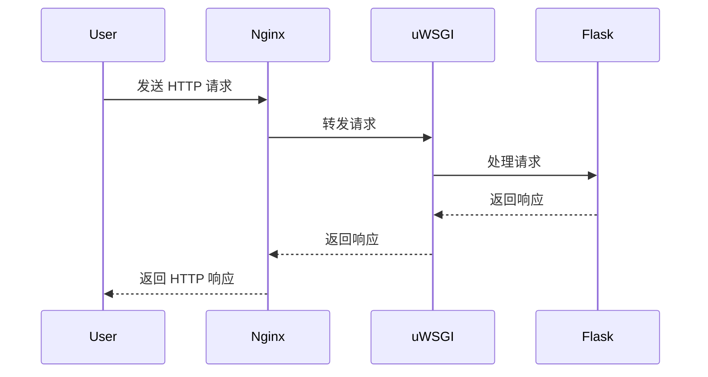

!!! warning
    最近没有时间维护对应的项目，等后续有空了会重构内容并开源。

Flask 是使用 Python 作为后端语言的 Web 微框架，旨在帮助开发者快速开发出一个小型网站。本文以一个实际的「搜索中台」小项目为例，展开 Python Flask 的具体介绍。

## 项目简介

整体的服务逻辑：



## Flask 基础

TODO

## Flask 部署

### 配置 MySQL

**放通端口**。服务器放通 MySQL 的应用端口，默认开启在 3306。

**安装 MySQL 并启动**。不同的 GNU/Linux 发行版的部署方法不尽相同，详细操作可以参考：

- CentOS：[Linux 安装 mysql8.0 - CSDN](https://blog.csdn.net/weixin_55914667/article/details/126410095)
- Ubuntu：[在Ubuntu 22.04 LTS 上安装 MySQL两种方式：在线方式和离线方式 - CSDN](https://blog.csdn.net/weixin_45626288/article/details/133220238)

**配置 MySQL 服务**。

- 在服务器中连接 MySQL

    ```mysql
    mysql -uroot -p
    ```

- 重置密码

    ```mysql
    ALTER USER 'root'@'localhost' IDENTIFIED WITH mysql_native_password BY 'password';
    ```

- 使用数据库

    ```mysql
    use mysql
    ```

- 允许远程登录数据库

    ```mysql
    update user set host = '%' where user = 'root';
    ```

- 刷新更新配置

    ```mysql
    FLUSH PRIVILEGES;
    ```

**构造数据库信息**。由于数据库相关的资源已经被我存储在了本地 Windows，故直接在本地开发环境中利用 DataGrip 数据库管理工具将相应的信息复制到这台服务器的 MySQL 数据库中即可：


### 配置 Nginx

**放通端口**。服务器安全组放通 Nginx 应用端口：80。

**下载 Nginx**。进入 [nginx 官网](http://nginx.org/en/download.html) 并找到以下内容：


然后通过 wget 命令下载压缩包：

```bash
wget https://nginx.org/download/nginx-1.24.0.tar.gz
```

解压：

```bash
tar -zxvf nginx-1.24.0.tar.gz
cd /home/nginx-1.24.0/
```

**安装 Nginx**。Ubuntu 需要额外 [手动安装 Nginx 的依赖库](https://blog.csdn.net/somanlee/article/details/69808788)：

```bash
# 配置configure
# --prefix 代表安装的路径
# --with-http_ssl_module 安装ssl
# --with-http_stub_status_module 查看nginx的客户端状态
./configure --prefix=/usr/local/nginx-1.24.0 --with-http_ssl_module --with-http_stub_status_module

# 编译 安装
make && make install
```

**启动 Nginx**。进入 `/usr/local/nginx-1.24.0/sbin/` 目录并启动 Nginx：

```bash
./nginx
```

> 报错：端口被占用。
>
> 
>
> 解决：使用 `killall -9 nginx` 杀掉 nginx 的进程，然后重启。


最后浏览器通过 http 协议默认的 80 端口访问公网 ip，就可以看到欢呼雀跃的一幕：


### 配置 Python

**安装 Python 软件**。参考：[linux 安装 python](https://blog.csdn.net/weixin_64940494/article/details/126266917)。

```bash
# 本地下载拖拽上传至服务器或 wget 命令下载 py 压缩包，并解压安装包
tar -xvf Python-3.11.tgz

# 进入安装包，配置安装路径
cd Python-3.11
./configure --prefix=/usr/local/python311

# 编译 安装
make && make install

# 将最新的 python 创建软链链接
ln -s /usr/local/python311/bin/python3.11 /usr/bin/python311

# 修改 yum 依赖默认的 python 版本
vi /usr/libexec/urlgrabber-ext-down
vi /usr/bin/yum

# 修改防火墙
vi /usr/bin/firewall-cmd
vi /usr/sbin/firewalld

# 创建 pip 软连接
ln -s /usr/local/python311/bin/pip3.11 /usr/bin/pip311
```

**配置虚拟环境包**。这是必须的，可以避免很多版本依赖问题。

下载虚拟环境管理包：

```bash
pip install virtualenvwrapper
```

在 /root/ 目录下进入 .bashrc 文件：

```bash
# ctrl + f 进入末尾，粘贴以下文字
export WORKON_HOME=$HOME/.virtualenvs
export VIRTUALENVWRAPPER_PYTHON=/usr/bin/python311
source /usr/local/bin/virtualenvwrapper.sh
```

刷新配置文件：

```bash
source ~/.bashrc
```

> 解决 `virtualenvwrapper.sh: There was a problem running the initialization hooks.` 报错
>
> - 解决方案一：注意上述 `VIRTUALENVWRAPPER_PYTHON=/usr/bin/python311` 中的路径是否正确
> - 解决方案二：[virtualenvwrapper.sh 报错: There was a problem running the initialization hooks.解决](https://www.cnblogs.com/cpl9412290130/p/10019231.html)

**创建 Python 虚拟环境**。一些 virtualenvwrapper 包的基本配置操作：

```bash
# 创建虚拟环境目录
mkvirtualenv --python=/usr/bin/python3.10 <EnvName>

# 启动虚拟环境
workon <EnvName>

# 退出虚拟环境
deactivate
```

### 运行 Flask

**拉取仓库代码并初始化环境**。进入 python 虚拟环境目录：

```bash
# 初次部署：拉取远程源文件
git clone https://github.com/Explorer-Dong/YunJinWeb.git

# 后续更新：覆盖原始代码并重新运行应用
git pull

# 安装所需项目依赖环境
pip install -r requirements.txt

# 导入 .env 环境变量配置文件
# 这一步因人而异，如果有些文件没法存到 git 系统，可以手动上传该文件
```

**使用 Flask 内置服务器运行**。该方法只限于开发环境使用，如果需要在生产环境上限服务，请看下一种运行方法。

```bash
python app.py
```

之后就可以通过「IP 地址 + 端口号」的方式访问服务了。如果遇到端口被占用的问题，可以采用和上述启动 Nginx 遇到端口占用一样的解决方案，找到占用端口对应的进程号，然后终止即可。

**使用 uWSGI 应用服务器运行**。该方法适用于生产环境，推荐使用。

安装 uWSGI 包：

```bash
pip install uwsgi
```

创建 uwsgi.ini 文件并编辑：

```bash
[uwsgi]

# -------------------- 路径相关的设置 --------------------

# python 虚拟环境的路径
home      = /root/.virtualenvs/py310

# 虚拟环境下 当前项目的路径
chdir     = /root/.virtualenvs/py310/YunJinWeb

# 指定 uWSGI 应用程序的入口文件
wsgi-file = /root/.virtualenvs/py310/YunJinWeb/app.py

# uWSGI 应用实例对象的名称
callable  = app

# -------------------- 进程相关的设置 --------------------

# 启用 uWSGI 主进程模式。主进程负责管理子进程，监控它们的状态，并在必要时重新启动它们。
master    = true

# 指定要启动的并发子进程的工作进程数量
processes = 10

# 指定 uWSGI 的 HTTP 监听端口
http      = :5000

# 在关闭 uWSGI 时自动清理 Unix socket 和 PID 文件。确保在服务器停止时不会留下遗留文件
vacuum    = true
```

启动 uWSGI 服务器：

```bash
# 显式启动
uwsgi --ini uwsgi.ini

# 隐式启动（保持后台运行）
uwsgi -d --ini uwsgi.ini
```

终止 / 重启 uWSGI 服务器：

```bash
# 查看 uWSGI 的所有进程
pgrep uwsgi

# 终止 uWSGI 的所有进程
pkill -9 uwsgi

# 启动操作看上一步教程
```

同理，之后可以通过 IP 地址 + 端口号的方式访问服务。如果配置了域名和 Nginx 代理，就可以直接用域名访问对应的服务了。
