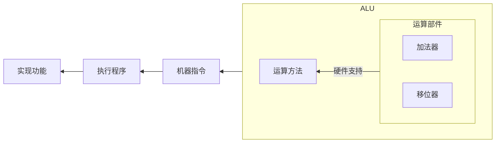

## 运算部件

本节我们学习 CPU 中的运算部件，即算数逻辑单元 (Arithmetic and Logic Unit, ALU)。ALU 在计算机中的地位大致如下图所示：

### 执行部件与控制信号

**执行部件**。ALU 有两个运算数输入 A 和 B 以及一个控制输入 ALUctr，输出为一个运算结果 Result、零信号 Zero 和溢出信号 Overflow。ALU 的内部结构如下图所示：

**控制信号**。对于 MIPS 中的 11 条指令，可以归纳为 7 种操作：addu、add、or、subu、sub、sltu、slt。也就是说 ALUctr 只需要 $\lceil \log_2(7) \rceil =3$ 个选择控制位。如下表所示，列出了 ALUctr 的选择控制逻辑：

**ALU 内部运算逻辑**。在 ALU 内部，需要根据控制信号 ALUctr 产生对应的运算逻辑。具体的，ALUctr 内部有 4 个运算控制信号，分别为 SUBctr、OPctr、OVctr 和 SIGctr。下面借书中原文分别解释 4 个控制信号对应的逻辑：

> SUBctr 用来控制 ALU 执行加法还是减法运算。当 SUBctr = 1 时，做减法；当 SUBctr = 0 时，做加法。
>
> OPctr 用来控制选择哪种运算的结果作为 Result 输出。因为所实现的 11 条指令中只可能有加/减、按位或、小于置 1 这 3 大类运算，所以 OPctr 有两位。
>
> OVctr 用来控制是否要进行溢出判断。当 OVctr = 1 时，进行溢出判断，此时，若结果发生溢出，则溢出标志 Overflow 为 1，当 OVctr = 0 时，无须溢出判断，此时，即使结果发生溢出，溢出标志 Overflow 也不为 1。
>
> SIGctr 信号控制 ALU 是执行「带符号整数比较小于置 1」还是执行「无符号数比较小于置 1」的功能。当 SIGctr = 0，执行「无符号数比较小于置 1」的功能；当 SIGctr = 1 时，执行「带符号整数比较小于置 1」的功能。

这样就可以完整实现 ALU 运算了。下表详细解释了每一条指令的运算类型与 ALUctr 取值之间的关系：

### 控制逻辑详解

加减运算控制（SUBctr）：很显然，加法（SUBctr = 0），减法（SUBctr = 1）。

输出内容控制（OPctr）：很显然， 3 大类运算就对应 3 个取值。

溢出判断控制（OVctr）：很显然，有符号运算需要溢出判断，其他运算都不需要。

小于置一控制（SIGctr）：这个逻辑比较有意思。为什么无符号数比大小时 `Less = Carry ^ SUBctr`；有符号数比大小时 `Less = Sign ^ Overflow` 呢？首先我们知道，比大小的本质是使用加法器做减法运算，那么 $A-B=A+B_{\text{补}}=A+(\sim B +1)$。

- 对于无符号数的比大小逻辑。由于是减法，SUBctr 一定是 1，因此此时的输出其实可以进一步归纳为 `Less = Carry ^ 1 = !Carry`。也就是说我们只需要分析加法运算的进位结果即可，而这就是之前学过的无符号整数加减运算逻辑了。如果 A 严格小于 B，则 B 的补码与 A 相加后不会产生进位，此时 `!Carry = !0 = 1` 表示 $A<B$；如果 $A\ge B$，则 B 的补码与 A 相加后就会超过无符号整数表示的范围产生进位，此时 `!Carry = !1 = 0` 表示 $A \ge B$。很巧妙的逻辑；
- 对于有符号数的比大小逻辑
    - 如果运算没有溢出，即 `Overflow=0`，此时 A 与 B 的正负一定相同。A 与 B 的比大小结果可以直接根据加法器运算结果的符号位来确定。如果运算结果是负的，即 `Sign=1`，那么显然 $A<B$；反之如果运算结果是正的，即 `Sign=0`，那么显然 $A\ge B$；
    - 如果运算发生溢出，即 `Overflow=1`，此时 A 与 B 的正负一定不同。但我们不知道谁正谁负，根据有符号整数加减运算的溢出符号判定逻辑可知：
        - 若 A 为正数 B 为负数。溢出发生时运算结果一定是负数（正溢出），即 `Sign=1`，此时 `Less = Sign ^ OverFlow = 0`，即 $A \ge B$；
        - 若 A 为负数 B 为正数，溢出发生时运算结果一定是正数（负溢出），即 `Sign=0`，此时 `Less = Sign ^ OverFlow = 1`，即 $A< B$。

## 运算方法

指令的运算需求有了，能进行基本运算的硬件 ALU 也设计出来了。如何利用已有的运算部件来巧妙地设计算法以高效地实现常用的数学运算呢？让我们一探究竟！

### 原码乘法运算

计算逻辑与手算完全一致，只不过在计算机内部进行了一定的改进，有三点：

1. 并不是全部算完每一步的乘法结果后再一次性累加，而是使用一个 "局部变量" 保存前缀和（部分积）；
2. 由于每一位的乘法结果都是在最高位进行的，因此我们不是对当前的乘法运算结果左移一位，而是将前面计算出的前缀和 **逻辑右移** 一位；
3. 由于单步乘法运算时只有 0 和 1，显然若当前为 0 则对答案的贡献也为 0，因此当乘法位为 0 时只需要前缀和右移一位即可，而不需要执行相加操作。

??? note "推导过程"

    其实算法过程很简单，就是模拟了乘法运算的过程，这里就不罗列了。只不过其中有一些关于运算部件的巧妙利用。比如将每次部分积右移后多出来的一位存放到 $Y$ 中，反正 $Y$ 右移后的最后一位已经没用并且舍弃掉了，前面空出来的一位正好就用来存储部分积的最后一位。
    
    我们将二进制位从低到高的下标从 $1$ 开始计数，进位位记作 $C$，部分积记作 $P$，乘数位记作 $Y$，则有这样的递推式：
    
    $$
    P_i = (P_{i-1}+Xy_i) \gg 1,\quad P_0 = 0
    $$
    
    模拟过程如下：
    
    

原码乘法可以应用在在浮点数的尾数运算中。对数值位直接使用原码乘法即可，符号位就是两个乘数的符号位相异或的结果，例如：设 $[x]_\text{原}=0.1110$，$[y]_\text{原}=1.1101$，计算 $[x\times y]_\text{原}$，符号位为 $0\oplus 1=1$，数值位为 $[x]_\text{原} \times [y]_\text{原}$，即 $1110 \times 1101$ 的原码乘法运算结果 $10110110$。同时，可以采用分块思想对该算法进行优化。具体的，由于是逐位运算，因此我们需要进行 $n$ 次相乘再相加的操作，时间复杂度为 $O(n)$。现有的优化方案就是逐 $k$ 位运算，那么时间复杂度就可以优化为 $O(\frac{n}{k})$。

### 补码乘法运算

如何在已知 $[X]_{\text{补}}$ 和 $[Y]_{\text{补}}$ 的情况下，计算 $[X\times Y]_{\text{补}}$ 呢？由于 $[X\times Y]_{\text{补}} \ne [X]_{\text{补}} \times [Y]_{\text{补}}$，因此补码乘法不能直接使用原码乘法的算法，需要我们重新设计运算方法，这里引入 Booth 算法。

??? note "推导过程"

    布斯算法的本质是将符号位与数值位一起运算，也就是对有符号数的一次性运算算法。如下推导：
    
    
    
    进而可以得到关于「真值」的部分积递推公式：
    
    $$
    P_{i} = [P_{i-1} + (y_{i-2}-y_{i-1})X] \gg 1
    $$
    
    于是可以得到关于「补码」的部分积递推公式：
    
    $$
    \begin{aligned}
    [P_{i}] _{\text{补}} &= [P_{i-1} + (y_{i-2}-y_{i-1})X]_{\text{补}} \gg 1 \\
    &= [P_{i-1}] _{\text{补}} \gg 1 + [(y_{i-2}-y_{i-1})X]_{\text{补}} \gg 1
    \end{aligned}
    $$
    
    显然的 $y_{i-2}-y_{i-1}$ 只有 $-1,0,1$ 共 3 种情况，因此我们只需要知道 $[-X]_{\text{补}}$ 和 $[X]_{\text{补}}$ 即可利用 **算数移位** 和加法快速运算。例如下面的算例：
    
    

由于计算机中的数据都是以补码形式存储，因此补码乘法的使用场景更加广泛。至于优化，与原码乘法的优化方案类似。

## 指令集体系结构

??? note "基本术语"

    在开始学习指令系统之前有必要知道一些基本术语：
    
    - 在 **逻辑层面** 上。CPU 能理解的只有 **指令**，不同功能的指令组成了一个集合叫做 **指令集**，指令集中不同的指令的组合方式就构成了 **指令集体系结构** (Instruction Set Architecture, ISA)，基于特定的指令集体系结构开发的应用程序可以运行在任何一个支持相同指令集体系结构的硬件上 （也就是所谓的兼容）；
    - 在 **物理层面** 上。CPU 能理解的指令就是 **01 序列**，不同功能的 01 序列就是指令集（也被称为 **架构**），指令集体系结构的具体实现就是 **CPU 内核**（也被称为微架构），多个 CPU 内核加上全局缓存（例如 L3 缓存）就是现代 **CPU**（也被称为芯片）。
    
    下面针对上述的术语举一些当下的实际应用与产品：
    
    - 在 **逻辑层面** 上。ISA 固然重要，但是显然不利于人类与机器的交互，在此基础之上出现了汇编语言，并继续诞生出了 **高级语言与编译器**。编译器就是一个遵循 ISA 的软件，因此每一个架构上都有特定的编译器。通用的编程语言在不同的架构上可以被编译成遵循对应架构的机器码从而正确运行；
    - 在 **物理层面** 上。当前主流的指令集（架构）有 **x86 架构、ARM 架构、RISC-V 架构、MIPS 架构**。基于不同的架构针对不同的应用场景可以设计出不同的 CPU 内核（微架构）如 **基于 ARM 架构的 A35、A76、Cyclone 内核** 等。基于不同的 CPU 内核针对不同的应用场景可以设计出不同的 CPU 如 **基于 ARM 架构的 A76 内核设计出的骁龙 865 处理器** 等。
    
    指令集体系结构简称指令系统，下面全部用 ISA 来表示。

本章我们会学习指令集体系结构中的一种：MIPS。将会围绕「如何设计一个 ISA」和「基于 ISA 封装的程序与 ISA 的关系」两个部分展开。

### 如何设计一个 ISA

在开始了解如何设计一个指令系统之前，不妨先从结果论的角度了解一下程序运行的一般流程：

1. 首先需要填充 CPU 中寄存器的信息。操作系统需要根据可执行文件（也就是程序，包括代码、数据、堆栈等信息）的目录位置将其调入内存，对于采用虚拟化技术的操作系统而言，需要分页调入，并维护当前程序对应的进程中的页表信息，并通过缓存机制将内存中的信息调入 cache 中保存，cache 中的信息再调入到用户态的通用寄存器中保存。当然寄存器信息不仅可以源于存储器中的程序信息，也可以来自 I/O 接口中的端口信息，这将在 [I/O 接口](./device.md#io-接口) 中具体介绍；
2. 然后 CPU 就可以利用寄存器中存储的信息开始进行计算工作。也就是所谓的取指令（Instruction Fetch）、解码（Instruction Decode）、执行（Execution）、内存访问（Memory Access）和结果写回（Write Back）五大步骤。这些都将在 [单周期处理器](#单周期处理器) 和 [流水线处理器](#流水线处理器) 中具体展开。

知道了最基本程序运行流程以及其中的的指令执行流程后，针对当前的指令系统，产生的问题也接踵而至：支持的操作数类型有哪些？支持的操作类型有哪些？如何对操作进行编码？以及如何进行寻址？前两个问题大同小异，并且操作类型与操作数类型是捆绑的，都可以通过操作类型编码来进行区分。因此我们需要重点关注的就是如何进行操作编码以及如何通过寻址来得到对应的操作数。也因此可以得知，一条指令需要有的信息就是「操作码」和「地址码」两类信息。具体的：

- 操作码。就是说明这条指令需要执行什么样的操作；
- 地址码。就是说明当前指令对应的操作需要的数据，例如源操作数的地址、目的操作数的保存地址等。

### MIPS 指令与 MIPS 汇编

我们知道指令都是 01 序列，这并不利于快速编程实现与人类阅读理解，为此引入了汇编语言。一般来说每一种指令集都会对应一套汇编，MIPS 也不例外。因此我们就需要学习 MIPS 的指令类型及其在程序中的汇编表示（选择、循环和过程调用）。

当然，程序与汇编之间的转换已经在《计算机系统基础》这门课程中已经学习过了，主要学的是 C 语言与 IA-32 指令集之间的转换，不再赘述。同时，很多基础性的概念诸如「程序转换步骤」也不再赘述。本节，我们重点学习 MIPS 的指令格式以及 11 条 MIPS 指令的汇编表示，具备「通过 **查表** 将 MIPS 系统的机器代码与 MIPS 系统的汇编代码进行转换」的能力即可。

在开始介绍具体的 11 条 MIPS 指令之前，我们先看一下 MIPS 的指令类型，共有三种，如下图所示：

**R-型指令**。这里的 R 即 Register。操作数和结果都存放在寄存器中。对应的操作码 OP 为 000000，具体的操作类型由 func 字段决定。具体的：

- 若是双目运算，则将寄存器 rs 和 rt 中的数据运算后送到寄存器 rd 中；
- 若是移位运算，则根据 shamt 字段给出的移位数，将 rt 中的数据进行移位后送到寄存器 rd 中。

下图仅列出了 5 条双目运算的汇编指令及其功能阐述：

**I-型指令**。这里的 I 即 Immediate。字段相对于 R 型指令就少了不少，具体的：

- 若是双目运算。就将 rs 和扩展后的立即数进行运算，并将结果保存到 rt 中；
- 若是访存指令。就将 rs 和符号扩展后的立即数相加得到一个地址，Load 就将内存中该地址中的值保存到 rt 中，Store 就将该地址保存到 rt 中；
- 若是条件转移（分支转移）。就将 rs 和 rt 进行运算后，根据运算结果决定是否要转移到相应的地址处执行，具体的寻址方式是相对寻址，即将 PC 加上立即数对应的偏移量得到有效地址。

下图列出了上述三种指令的具体逻辑：

**J-型指令**。这里的 J 即 Jump。J-型指令只有一个操作码和一个 26 位的直接地址。具体的：主要是无条件转移指令。只需要在取指令部件中将 PC 的高四位拼接上 26 位直接地址，最后在末尾补两个 0 即可得到 32 位的跳转地址。

为什么在末尾补两个 0 即可？是因为在 MIPS 指令集体系结构中，是按照字（4 个字节）对齐的，也就是说其对内存的访存都是以 4 个字节为一个整体，每次寻址时只需要知道起始的字节位置并一次性读取 4 个字节即可得到 32 位地址。又由于从 0 开始编址，那么最终的地址就都是 4 的倍数了。更进一步的，如果按照 $k$ 个字节对齐，那么所有的地址就都是 $k$ 的倍数。

下图列出了具体实现：

## 单周期处理器

本章我们开始学习具体的 CPU 执行指令的过程。CPU 的设计方法分为「硬连线设计」和「微程序设计」两种。其中硬连线的设计方法就是根据指令直接设计硬件来支持执行，而微程序的设计方法就是将指令的执行构成抽象为程序设计来支持执行。前者的执行速度更快但是不易维护，适用于精简指令集架构 RISC 的设计，后者的执行速度较慢但是可维护性和可扩展性更好，适合复杂指令集架构 CISC 的设计。下面要介绍的「单周期处理器」和「流水线处理器」都是采用硬连线的设计思路。

同样的，由于一个 ISA 涉及几十上百条指令，因此我们仅仅学习最基本的 11 条 MIPS 指令在「单周期处理器」中的执行过程。而所谓的单周期处理器，就是一个周期仅仅执行一条指令（于是单周期处理器的周期就是执行时间开销最长的指令对应的时间）。

然而无论是即将要学习的单周期处理器，还是之后要学习的流水线处理器，所有的处理器执行指令的过程都无外乎：取指、译码、执行、访存和写回。这主要由两大部件来完成，分别是「控制部件」和「执行部件」。其中控制部件通过对指令译码产生控制信号，执行部件在接收到控制信号后对数据进行各种运算得到相应的计算结果。因此我们需要重点关注的有两点：

1. 控制信号。每一条指令分别对应了哪些控制信号？
2. 数据通路。数据在执行部件中是如何流通的？

下面我们将会围绕 MIPS 中那 11 条指令，来回答上述问题。

### 数据通路

下图是单周期处理器完整的控制部件与执行部件：

如上图所示，加下划线的都是控制信号，用虚线箭头指出。共有 9 个，从上到下分别为：

- RegWr：寄存器写使能控制信号。1 表示允许写，0 表示禁止写；
- RegDst：目的寄存器控制信号。1 表示选择 Rd 作为目的寄存器，0 表示选择 Rt 作为目的寄存器；
- Branch：条件转移控制信号。1 表示需要通过条件进行 PC 的更新，0 表示 PC 默认通过 +4 更新；
- Jump：无条件转移控制信号。1 表示需要通过指令进行 PC 的更新，0 表示 PC 默认通过 +4 更新；
- MemWr：存储器写使能控制信号。1 表示允许写入存储器，0 表示禁止写入存储器；
- MemtoReg：存储器是否写入寄存器的控制信号。1 选择存储器的数据写入寄存器，0 表示选择 ALU 的数据写入寄存器；
- ExtOp：扩展类型的控制信号。1 表示符号扩展，0 表示零扩展；
- ALUSrc：第二源操作数的选择控制信号。1 表示选择扩展后的立即数作为第二源操作数，0 表示选择 busB 端口的数据作为第二源操作数；
- ALUctr：算数运算单元的选择控制信号。3 bits 对应 8 种信号。详情见 chapter3.1 的内容。

### 控制信号

| 指令类型 |        指令         | RegWr | RegDst | Branch | Jump | MemWr | MemtoReg | ExtOp | ALUSrc |    ALUctr     |
| :------: | :-----------------: | :---: | :----: | :----: | :--: | :---: | :------: | :---: | :----: | :-----------: |
|   R-型   |   `add rd,rs,rt`    |   1   |   1    |   0    |  0   |   0   |    0     |   x   |   0    |      add      |
|    -     |   `sub rd,rs,rt`    |   1   |   1    |   0    |  0   |   0   |    0     |   x   |   0    |      sub      |
|    -     |   `subu rd,rs,rt`   |   1   |   1    |   0    |  0   |   0   |    0     |   x   |   0    |     subu      |
|    -     |   `slt rd,rs,rt`    |   1   |   1    |   0    |  0   |   0   |    0     |   x   |   0    |      slt      |
|    -     |   `sltu rd,rs,rt`   |   1   |   1    |   0    |  0   |   0   |    0     |   x   |   0    |     sltu      |
|   I-型   |  `ori rt,rs,imm16`  |   1   |   0    |   0    |  0   |   0   |    0     |   0   |   1    |      or       |
|    -     | `addiu rt,rs,imm16` |   1   |   0    |   0    |  0   |   0   |    0     |   1   |   1    |     addu      |
|    -     |  `lw rt,rs,imm16`   |   1   |   0    |   0    |  0   |   0   |    1     |   1   |   1    |     addu      |
|    -     |  `sw rt,rs,imm16`   |   0   |   x    |   0    |  0   |   1   |    x     |   1   |   1    |     addu      |
|    -     |  `beq rs,rt,imm16`  |   0   |   x    |   1    |  0   |   0   |    x     |   x   |   0    | subu addu |
|   J-型   |     `j target`      |   0   |   x    |   0    |  1   |   0   |    x     |   x   |   x    |     addu      |

## 流水线处理器

本章我们学习「**流水线处理器**」的设计。与上述「单周期处理器」类似，学习 11 条 MIPS 指令在流水线处理器中是如何执行的。而由于流水线的指令执行方式会带来一些冒险问题，因此再介绍一下冒险问题是如何产生的以及应该如何规避冒险问题。

所谓流水线，其实就是并行执行指令。首先我们需要将指令统一划分为相同的字段，例如（取指、译码、执行、访存、写回）五个字段。接下来就可以并行执行指令了，当然这里的并行并不是很多指令一起执行，这样显然就不能正确运行程序逻辑了，所谓并行指的是指令仍然顺序执行，只不过可以分字段并行，例如，下一条指令在上一条指令进入译码阶段时可以开始进入取指阶段，以此类推。

具体的，对于上述 11 条指令，都有取指和译码两个阶段，区别就在于根据译码得到控制信号后的运算逻辑以及是否需要从存储器取数或是否需要将数据写入存储器。其中 Load 指令具有所有的阶段，如下「时空图」所示：

但并不是所有的指令都像 Load 指令一样具有所有的段，为了能够让所有的指令能够在统一的段划分下并行执行，需要对其余的指令进行空段扩展，使其均成为 5 段指令。具体的：

1. 5 条 R 型指令和 I 型运算指令 ori 和 addiu 都需要在 Write 之前加上一段空 Mem 段；
2. I 型指令中的 sw 和 beq 指令都需要在 Mem 之后加上一段空 Write 段；
3. J 型指令需要在 Exec 段之后加上一段空 Mem 段和一段空 Write 段。

### 数据通路

进而可以得到如下图所示的 5 段流水线处理器的控制部件和处理部件：

如上图所示，5 段流水就对应了指令执行过程中的 5 个逻辑。仍然用下划线表示控制信号并用虚线指出，从左到右共有 10 个控制信号，相比于单周期处理器多了一个 R-type 指令，其余不变。当 R-type 取 1 时表示当前指令是 R-型指令，取 0 表示非 R-型指令。

注意到上图的寄存器堆结构中，写口与读口是分离的，也就是说允许在一个周期内同时进行寄存器的读和写操作。

### 控制信号

在流水线处理器中，所有的控制信号都在 IF/ID 段寄存器中全部产生并不断向之后的段寄存器传递，直到某个信号不再被使用就终止传递。也就是说在流水线处理器中，段寄存器传递的不仅仅是数据，也有各种控制信号。下面详细介绍数据在各段寄存器中的传递情况。

**IF 段**。向下一个段寄存器 IF/ID 传递：`指令 I`、`PC+4`、`PC[31:28]` 共 3 个信息。如下图所示：

**ID 段**。向下一个段寄存器 ID/Ex 传递：`PC+4`、`PC[31:28]||target[25:0]||00`、`func`、`imm16`、`R[Rs]`、`R[Rt]`、`Rt`、`Rd` 共 8 个信息。

**Ex 段**。Ex 段开始产生控制信号。此处的 5 个控制信号除了 R-type 的取值取决于指令类型以外，其余的控制信号取值与单周期处理器完全一致。向下一个段寄存器 Ex/Mem 传递的内容取决于指令需要计算的东西如下：

- R 型指令：ALUout、Overflow、Zero、待保存数据的寄存器编号；
- I 型运算指令（ori、addiu）：ALUout、Overflow、Zero、待保存数据的寄存器编号；
- I 型访存指令（lw、sw）：ALUout（存储器地址）、待保存数据的寄存器编号；
- I 型条件转移指令（beq）：Zero、Btarg（ `PC+4` 与 `扩展后的imm16 × 4` 之和）
- J 型无条件转移指令（jump）：Jtarg（ `PC[31:28]||target[25:0]||00` ）

**Mem 段**。Mem 段产生控制信号的逻辑与单周期处理器同样一致。向下一个段寄存器 Mem/Wr 传递的内容取决于指令逻辑，如下：

- R 型指令和 I 型运算指令：ALUout、Overflow、待保存数据的寄存器编号；
- lw 指令：待保存数据的寄存器编号、Do（从存储器读出来的数据）；
- sw 指令：不用传递了（将待保存的地址通过 WA 端口送入后再将 R[Rt] 中的数据写入 Di 端口即可）；
- beq 指令：不用传递了（若 Zero=1 则将 Btarg 送回 PC 寄存器来更新 PC 中的值）；
- jump 指令：不用传递了（将 Jtarg 送回 PC 寄存器来更新 PC 中的值）。

**Wr 段**。Wr 段产生控制信号的逻辑与单周期处理器同样一致。这是最后一段，需要决定是否需要向寄存器堆写入数据，具体的：

- R 型指令和 I 型运算指令：MemtoReg 取 0 让 ALUout 中的数据写入 Rt 或 Rd 寄存器中，当然写使能信号需要在不溢出的情况下才能为 1；
- lw 指令：MemtoReg 取 1 让 Do 写入 Rt 寄存器中；
- sw、beq、jump 指令禁止改变寄存器的值即可，即 RegWr=0。

### 冒险解决

**结构冒险 (hardware resource confilicts)**。即同一个部件同时被不同的指令所使用。

解决方法如下：

1. 每一个硬件部件在一个时刻只能被一条指令使用；
2. 将指令存储器 (Instruction Memory, IM) 和数据存储器 (Data Memory, DM) 分离。由于流水线策略的并行机制，取指令和写存储器操作会因为并行而同时访问存储器，因此我们可以将 IM 和 DM 分离。这样就可以在同一个周期内同时取指令以及向存储器写数据了。Data Memory 见 chapter6.1 中的数据通路图，Instruction Memory 见 chapter6.2 中的 IUnit 内部实现；
3. 将寄存器的读口和写口分离。同样由于流水线策略的并行机制，会导致指令写寄存器 (Write) 和指令读寄存器 (Reg/Dec) 的情况同时发生，为了解决这个问题，可以将寄存器的读口和写口分离，详情见 chapter6.1 中的数据通路图。

解决结构冒险的示意图如下所示：

**数据冒险 (data dependencies)**。理解为写后读，即从 Reg 读取的数据是没有更新过的旧值。

解决方法如下：

1. 转发 (Forwading)。现在寄存器的值不仅仅取决于指令指向的寄存器的数据，也有可能是之前的指令运算后的结果。在物理实现上，前者就是从前面的段寄存器正常流水过来的数据，后者属于从后面的段寄存器额外传过来的数据；
2. 寄存器写后立刻读。让寄存器能够在一个周期内将数据从写口传递到读口。

解决数据冒险的示意图如下所示：

特殊的。上述示意图中执行的都是算数运算。但如果出现了 Load 指令，那么运算结果是在 Mem 段之后才能从数据存储器 DM 中读出来，由于「后续指令只能依赖已经计算出的数据」，因此如果紧跟在 Load 指令之后的一条指令需要使用 DM 中读出的数据参与 ALU 的计算，就没办法使用上述的转发技术。如下图所示：

解决方法就是在 Load 指令的后面增加一条无关指令或者空指令，然后再转发。至于怎么增加，可以从硬件、软件、编译三个角度进行：

1. 硬件角度。阻塞一个周期；
2. 软件角度。插入一条无关指令；
3. 编译角度。将编译的指令中无关的指令提前到 Load-use 指令之间。

**控制冒险 (changes in program flow)**。即转移或异常改变执行流程，顺序执行指令在目标地址产生前已被取出。

解决方法如下：

- 首先可以使用上述 Load-use 中的软硬件方法；
- 也可以使用编译优化重排指令来实现；
- 也可以使用分支预测技术来解决。
