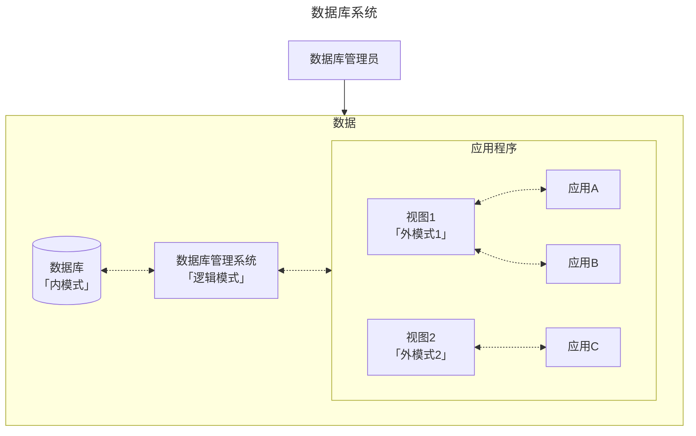

## 前言

教材情况：

|     课程名称     |      选用教材      | 版次 |  作者  |     出版社     |      ISBN 号       |
| :--------------: | :----------------: | :--: | :----: | :------------: | :---------------: |
| 数据库原理与应用 | 《数据库系统概论》 |  6   | 王珊等 | 高等教育出版社 | 978-7-04-059125-5 |

学习资源：

- 课程官网：[数据库系统概论 (ruc.edu.cn)](http://chinadb.ruc.edu.cn/home)

为什么要学这门课？

> 数据库是时代变迁的产物，掌握数据库对应的知识和技能很有必要。这门课主要学习关系数据库的相关理论并以 openGauss/PostgreSQL 作为实验平台进行实操。可以借这门课系统地学习关系数据库的理论与实操。

会收获什么？

> 关系型数据库的基本概念与使用方法、基于 DBMS 进行应用级的设计与开发、深入 DBMS 的底层了解其存储、优化、恢复等技术。三个分句分别对应全文的「基础理论」、「应用开发」和「系统优化」。

## 基础理论

### 1 绪论

数据库发展范式：人工系统 $\to$ 文件系统 $\to$ 数据库系统

数据库系统概念图：



**数据库的三级模式**：从硬件到应用将一个数据库抽象为三层。其中：

- 内模式：硬件存储数据的方式；
- 逻辑模式：数据库管理的方式，也就是数据存储方式的 **逻辑** 抽象。进而引出后续如何存储数据的「数据模型」概念；
- 外模式：不同的应用对全体数据有不同的访存权限。一个外模式可以对应多个应用程序，但是一个应用程序只能对应一个外模式。

**数据模型**：逻辑模式的具体实现策略。我们需要对现实世界的数据进行抽象进而便于虚拟化存储，以及后续对数据库进行增删改查等操作。从发展角度来看，数据模型一共经历了三个阶段，分别为 **层次模型** $\to$ **网状模型** $\to$ **关系模型** 三个阶段。其中关系模型是数据库「逻辑模式」的实现方式，有以下两个关键点：

- 三要素：数据结构（二维表）、数据操作（增删改查）和关系的完整性约束（每一个实体能通过主键唯一检索、外键引用必须存在、关系要根据业务需求设定完备）；

- 名词对照：关系（一张表）、元组（一行数据）、属性（一个字段）和码（主键）。

### 2 关系模型

#### 2.1 基本概念

我们用 $R = (A_1:D_1,A_2:D_2,...,A_n:D_n,)$ 来逻辑表示一个关系。其中 $R$ 表示关系，$A$ 表示属性，$D$ 表示属性的取值域。以下关键词几乎涵盖了关系的大部分术语。


#### 2.2 关系操作

**关系操作的最小单位是什么**？所有的增删改查操作都是以「元组的集合」为最小单位进行的。

#### 2.3 关系的完整性

**外键是什么？有什么用**？一张表的外键必须是另一张表的主键以确保数据的完整性，因为主键是必须全部存在的。当然，外键也可以引用本表的主键。有了外键就可以实现表与表之间一对多或多对多的关系。

??? note "实例"

    === "一对多"

        例如，一个客户可以购买很多商品，而一个被购买的商品只能隶属于一个客户。

        假设有两个表：`customers` 和 `orders`。`customers` 表保存客户的信息，`orders` 表保存订单信息。每个订单都应该对应一个客户，所以可以使用外键将这两个表关联起来。

        **创建表**

        ```sql
        -- 创建 customers 表
        CREATE TABLE customers (
            customer_id INT PRIMARY KEY,
            customer_name VARCHAR(100)
        );

        -- 创建 orders 表，order_id 是主键，customer_id 是外键，引用 customers 表中的 customer_id
        CREATE TABLE orders (
            order_id INT PRIMARY KEY,
            order_date DATE,
            customer_id INT,
            FOREIGN KEY (customer_id) REFERENCES customers(customer_id)
        );
        ```

        在上述示例中，`orders` 表中的 `customer_id` 是一个外键，它引用了 `customers` 表中的 `customer_id` 列。这样一来，只有在 `customers` 表中存在的 `customer_id` 才能在 `orders` 表中作为合法的 `customer_id`。这确保了每个订单都有有效的客户。

        **插入数据（增）**：当向 `orders` 表中插入一条新记录时，数据库会检查 `customer_id` 是否在 `customers` 表中存在。如果不存在，插入操作会失败。

        ```sql
        -- 插入一条合法记录
        INSERT INTO customers (customer_id, customer_name) VALUES (1, 'Alice');

        -- 插入订单记录，外键 customer_id 存在于 customers 表中
        INSERT INTO orders (order_id, order_date, customer_id) VALUES (101, '2024-09-26', 1);

        -- 尝试插入一个无效的订单记录（客户ID为2在 customers 表中不存在）
        INSERT INTO orders (order_id, order_date, customer_id) VALUES (102, '2024-09-26', 2); -- 会失败
        ```

        **删除或更新时（删 | 改）**：如果试图删除 `customers` 表中的某个 `customer_id`，而该 ID 在 `orders` 表中被引用，会引发外键约束错误。可以通过设置外键的级联操作（如 `ON DELETE CASCADE` 或 `ON UPDATE CASCADE`）来控制这种行为，使删除或更新操作可以自动级联到相关表。

        ```sql
        -- 定义外键时使用级联删除
        CREATE TABLE orders (
            order_id INT PRIMARY KEY,
            order_date DATE,
            customer_id INT,
            FOREIGN KEY (customer_id) REFERENCES customers(customer_id) ON DELETE CASCADE
        );

        -- 删除客户1时，orders 表中所有引用 customer_id = 1 的订单都会自动被删除
        DELETE FROM customers WHERE customer_id = 1;
        ```

    === "多对多"

        例如，一门课程需要多门先修课，而一门课程也可以成为很多课程的选修课。

        这里课程与先修课之间的实体对象是相同的，并且一门课程可以有许多门先修课，而一门课程也可能成为很多课程的先修课，如果还是像一对多那样进行存储，即课程表中增加一列先修课，就会导致先修课列中可能出现多个信息的情况，这也就不符合关系型数据库中的第一范式：原子性。因此我们不得不创建一个新表，也就是 **中间表**，来存储课程和先修课之间的关系。

        **创建表**

        ```sql
        -- 创建 courses 表
        CREATE TABLE courses (
            course_id INT PRIMARY KEY,
            course_name VARCHAR(100)
        );

        -- 创建 prerequisites 表，其中 course_id 和 prerequisite_id 都是外键
        CREATE TABLE prerequisites (
            course_id INT,  -- 课程ID
            prerequisite_id INT,  -- 先修课ID
            PRIMARY KEY (course_id, prerequisite_id),  -- 组合主键
            FOREIGN KEY (course_id) REFERENCES courses(course_id) ON DELETE CASCADE,  -- 课程ID外键
            FOREIGN KEY (prerequisite_id) REFERENCES courses(course_id) ON DELETE CASCADE  -- 先修课ID外键
        );
        ```

        在这个设计中：

        - `courses` 表保存所有课程的基本信息，每门课程都有唯一的 `course_id`。
        - `prerequisites` 表用于表示多对多的先修课关系，其中 `course_id` 是当前课程的 ID，`prerequisite_id` 是该课程的先修课程的 ID。两者都引用了 `courses` 表中的 `course_id` 列，构成多对多的关系。

        **插入数据（增）**

        插入课程记录：

        ```sql
        -- 插入一些课程记录
        INSERT INTO courses (course_id, course_name) VALUES (1, 'Mathematics');
        INSERT INTO courses (course_id, course_name) VALUES (2, 'Physics');
        INSERT INTO courses (course_id, course_name) VALUES (3, 'Computer Science');
        INSERT INTO courses (course_id, course_name) VALUES (4, 'Linear Algebra');
        ```

        插入先修课关系记录：

        ```sql
        -- 课程 Computer Science 需要 Mathematics 和 Physics 作为先修课
        INSERT INTO prerequisites (course_id, prerequisite_id) VALUES (3, 1);  -- Computer Science -> Mathematics
        INSERT INTO prerequisites (course_id, prerequisite_id) VALUES (3, 2);  -- Computer Science -> Physics

        -- 课程 Physics 需要 Linear Algebra 作为先修课
        INSERT INTO prerequisites (course_id, prerequisite_id) VALUES (2, 4);  -- Physics -> Linear Algebra
        ```

        在上述例子中：

        - `prerequisites` 表表示课程之间的先修关系。例如，`Computer Science` 课程的 `course_id` 是 3，它的先修课是 `Mathematics`（`prerequisite_id` 为 1）和 `Physics`（`prerequisite_id` 为 2）。
        - 通过这种方式，可以表示一门课程有多门先修课，同时一门课程也可以作为多门课程的先修课。
        - 插入的 `course_id` 和 `prerequisite_id` 必须都是 `courses` 表中已有的课程，否则会插入失败。

        **删除数据（删）**

        由于在创建表时设置了级联操作 `ON DELETE CASCADE`，因此当我们删除任何一个存在的课程时，与该课程相关的所有先修课信息也都会被级联删除。无论该课程是其他课程的先修课，还是它自身有先修课。

#### 2.4 关系代数

所有的关系运算都可以用符号来表示，符号符合对应的算律。这么表示的目的有助于在理论上对表达式进行化简，从而降低计算开销。

##### 传统的集合运算

并 $\cap$、差 $-$、交 $\cup$ 和笛卡尔积 $\times$ 都是针对两个关系中相同类型的属性组进行的集合运算。除了差，其余运算都有交换律。

##### 专门的关系运算

先补充几个必要的符号表示：

- 元组。在关系 R 中，$t \in R$ 表示 t 是关系 R 的一个元组。$t[A_i]$ 表示元组在 $A_i$ 属性上的分量。
- 取反。针对属性集合 X，取反就是属性全集 U 和属性集合 X 的差。
- 串接。将两个元组左右连接。
- 象集。对于关系 $R(A_1,A_2)$，$A_1$ 的象集就是 $A_1$ 所有取值对应的 $A_2$ 取值集合。

1）选择 $\sigma_F(R)$


- 筛选出关系 R 中符合条件 $F\text{(Filter)}$ 的行；
- 对应 SQL 中的 where 关键词；
- $F$ 按照优先级分别为：$()>\theta>\lnot>\land>\lor$。其中 $\theta=\{ >,<,\ge,\le,=,\ne \}$。

2）投影 $\Pi_A(R)$


- 筛选出关系 R 中含有属性集合 $A\text{(Attribute)}$ 的列；
- 对应 SQL 中的 select 关键词；
- 筛完后可能需要再进一步删除重复的行。

3）连接 $R \Join S$


- 一般连接。筛选出两个关系 R, S 的笛卡尔积 $R\times S$ 中「R 的属性组 A 和 S 的属性组 B」符合条件 $\theta$ 的行（即笛卡尔积的子集）。当关系为取等时，被称为 **等值连接**；当关系为取等并且需要在连接结果中删除这两个相同属性中的一个时，就叫做 **自然连接**；
- 左外连接。当 R 的属性 A 的取值不在 S 的 B 中时，在结果中保留 R 的结果，S 对应的值填 NULL；
- 右外连接。当 S 的属性 B 的取值不在 R 的 A 中时，在结果中保留 S 的结果，R 对应的值填 NULL；
- 外连接。R 与 S 的都保留，另外一个不存在的都填 NULL。

4）除法 $R \div S$


- 对于两个关系 $R(X,Y)$ 和 $S(Y,Z)$，$R\div S$ 的结果 $P(X)$ 是 R 满足下列条件的元组在 X 上的投影：R 在 X 上的象集包含 S 在 Y 上的投影。

??? note "除法运算示例"

    

    

### 3 SQL

本章我们学习 **结构化查询语言 (Structured Query Language, 简称 SQL)**。共有数据定义、数据操纵和数据控制三种操作类型。其中数据控制将在第 4 章的数据完整性展开。

在此之前，有必要知道 DMBS 的层次结构。从最开始的一个机器（例如服务器），机器中下载安装了 DBMS（例如 openGauss），DBMS 中创建了很多的数据库（例如 postgres、experiment 等等），每一个数据库中会有很多的 schema（例如默认的 public 等等），每一个 schema 中可以创建很多的表（例如 student 等等）。

练习网站：

- 相对容易但是后续需要付费：[自学 SQL 网](http://xuesql.cn/)
- 相对困难但是全部免费：[SQL 之母](http://sqlmother.yupi.icu/#/learn)
- 相对最困难但是更加综合：[数据库题库 - LeetCode](https://leetcode.cn/problemset/database/?difficulty=EASY)

#### 3.1 数据定义

我们首先需要使用 `create database <db_name>` 创建一个数据库。

对于数据定义，一共有 **创建 (create)、删除 (drop)、修改 (alter)** 三种操作。按照定义对象的不同有下表所示的语句：

| 操作对象 |      创建       |     删除      |     修改      |
| :------: | :-------------: | :-----------: | :-----------: |
|   模式   | `create schema` | `drop schema` |       -       |
|    表    | `create table`  | `drop table`  | `alter table` |
|   视图   |  `create view`  |  `drop view`  |       -       |
|   索引   | `create index`  | `drop index`  | `alter index` |

**对于模式 `schema`**。可以理解为命名空间，不同的 `schema` 下可以创建同名但功能和用处不同的表。

**对于表 `table`**。就是关系数据库中最基本的存储单元。

**对于视图 `view`**。这是一种抽象的说法，本质上就是通过定义特定的视图，让特定的人看到数据库中特定的数据。命令格式如下：

```sql
create view <视图名>
as <子查询>
[with check option];
```

**对于索引 `index`**。就是通过某种数据结构对表中的某个字段建立索引从而加速查询过程。也就是通过空间换时间的理念，离线建索引，动态查询。常见的建索引的手段包括排序、哈希、B+索引等等。显然，由于是离线操作，每一次对数据的更新都需要重新建立索引，因此对于经常修改数据的场景，就不太适合建立索引。

#### 3.2 数据操纵

有了数据，就可以对其进行操纵。一共有 **增 (insert)、删 (delete)、改 (update)、查 (select)** 四种操作。

???+ note "命令格式"

    === "insert"

        ```sql
        insert into <表名> [(列1, 列2, ..., 列n)]

        -- 插入单条数据 (如果 num 的数量 < 列的数量，则为 null 值)
        values (num1, num2, ..., numn);

        -- 插入子查询结果
        [select ... from ...];
        ```

    === "delete"

        ```sql
        delete from <表名>
        [where <条件>];
        ```

        - 删除一个；
        - 删除多个；
        - 根据子查询结果删除。

    === "update"

        ```sql
        update <表名>
        set <列名>=<表达式>
        [where <条件>];
        ```

        - 修改一个；
        - 修改多个；
        - 根据子查询结果修改。

    === "select"

        ```sql
        -- 选择最终表中需要展示的列。all(默认) 表示不去重，distinct 表示去重。
        select [all | distinct] <列名> [[as] 别名] [aggregate_function(列名) [[as] 别名]]...

        -- 确定关系数据的来源具体是哪些表。
        from <表名/视图名> [as] [别名] ...

        -- 约束元组需要满足的条件。
        [ where <条件表达式> ]

        -- 按照指定的列进行聚合。having 等价于 where 语句，在聚合的条件下进行约束。
        [ group by <列名1> [having <条件表达式>] ]

        -- 按照指定的列进行排序。asc(默认) 表示升序，desc 表示降序。
        [ order by <列名2> [asc | desc] ]

        -- limit 表示限制返回的总行数。offset 表示跳过的行号。
        [ limit <行数1> [offset <行数2>] ];
        ```

1）单表查询

我们在查询数据时，可以从最终需要什么样的数据这个角度来理解查询命令的意义。比如 `select` 是用来 **筛选列数据** 的，而 `where` 以及其他的条件限定语句都是根据元组在每一个字段上具体的取值来 **筛选行数据** 的。

`select`。后面都是跟的列名。1）可以对列名取别名，用 `as` 即可；2）可以在 select 的后面紧跟着 `all` 或 `distinct` 关键字，前者是默认的，表示不对结果去重，后者需要显式的指明表示对结果去重。例如：

```sql
-- 表示对最终结果进行去重
select distinct title, name, time as t
...

-- 表示不对最终结果去重
select title, name, time as t

-- 等价于
select all title, name, time as t
```

`from`。后面跟的是表名或视图名。可以对表名或视图名取别名，用 `as` 即可。例如：

```sql
...
from movie as mv, people
...
```

`where`。后面跟的是条件表达式。可以简单的理解为高级语言中的 if 或 while 后面跟的内容，于是多个表达式之间就可以利用 `and` 或 `or` 进行连接。而既然是表达式，就是那些二元比较运算，如果是字符型还增加了诸如 `like` 的运算符（其中 `%` 表示模糊匹配，`_` 表示精确占位匹配，如果本身就有 `_` 或 `%` 符号，可以用 `\` 进行转义。例如：

```sql
...
where year >= 1990 and title like "%girl_\_and%"
...
```

`order by`。后面跟列名。表示按照某一列进行排序，如果是字符就按照字符对应的数字编码进行排序；例如：

```sql
...
order by year desc
...
```

`limit`。后面跟数字 $x$。表示限定输出 $x$ 行。`offset` 是可选的但是只能跟在 `limit` 的后面，后跟数字 $y$ 表示忽略前 $y$ 行。例如：

```sql
...
-- 若首行为第1行，下面的语句表示输出 [6,15] 行
limit 10 offset 5
...
```

2）连接查询

当某个对象的属性散落在多个表时，单表查询已经无法满足我们的需求了，此时就需要使用连接关键字 `join` 操作来实现多表查询。共有 4 种连接方式，与 ch2.4 关系代数中介绍的连接逻辑完全一致，分别为内连接 `[inner] join`、左外连接 `left [outer] join`、右外连接 `right [outer] join` 和外连接 `full [outer] join`。

注：中括号表示对应的关键字是可选的；内连接其实可以不用写 `join` 关键字的。

现在我们进行一个小练习。对于下面的两张表结构，查询 SC 表中 SC ='c1' 的课程成绩最高的学生学号、姓名和成绩。


仅用「内连接」的实现方法如下：

```sql
-- 方法一：倒序取首个
select student.ssno, sname, grade
from student, sc
where student.sno = sc.sno and cno = 'c1'
order by grade desc
limit 1;
```

3）嵌套查询

现在我们需要在某个子查询的基础之上继续进行查询，就需要用到嵌套查询，具体分为以下四类：

- 带有 `in` 谓词的子查询；
- 带有 `比较运算符` 的子查询；
- 带有 `any(some)/all` 谓词的子查询；
- 带有 `exists` 谓词的子查询。实现逻辑表达：$(\forall y)p\to q \iff \lnot \exist y (p \land \lnot q)$。

值得注意的是：子查询不能加 `order by` 语句，因为根据 DBMS 的执行顺序，排序只能在查询出全部结果后对 `select` 中的内容进行排序。

现在让我们使用「内连接+嵌套查询」的方法完成上述例题：

```sql
-- 方法二：查询一个学生，其成绩是对应课程的最高分
select student.ssno, sname, grade
from student, sc
where student.sno = sc.sno and cno = 'c1' and grade = (
    select max(grade)
    from sc
    where cno = 'c1'
);

-- 方法三：查询一个学生，其成绩是 >= 对应课程的最高分
select student.ssno, sname, grade
from student, sc
where student.sno = sc.sno and cno = 'c1' and grade >= all(
    select grade
    from sc
    where cno = 'c1'
);
```

4）集合查询

对多个查询结果进行并 `union`、交 `intersect`、差 `except` 操作。显然的，集合查询需要参与查询的表之间具有完全相同的属性组以及属性值域。例如下面的集合查询语句：

```sql
-- 并集：查询CS系年龄不大于19岁的学生
select * from student where sdept = 'CS'
union
select * from student where age <= 19;

-- 交集：查询既选了1号课又选了2号课的学生
select sno from sc where cno = '1'
intersect
select sno from sc where cno = '2';

-- 差集：查询CS系年龄不大于19岁的学生
select * from student where sdept = 'CS'
except
select * from student where age > 19;
```

5）基于派生表的查询

如果我们想要在一次查询中扩大数据源，就可以在 `from` 中嵌套一个派生表。注意，嵌套的表属于一个临时表，在查询结束后就会自动销毁。例如下面的基于派生表的查询语句：

```sql
select name
from student, (select grade from sc)
where ...;
```

### 4 完整性

所谓完整性，就是确保数据库中的数据是正确的，对应了「数据控制」逻辑。当然，这是 DMBS 的内部机制。那什么时候会出现不正确的数据呢？主要存在于「定义结构、增数据、删数据和改数据」四个场景。针对这些可能出现不正确数据的场景，DMBS 一般都会有以下三种机制：**实体定义完整性**、**完整性检查** 和 **违约处理**。接下来将从「主键、外键和用户定义」三个角度进行讲解与举例。

#### 4.1 实体完整性

定义完整性。创建表时必须设置主键；

完整性检查。增、删、改；

违约处理。拒绝。

#### 4.2 参照完整性

定义完整性。创建表时外键必须引用其他表的主键；

完整性检查。增、删、改；

违约处理。拒绝、级联、设置为空。

#### 4.3 用户定义完整性

定义完整性。创建表时，针对不同的列可以设置：非空 `not null`、不重复 `unique`、值域限定 `check (condition)`；

完整性检查。增、改；

违约处理。拒绝。

#### 4.4 约束命名子句

为了更好的设置、删除约束，可以使用形如 `constraint <约束名称> <约束条件>` 的 **完整性约束命名子句**。这样一个表就不会被写死，格式一般为：

```sql
alter table <table_name>
[add constraint <约束名称> <约束条件>]
[drop constraint <约束名称>]
```

#### 4.5 触发器

关于触发器的定义。触发器 (trigger) 是建立在表之上的，当表触发了某些事件后，定义在这张表之上的触发器就会被激活。触发器的创建语句为：

```sql
create trigger <触发器名>
{before | after} <事件> on <表名>
referencing {new <info> | old <info>} as <变量>
for each {row | statement}
<触发动作>
```

其中 `row` 表示按行触发，`statement` 表示按语句触发。对于修改行较多的语句，此时如果是按行触发就会导致性能开销很大。

关于触发器的执行顺序。如果一张表上定义了多个 `before` 和 `after` 的触发器，一般情况下执行顺序为 `before` $\to$ SQL $\to$ `after`。对于所有的 `before` 或 `after` 类型的触发器，一般都是按照创建顺序执行。

关于触发器的删除方法。使用 `drop trigger <触发器名> on <表名>` 即可。

## 应用开发

### 5 关系规范化

对于一个关系，我们不能量化的判定其好坏程度，仅靠经验是很难保证这样的关系在未来会不会出现问题，因此本章我们将从理论的角度来分析一个关系模式的好坏程序。主要学习关系模式的规范化理论，至于如何规范表，可以通过拆解属性的方式实现。

现在定义一个关系模式为 R(U, F)，U 表示关系属性，F 表示函数依赖。规范化有不同等级的范式，关系模式从低等级的范式 (Normal Form) 到高等级的范式的过程就叫做规范化。

**1NF**：即原子性，每一个属性不可再分；

**2NF**：对于满足 1NF 的关系模式，每一个非主属性都完全函数依赖 **候选码（能决定整个元组的属性/属性组）**，就称为满足 2NF。

??? note "不满足 2NF 的关系模式以及错误情况分析"

    对于下面的「学院学生选课」函数依赖关系：

    

    主码为 Sno 和 Cno 用方框框出；非主属性为 Grade，School 和 Sloc；实线表示完全函数决定，虚线表示部分函数决定。下面给出上述关系模式是否满足 2NF 的分析：

    - Grade 完全函数依赖候选码，即主码完全决定 Grade，记作 (Sno, Cno $\xrightarrow[]{F}$ Grade)
    - School 不是完全依赖函数候选码，因为候选码的子集 Sno 就可以完全决定 School，即主码部分决定 School，记作 (Sno, Cno $\xrightarrow[]{P}$ Grade)
    - Sloc 与 School 类似，也不是完全函数依赖候选码。

    通过上面对 3 个非主属性的依赖分析可以发现，并不满足 2NF 的规范化约束，因此这个关系模式不满足 2NF。

    一旦不满足 2NF，就会出现下述级联错误：

    - 插入错误：有学号有学院和住所，但是还没选课，那么这条数据就插不进去；
    - 删除错误：只选了一门课，退选的时候就连带着学号全删了；
    - 修改复杂：如果某个学生的学院 School 发生了改变，那么该学生的每一条选课信息都需要修改学院和住所 Sloc。

**3NF**：对于满足 2NF 的关系模式，假设主码为 X，非主码有 Y 和 Z，不允许出现 X 决定 Y，Y 又决定 Z 的传递依赖，否则还是会出现级联错误。例如下表 $\text{DemoTable}(\underline{Sno}, School, Sloc)$ 就不满足 3NF：


**BCNF**：决定集要包含候选码。对于满足 2NF 的关系模式，假设主码为 (X, Y)，非主码为 Z，不允许出现 X 决定 Z，Z 又决定 Y 的传递依赖，否则还是会出现级联错误。例如下表 $\text{DemoTable}(\underline{S, J}, T)$ 就不满足 BCNF：


至此已经介绍完所有函数依赖相关的范式。理论是枯燥的，但是能够确保数据库的高效与安全。

- **如果不满足范式会有什么问题**？1NF 很显然，就不多说；2NF 会出现诸如「增、删、改」的问题；而 3NF 和 BCNF 会出现「改」的问题；
- **如何解决不满足范式的关系模式**？对关系模式进行分解。如果出现了 2NF 中的部分函数依赖，那就拆成只有完全函数依赖；如果出现了 3NF 或 BCNF 中的传递依赖，那就拆成没有传递函数依赖。

**多值依赖**：现在不会出现错误了，但是仍然会导致「增、删、改」的复杂。当同时存在 $A\to \to B, A\to \to C$ 时，拆成 $R(A, B)$ 和 $R(A, C)$ 即可。

**4NF**：如果有非平凡多值依赖（不存在空值），则该属性（组）必须依赖于候选码。如果多值依赖有空值，则一定满足 4NF。

### 6 数据库设计

现在我们拉到了一个甲方，需要根据甲方的需求设计一个数据库。完整流程共分为六个阶段，如下图所示：


本章我们主要学习概念结构和逻辑结构的设计。在开始之前，再对绪论中数据库的各级模式做一个补充：


#### 6.1 概念结构设计

学会设计 E-R 图，即（Entity-Relation 实体关系图）。实体用矩形表示，关系用菱形表示，实体的属性用椭圆形表示。如果一个实体的属性需要和别的实体发生关系，那么这个属性就不能作为属性而应该拉出来单独作为一个关系。

#### 6.2 逻辑结构设计

利用上述得到的 E-R 图落实到具体的关系型 DBMS 中。要考虑到关系的完整性以及范式，一般的：

- 一对一和一对多的关系可以只保留其中的一个实体，另外的一个实体作为保留实体的属性而存在；
- 多对多关系的实体就必须要单独创建一个表来存储这样的关系。

## 系统优化

### 7 存储管理

#### 7.1 数据组织

对于变长字段，可以通过额外维护「字段所在的首地址」和「占用字节数」两个信息来维护。

#### 7.2 索引结构

最常见的是 B+ 树的索引结构，具体见 [OI-Wiki](https://oiwiki.org/ds/bplus-tree/) 上的讲解。当然还有诸如哈希索引、位图索引等索引结构。通过索引结构，可以让索引长期保持在内存中，减少系统的 I/O 次数从而加速查询操作。

### 8 查询优化

对于一个查询语句， DBMS 将会首先对其进行分析和检查操作得到一棵语法树。接着对其进行逻辑优化（代数优化）和物理优化，并生成最终的查询代码，执行此查询代码即可得到最终的查询结果。其中最重要的就是对语法树进行优化的过程。本章我们就将学习 DBMS 对语法树进行优化的策略，最后再补充介绍 DBMS 执行语法树的顺序。

一个查询语句的执行流程如下图所示：


以下面这个查询语句为例：

```sql
select
    student.sname
from
    stdent, sc
where
    student.sno = sc.sno and sc.cno = '81003';
```

很容易得到对应的语法树如下：


下面开始进行优化。此处我们只介绍「选择」和「连接」两种语句的优化策略，具体见各 DBMS 的实现文档。

**逻辑优化**。对于逻辑优化，最基本的就是先选择，再做连接。然后就是投影操作可以在元组扫描的时候一次性做好。那么对于上述语法树而言，就可以得到如下的逻辑优化结果：


**物理优化**。选择和逻辑优化分开讲解：

- 对于选择，物理优化策略就是到底需不需要进行索引。对于小表或者命中率高的场景，就直接使用 **全表扫描**，对于大表或命中率低的场景，就可以考虑使用 chapter9.2 中的 **索引扫描**。最常见的就是使用 B+ 树索引；
- 对于连接，物理优化策略就是连接算法的选择。若两表的连接属性都已经是有序的了，可以考虑排序 **合并连接**（sort-merge join）算法；若两表的连接属性中至少有一个含有索引，则可以考虑 **索引连接**（index join）算法；若上述两条都不适用，但其中一个表较小，则可以考虑使用 **哈希连接**（hash join）算法；最后可以考虑 **嵌套循环连接**（nested loop join）算法。

最后简单讲讲查询计划的执行顺序。对于上图逻辑优化后的语法树。要么自上而下，每一个结点向子结点请求数据，要么自下而上，每一个结点向父结点发送数据。总的来说都是基于优化后的树结构进行的查询执行。

### 9 数据库恢复技术

本章我们主要学习数据库四大特性 ACID 中的 ACD，即原子性（Atomicity）、一致性（Consistency）和持久性（Durability）。至于隔离性（Isolation）属于并发板块，这里不进行讨论。

在数据库中，类似于操作系统中的原语操作被称为事务（Transaction）。一般而言，在未显式定义事务的情况下，DBMS 默认每一条 SQL 语句都是一个事务。当然，为了防止并发错误，我们可以显式的定义一组 SQL 语句作为一个事务来避免可能的并发错误。例如对于银行转账的场景，我们可以显式的定义如下伪 SQL：

```sql
begin transaction
amount = 转账金额
balace = 甲的余额
if (balance - amount) < 0
    rollback
else
    甲的余额 - amount
    乙的余额 + amount
commit;
```

对于一个事故故障，我们会对所有的事务进行重做 (ReDo) 和回滚 (UnDo) 操作。具体的，当事故发生时，对于一个已经 commit 的事务，就需要进行重做操作，对于一个还没有 commit 的事务，就需要进行回滚操作，以此来确保数据库恢复时数据的正确性。
