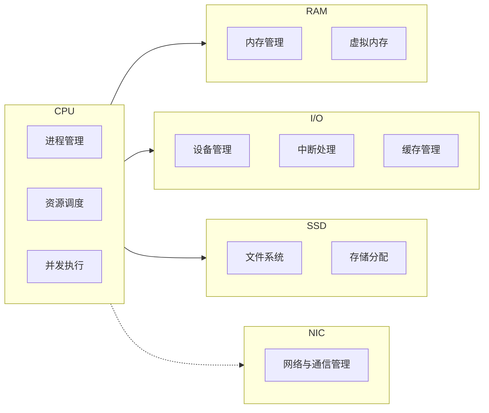
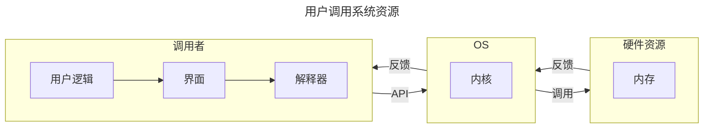
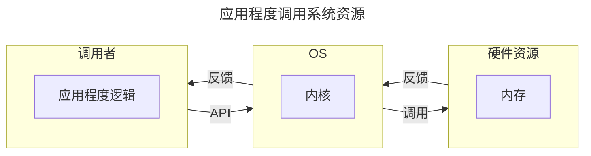
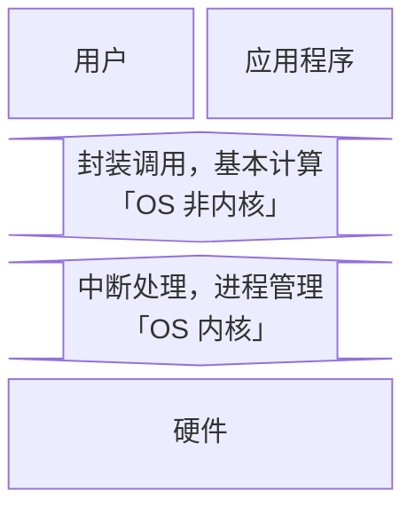

本文记录操作系统的学习笔记，推荐 NJU 蒋炎岩老师的课程 [^nju-os] [^nju-os-slide]，我与同学共同完成了进程调度、连续存储和页式存储的模拟逻辑的代码 [^os-simulate]。

[^nju-os]: [2024 南京大学 “操作系统：设计与实现” | JYY - (space.bilibili.com)](https://space.bilibili.com/202224425/channel/collectiondetail?sid=2237004)
[^nju-os-slide]: [蒋炎岩课程配套讲义 | JYY - (jyywiki.cn)](https://jyywiki.cn/OS/2024/)
[^os-simulate]: [OS Simulation | Explorer-Dong - (github.com)](https://github.com/Explorer-Dong/OS_Simulate)

**为什么要学这门课**？目前无论是考研还是互联网行业求职，操作系统似乎一直深受青睐。在对操作系统有了一点粗浅的认知后，我做出了这样的人机类比，尝试解释为什么操作系统会有如今这般重要的地位：对于任何一种具备交互、计算功能的电子计算机而言。不同的「模块」就是不同的器官，承担了各自的责任和义务（毋庸置疑 CPU 就是心脏）；源源不断的「电能」就是循环不止的血液，确保所有的细胞能及时的进行呼吸以正常工作；「主板」则承担了骨架与神经的指责，搭载了所有的模块并确保数据可以在不同的模块之间自由的流通；而「操作系统」则肩负起肌肉的责任，从 CPU 的心肌泵动开始让整台计算器健康地运作。

**会收获什么**？能详细地解释下面的过程中电脑都发生了什么：按下电源键，网络连接，蓝牙连接，启动网易云音乐播放器软件并开始播放，启动谷歌浏览器并进入力扣网站，启动 Pycharm 集成开发环境软件编写代码并运行测试，关闭 Pycharm，关闭谷歌浏览器，关闭网易云，断开蓝牙，断开 WIFI 连接，关机。记得多想想：是什么？为什么？会怎么样？当然也可以想想：可以比它更优吗？比如：什么是【操作系统】？为什么会有【操作系统】？有了【操作系统】会怎么样吗？可以用别的策略代替吗？上述的【操作系统】可以替换为任意一个名词或短语。

## 硬件视角下的操作系统

## 操作系统的定义

- 对于硬件。操作系统封装所有的硬件资源，并抽象出系统调用接口供外部调用。
- 对于用户和软件。操作系统通过提供抽象好的 API 给软件和用户提供运行和计算服务。

## 操作系统管理资源的方式

主要有三个技术。资源复用、资源虚拟化和资源抽象。后两个技术都是从第一个技术衍生而来，个人认为很多东西的解释都被复杂化了。

- 资源复用。其实根本没有复用，这只是相对于一开始的时候，一台计算机只能一次运行一个程序而言的。现在一台计算机需要同时运行很多程序，怎么办呢？既然程序运行需要计算资源，那我直接把计算机中的资源划分成很多份不就好了。当然了，除了内存进行空间上的划分，时间上也可以划分，比如 CPU，于是就有了资源复用中「空分复用」和「时分复用」两个理念。
- 资源虚拟。其实就是名词学术化的资源复用。比如，我将物理世界中的硬件，通过操作系统的划分与调度，将其转化为逻辑世界中的多个资源，也就是所谓的将「单一物理资源」虚拟化为「多个逻辑资源」的理念。
- 资源抽象。就是一种底层封装，顶层调用的思想。比如，对于每一个进程而言，都获得了操作系统为 ta 单独分配的 CPU 状态集和内存空间，而无需关心这些硬件资源是怎么分配给 ta 的。比如，对于每一个文件而言，都是对物理存储空间的抽象。

## 操作系统的特点

并发性、共享性和异步性。都很好理解。并发就是多个进程任务同时进行，但其实是操作系统的一个小把戏，让 CPU 在极短的时间间隔内频繁地切换执行不同的进程；共享是并发的衍生，我们知道程序执行是需要消耗资源的，而资源有限，因此我们可以让所有的进程共享同一块资源；而异步就是指一个任务在等待其他任务执行时，不会阻塞整个系统，等到其他任务执行结束或者切换到当前任务时，可以继续 ta 的执行。**所以这么折腾到底是为了啥**？可以从两个角度出发：

1. 对于一个任务而言：这样做可以 **提升资源利用率**。因为一个进程在执行时，任务会有很多，不仅仅需要 CPU 的状态计算，可能还需要和别的设备进行数据交互，我们知道 CPU 的计算效率远高于诸如 I/O 之类的设备，这就会让系统停下来等待进程执行其他的任务。我们就可以利用系统停下来等待的这段时间，把这个进程的其他任务给执行了。同时，如果一个任务可以被划分为多个子任务，也可以并发以提升资源利用率。
2. 对于多个任务而言：可以 **提升系统响应效率**。多个用户同时提交请求？是一个一个响应，最快的极快，最慢的很慢。还是牺牲一点速度，大家都慢一点但是都没那么慢，同时响应？显然是后者。

## 操作系统对上层提供服务的方式

一句话概括就是，操作系统将封装好的应用程序接口 (Application Program Interface, API) 给用户或应用程序调用。例如下面的两个流程图：

## 为什么让操作系统对下层抽象进而为上层提供服务？

因为下层的硬件电路十分繁杂，并且不同厂商生产的硬件可能会有使用上的不同。通过操作系统对下层硬件的封装，不仅可以隐藏复杂的硬件资源调度，还可以统一出一种普适性更高的接口规则供上层服务使用。

## 操作系统的内核是什么？操作系统的其他部分是什么？为什么要这样区分？

首先我们有必要了解「用户态」和「内核态」的概念。这两种状态定义了应用程序的指令执行权限，当程序运行在用户态时，不可以执行一些关键的指令，例如中断、网络通信等；但当程序运行在核心态时，可以执行所有指令。不难发现隔离化的运行模式相比于所有应用程序都有最高指令执行权限来说，可以进一步提升程序运行时系统的安全性。于是乎，操作系统的内核概念应运而生。

知道了指令执行权限隔离的程序运行理念后，再来理解操作系统的内核就很显然了。我们知道操作系统本质上就是一系列的系统软件，我们将操作系统中直接与硬件交互的软件划分到一起并称为「内核」，代表性内核软件可以实现的功能如「中断处理，进程管理」。操作系统剩余的部分就被划分为「非内核」部分，用于和应用程序直接交互，代表性非内核软件可以实现的功能形如「提供系统调用接口，基本计算」。当程序运行在用户态时，仅可以和操作系统的非内核部分交互；当切换到核心态时，就可以操作系统包括内核的所有部分交互。

