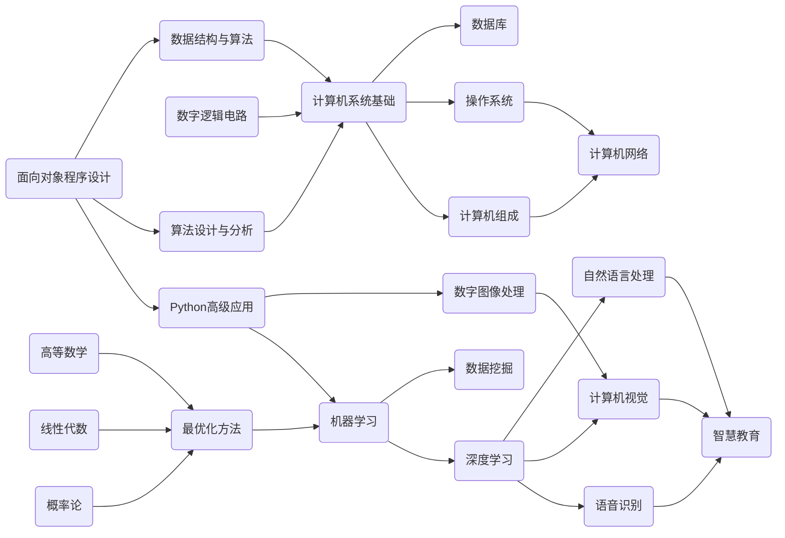
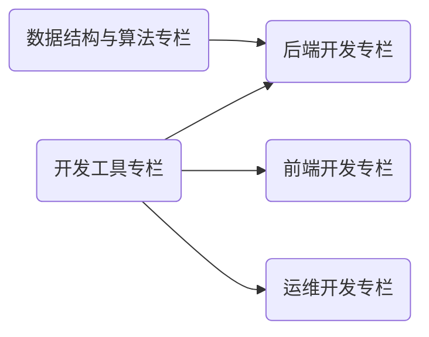

<h2 align="center">本站定位</h2>

欢迎访问我的知识（Wiki）网站！本网站托管了个人从本科开始记录的 **课程笔记** 与 **技术文章**。内容按照 Markdown 格式撰写，站点采用 MkDocs 框架编译，云端基于 GitHub Pages 与 Aliyun Server 双平台部署。

*[Wiki]: 一种允许一群用户用简单的描述来创建和连接一组网页的社会计算系统。

<h2 align="center">共建社区</h2>

若您有 **意见或建议**，欢迎参与贡献！贡献者名单将会出现在对应页面的底部，也会给您的 GitHub 账户累计贡献积分。详细的贡献方式如下：

- 评论区留言：`下滑至页面的最低部 >> 点击登录 >> 输入您的宝贵意见或建议`；
- 修改文章 / 新增内容：`点击网站右上角的小猫娘前往网站仓库 >> 点击右上角 Fork 按钮 >> 回到原来的网站页面点击右上角铅笔按钮 >> 编辑内容后向我发起 pull request`，当然您也可以将仓库克隆至本地，按照 `.github/workflows/bot.yml` 文件指引安装构建文档所需的依赖环境，完成修改 / 新增后推送至仓库并向我发起 pull request。

<h2 align="center">行文规范</h2>

本站点行文格式主要参考 [OI Wiki 格式手册](https://oi-wiki.org/intro/format/)。其中，文章标题为 H2 至 H4，低于 H4 等级的标题不应再出现，可以用段首加粗的形式呈现。根据该格式，您可以对每一篇文章有一个整体的阅读把握。

<h2 align="center">站点地图</h2>

正如在一开始介绍的那样，本站的定位是「课程笔记」与「技术文章」，下面的两张拓扑图覆盖了本站的全部内容。

<figcaption>拓扑图1. 课程笔记</figcaption>

<figcaption>拓扑图2. 技术文章</figcaption

