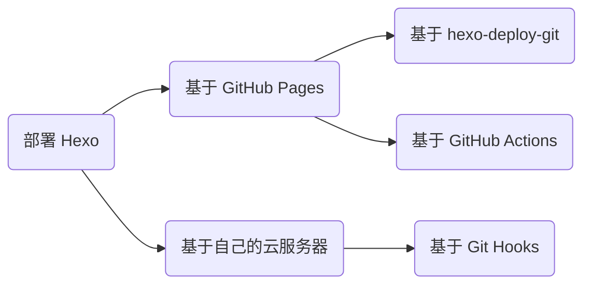

## 前言



## 基于 hexo-deploy-git

该方法在「Hexo 建站指南」中已详细介绍，不再赘述，见：<https://blog.dwj601.cn/FrontEnd/Hexo/build-your-own-website-with-hexo/#部署云端>。

## 基于 GitHub Actions

该方法可以利用 GitHub Actions 的 CI/CD 功能，省去「本地构建」与「手动部署」的操作，让 GitHub 平台帮助我们完成这两步操作，从而让我们只需要像维护项目代码一样专注于内容创作与版本管理，而无需关心其他任何事情。下面以「源码和站点同属一个仓库」的情景为例介绍具体地操作与工作流配置。

1）创建一个空 GitHub 仓库、创建一个鉴权 token（该 token 可以让 GitHub Actions 以你的身份操作你的仓库）、赋予 GitHub Actions 读写权限

创建一个鉴权 token：`头像 >> Settings >> Developer settings >> Personal access tokens >> Tokens (classic)`


赋予 GitHub Actions 读写权限：`Settings >> Actions >> General >> Workflow permissions`


2）初始化一个博客项目

```bash
hexo init
```

3）编辑 _config.yml 文件中的 url 字段

```yaml
url: https://explorer-dong.github.io/demo-github-actions
```

4）创建工作流文件 .github/workflows/bot.yml 并编辑如下内容

```yaml
name: Build and Deploy
on: [push]
jobs:
  build-and-deploy:
    runs-on: ubuntu-latest
    steps:
      # 相当于 git clone 到服务器
      - name: Checkout 🛎️
        uses: actions/checkout@v4
        with:
          persist-credentials: false

      # 安装依赖并生成页面
      - name: Install and Build 🔧
        run: |
          npm install -g hexo-cli --save
          npm install
          hexo generate

      # 部署
      - name: Deploy 🚀
        uses: JamesIves/github-pages-deploy-action@v4
        with:
          token: ${{ secrets.GITHUB_TOKEN }}
          branch: gh-pages   # 存储站点的分支
          folder: public     # 构建出来的待部署的站点文件夹名称
```

5）初始化 Git 版本管理并连接到远程仓库

```bash
# 初始化
git init
git add .
git commit -m 'init'

# 连接远程仓库
git remote add origin https://github.com/Explorer-Dong/demo-github-actions.git

# 首次推送
git push -u origin main
```

6）在 GitHub Pages 上配置站点托管分支 `Settings >> Pages >> Build and deployment`


GitHub Pages 按照上述工作流的指令，检测到 push 后开始执行，即 checkout、generate 和 deploy。等待所有流程结束后，重新加载 `https://<username>.github.io/<project>/` 就可以发现站点已经托管成功了！

## 基于 Git Hooks

由于使用 Github Pages 服务访问速度过慢（因为托管的服务器在国外），使用 Gitee Pages 又不能自定义域名。故综合考虑还是部署到自己的国内服务器上。加上网上相关内容不是时间长远，就是环境不一，而且感觉都是一个人写完以后大家照着抄的，几乎都长一样。所以决定自己也整理一下（也抄一篇），并且补充相关原理。本篇博客将以阿里云 Ubuntu22.04 为例，介绍如何将自己的 hexo 静态博客项目部署到属于自己的服务器上并持续集成。

在开始之前，你应已具备以下条件：

- 已国内备案的[云服务器](https://www.aliyun.com/daily-act/ecs/activity_selection?userCode=jpec1z57)
- 基本的 [hexo](https://blog.dwj601.cn/FrontEnd/Hexo/hexo-learning-record/) 部署知识
- 基本的 [linux](https://explorer-dong.github.io/categories/Operation/Ubuntu/) 运维知识
- 基本的 [git](https://blog.dwj601.cn/DevTools/Git/git-learning-record/) 指令

其实具备了上面的条件以后，就可以将我们的 hexo 静态博客项目部署并公开访问了。即直接通过 shell 连接工具（以 Mobaxterm 为例），连接上自己的服务器之后，上传本地 hexo 项目的 public 文件夹到服务器的指定目录下，最后通过 nginx 代理一下即可。但是这样做有一个问题就是，不够便捷~~装13~~，尤其是当文章内容较多、文章改动频繁并且想要实时与用户共享的时候，这样的手动操作挺麻烦的并且都是重复工作。那么有什么方法可以解决吗？有的！我们可以利用 hexo 的 deploy 命令，结合 Git 的 hooks 工作流进行自动部署！只需要本地执行 hexo 的部署三步曲，即可实现实时更新部署并公开访问。那么接下来我们就开始操作吧！

### 1. 服务器厂商端：域名解析

第一步我们需要将自己的域名指向自己的服务器。我采用的是二级域名的方式，实现的是 `xxx.example.cn` 访问博客的效果，若想要实现 `example.cn/userblog/` 访问博客的效果，可以修改 hexo 的 `_config.yml` 文件，指定根路径的前缀 url 即可。


### 2. 服务器端：配置服务器 Git 用户与钩子

#### 2.1 新建服务器用户

由于 root 用户的权限过大不够安全，因此我们创建一个新用户并赋予持续集成权限。

- 创建新用户。名称任取，假设就叫 `git`

    ```bash
    useradd git
    ```

- 修改新用户密码。后续采用 SSH 免密通信，因此这个密码无所谓

    ```bash
    passwd git
    ```

- 编辑 `/etc/sudoers` 文件，在 `root ALL=(ALL:ALL) ALL` 后追加一句

    ```bash
    git ALL=(ALL:ALL) ALL
    ```

#### 2.2 创建 Git 钩子

与 Github Pages 自动部署的工作流逻辑类似，我们将静态文件推送到云服务器后，也需要有 robot 来帮我们自动部署、持续集成项目。因此我们需要创建一个 robot，而这个robot 就是 git hooks。

- 创建一个 git 裸仓库

    ```bash
    mkdir /home/repo/blog.git
    cd /home/repo/blog.git
    git init --bare
    ```

- 创建钩子文件用来检测仓库动态

    ```bash
    cd hooks
    touch post-receive
    ```

- 编辑钩子文件，在 post-receive 文件中输入以下内容

    ```bash
    # --work-tree 表示网站的根路径
    # --git-dir   表示 Git 仓库路径
    git --work-tree=/home/www/blog --git-dir=/home/repo/blog.git checkout -f
    ```

- 为钩子文件授予可执行权限

    ```bash
    chmod +x /home/repo/blog.git/hooks/post-receive
    ```

- 将仓库目录的所有权移交给 git 用户

    ```bash
    chown -R git:git /home/repo
    ```

- 将 hexo 部署目录的所有权移交给 git 用户

    ```bash
    chown -R git:git /home/www/blog
    ```

### 3. 服务器端：建立 SSH 通信

为了后续进行持续集成时仅仅使用 hexo 的三步部署命令，我们需要建立起本地 PC 机与远程服务器的网络传输连接，连接是需要加密的，也就少不了密码的输入。而 SSH 解决了这一问题，我们只需要建立好本地机与远程服务器的 SSH 连接，即可实现不输入密码的持续集成操作。

我们首先在**本地**生成一对密钥，其中包含公钥和私钥。我们需要将公钥上传云服务器，后续连接时会自动使用本地的私钥进行匹配。请一定确保私钥在你本地 PC 端的私密性。

- 使用 Git Bash 终端生成一对密钥，连续三次回车即可生成默认配置的密钥对

    ```bash
    ssh-keygen
    ```

    

- 在 `/home/git` 目录下右键新建名为 `.ssh` 的文件夹，并在该文件夹内新建名为 `authorized_keys` 的文件，将之前生成的公钥文件中的所有内容复制进去，保存

- 对相关文件赋予权限

    ```bash
    chmod 600 /home/git/.ssh/authorized_keys
    chmod 700 /home/git/.ssh
    ```

- 将 .ssh 文件夹及其内的文件权限转移给 git 用户

    ```bash
    chown -R git:git /home/git/.ssh
    ```

- **本地**测试 ssh 连接，首次连接需要输入一个 `yes` 用来在本地存储主机信息

    ```bash
    ssh git@xxx.xxx.xxx.xxx
    ```

    如果不需要输入密码就进入了命令行界面，表示 ssh 通信建立成功！

    

### 4. 服务器端：配置 Nginx 反向代理

编辑 nginx.conf，将网站的根路径设置为上述的 `--work-tree`。我是这样配置的：

```nginx
server {
    listen 443 ssl;
    server_name blog.dwj601.cn;

    ssl_certificate      /etc/nginx/ssl/blog.dwj601.cn.pem;
    ssl_certificate_key  /etc/nginx/ssl/blog.dwj601.cn.key;

    ssl_session_cache    shared:SSL:1m;
    ssl_session_timeout  5m;
    ssl_ciphers  HIGH:!aNULL:!MD5;
    ssl_prefer_server_ciphers  on;

    location / {
        root /home/www/blog;
    }
}
```

### 5. 本地端：配置 Hexo 的部署任务

我们在本地的 Hexo 项目中，编辑 `_config.yml` 文件中的 deploy 任务：


最后我们在本地只需要执行 `hexo clean && hexo generate && hexo deploy` 即可实现一步部署到自己的服务器！可以进入上述 `--work-tree` 目录，即在钩子文件中配置的网站根目录查看文件是否存在：


### 原理


#### Git Hooks 是什么？工作原理是什么？

可以将其类比 github workflows，可以在我们做出某些行为的前后自动执行一些我们预设定的任务。此处使用到的就是 post-receive 任务，[原文](https://git-scm.com/docs/githooks#post-receive)是这样解释的：

> This hook is invoked by [git-receive-pack[1\]](https://www.git-scm.com/docs/git-receive-pack) when it reacts to `git push` and updates reference(s) in its repository. It executes on the remote repository once after all the refs have been updated.

即当其接收到 push 任务并且存储库的索引被更新后，该钩子就会执行其中的内容。我们利用其特点，在将我们的 hexo 项目 push 到服务器后，执行其中的部署指令，即可实现自动部署、持续集成的功能。

#### SSH 是什么，工作原理是什么？

可以简单的将其理解为一种用来连接本地客户端与远程服务器的通信隧道。下面是[较为官方](https://info.support.huawei.com/info-finder/encyclopedia/zh/SSH.html)的解释：

> SSH（Secure Shell，安全外壳）是一种网络安全协议，通过加密和认证机制实现安全的访问和文件传输等业务。传统远程登录和文件传输方式，例如Telnet、FTP，使用明文传输数据，存在很多的安全隐患。随着人们对网络安全的重视，这些方式已经慢慢不被接受。SSH协议通过对网络数据进行加密和验证，在不安全的网络环境中提供了安全的网络服务。作为Telnet和其他不安全远程shell协议的安全替代方案，目前SSH协议已经被全世界广泛使用，大多数设备都支持SSH功能。

用一张图来更加清晰直观的理解：


### 参考

[基于Hexo的静态博客网站搭建并部署至云服务器](https://www.glimound.com/build-hexo-blog/)

[Linux chmod命令](https://www.runoob.com/linux/linux-comm-chmod.html)

[Linux chown 命令](https://www.runoob.com/linux/linux-comm-chown.html)

[Git Hooks](https://githooks.com/)

[githooks - Hooks used by Git](https://git-scm.com/docs/githooks)

[什么是SSH？](https://info.support.huawei.com/info-finder/encyclopedia/zh/SSH.html)
