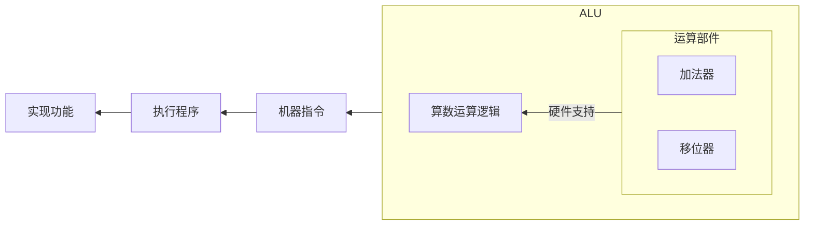

## 计算机组成原理

## 前言

学科地位：

| 主讲教师 | 学分配额 | 学科类别 |
| :------: | :------: | :------: |
|  闫文珠  |   3.5    |  自发课  |

成绩组成：

| 作业+实验 | 期末 |
| :-------: | :--: |
|    50%    | 50%  |

教材情况：

|    课程名称    |         选用教材         | 版次 |  作者  |     出版社     |      ISBN 号      |
| :------------: | :----------------------: | :--: | :----: | :------------: | :---------------: |
| 计算机组成原理 | 《计算机组成与系统结构》 |  3   | 袁春风 | 清华大学出版社 | 978-7-302-59988-3 |

最基本的计算机硬件普及：

- [【硬核科普】从零开始认识主板](https://www.bilibili.com/video/BV1xQ4y1b7JS/)
- [【硬核科普】从零开始认识显卡](https://www.bilibili.com/video/BV1xE421j7Uv/)

为什么要学这门课？

> 上上学期学习了《数字逻辑电路》，云里雾里；上学期学习了《计算机系统基础》，继续云里雾里。本学期开始学习《计算机组成原理》？如果用一句话来概括我对数字逻辑电路的理解，大概可以这样说：原来计算机是一个由“门电路”、“导线”和“时钟脉冲”组成的机器。如果用一句话来概括我对计算机系统基础的理解，大概可以这样说：原来计算机所有的活动都是由翻译过来的 01 序列驱动的。
>
> 现在我们让 AI 模仿上面我对课程理解的概括逻辑，用一句话来概括计算机组成原理，ta 是这样回答的：**原来计算机的高效运作是通过硬件架构的精妙设计，将复杂的指令和数据流转化为有序的电子信号运动来实现的**。
>

会收获什么？

> 对计算机整体有一个宏观的把握，了解 CPU、存储和 I/O 设备的工作逻辑，尤其要熟悉单核 CPU 的工作逻辑。最后能够利用 verilog 硬件描述语言从逻辑上实现一个单核 CPU。
>

注：

> **本书 ISA 采用 MIPS 指令系统**。之前学习的 [《计算机系统基础》](https://blog.dwj601.cn/GPA/4th-term/SysBasic/#3-2-IA-32-指令系统概述) 中 ISA 采用的是 IA-32 指令系统，也就是大名鼎鼎的 x86-64 指令系统的 32 位前身。
>
> 为了形式化地描述 CPU 的运行逻辑，需要使用寄存器传送级 (register transfer level, 简称 RTL) 语言。**本书 RTL 语言有以下规定**：R [r] 表示通用寄存器 r 的内容，M [addr] 表示存储单元 addr 的内容；M [R[r]] 表示寄存器 r 的内容所指存储单元的内容；PC 表示 PC 的内容，M [PC] 表示 PC 所指存储单元的内容；SEXT [imm] 表示对 imm 进行符号扩展，ZEXT [imm] 表示对 imm 进行零扩展；传送方向用 $\leftarrow$ 表示，即传送源在右，传送目的在左。

仿真实验详情见 github 仓库：https://github.com/Explorer-Dong/CPU_Simulate

## 绪论

### 1 计算机组成原理概述

注：本章与《计算机系统基础》的第 1 章重复，详见 <https://blog.dwj601.cn/GPA/4th-term/SysBasic/#第1章-计算机系统概述>

主要掌握 **冯诺依曼状态机** 和 **计算机性能度量** 两个知识点。

### 2 数据的机器级表示

注：本章与《计算机系统基础》的第 2 章重复，详见 <https://blog.dwj601.cn/GPA/4th-term/SysBasic/#第2章-数据的机器级表示与处理>

主要掌握 **数值/非数值数据的表示**、**数据宽度**、**存储对齐** 和 **纠/检错** 四个知识点。

数据的纠错/检错见 7.4 节。

## CPU

### 3 运算方法和运算部件

本章我们讲讲 CPU 中的 **算数逻辑单元（Arithmetic and Logic Unit，简称 ALU）**。ALU 在计算机中的地位大致如下图所示：



也就有了这样的学习路线：涉及运算的机器指令（MIPS 指令系统） $\to$ 运算部件支持（逻辑电路图） $\to$ 算数运算逻辑（算法设计）

#### 3.1 涉及运算的机器指令

**都有哪些涉及运算的机器指令**？机器指令的种类有很多，我们在计算机系统基础中已经学习到了比如：数据传输指令、控制指令、跳转指令等等。由于本章讲解的是算数运算，因此我们主要学习涉及到运算的机器指令。我们将所有涉及到运算的机器指令抽丝剥茧，凝练出了以下共 11 条指令：


不难发现，上述 11 种除了最后一个跳转指令，其余的 10 条运算指令只有 3 大类：加减法、按位或、小于置 1。

#### 3.2 运算部件支持

**有了上述的程序运算需求，如何设计出对应的硬件来支持呢？CPU 中的 ALU 单元就是负责运算的部件**。ALU 内部的逻辑结构如下图所示，其输入有两个运算数 A 和 B 以及一个控制输入 ALUctr：


ALUctr 有 4 个控制信号，下面借书中原文分别解释 4 个控制信号对应的逻辑：

> SUBctr 用来控制 ALU 执行加法还是减法运算。当 SUBctr = 1 时，做减法；当 SUBctr = 0 时，做加法。
>
> OPctr 用来控制选择哪种运算的结果作为 Result 输出。因为所实现的 11 条指令中只可能有加/减、按位或、小于置 1 这 3 大类运算，所以 OPctr 有两位。
>
> OVctr 用来控制是否要进行溢出判断。当 OVctr = 1 时，进行溢出判断，此时，若结果发生溢出，则溢出标志 Overflow 为 1，当 OVctr = 0 时，无须溢出判断，此时，即使结果发生溢出，溢出标志 Overflow 也不为 1。
>
> SIGctr 信号控制 ALU 是执行「带符号整数比较小于置 1」还是执行「无符号数比较小于置 1」的功能。当 SIGctr = 0，执行「无符号数比较小于置 1」的功能；当 SIGctr = 1 时，执行「带符号整数比较小于置 1」的功能。

完美实现了所需的 3 大类运算逻辑。

**ALU 是如何控制以精准实现上述 11 条指令的？本质上就是通过 ALUctr 来实现运算控制的**。除了最后一个跳转，难道 10 个指令就一定需要 $\lceil \log_2(10) \rceil =4$ 位进行信号选择控制吗？并不是，其中一些虽然功能不同，但是运算逻辑相同：

- 指令 addiu、lw、sw 和 beq 转移目标地址计算的 ALU 控制信号取值一样，都是进行加法运算并不判溢出，记为 addu 操作.
- 指令 subu 和 beq 判 0 操作的 ALU 控制信号可看成一样，都做减法运算并不判溢出，记为 subu 操作。

下表详细解释了每一条指令的运算类型与 ALUctr 取值之间的关系：


因此，这 11 条指令可以归纳为 7 种操作：addu、add、or、subu、sub、sltu、slt，也就是说 ALUctr 只需要 $\lceil \log_2(7) \rceil =3$ 个选择控制位！如下表所示，列出了 ALUctr 的选择控制逻辑：


**为什么可以这样控制**？

加减运算控制（SUBctr）：很显然，加法（SUBctr = 0），减法（SUBctr = 1）。

输出内容控制（OPctr）：很显然， 3 大类运算就对应 3 个取值。

溢出判断控制（OVctr）：很显然，有符号运算需要溢出判断，其他运算都不需要。

小于置一控制（SIGctr）：这个逻辑比较有意思。为什么无符号数比大小时 `Less = Carry ^ SUBctr`；有符号数比大小时 `Less = Sign ^ Overflow` 呢？首先我们知道，比大小的本质是使用加法器做减法运算，那么 $A-B=A+B_{\text{补}}=A+(\sim B +1)$。

- 对于无符号数的比大小逻辑。由于是减法，SUBctr 一定是 1，因此此时的输出其实可以进一步归纳为 `Less = Carry ^ 1 = !Carry`。也就是说我们只需要分析加法运算的进位结果即可，而这就是之前学过的无符号整数加减运算逻辑了。如果 A 严格小于 B，则 B 的补码与 A 相加后不会产生进位，此时 `!Carry = !0 = 1` 表示 $A<B$；如果 $A\ge B$，则 B 的补码与 A 相加后就会超过无符号整数表示的范围产生进位，此时 `!Carry = !1 = 0` 表示 $A \ge B$。很巧妙的逻辑。
- 对于有符号数的比大小逻辑。
    - 如果运算没有溢出，即 `Overflow=0`，此时 A 与 B 的正负一定相同。A 与 B 的比大小结果可以直接根据加法器运算结果的符号位来确定。如果运算结果是负的，即 `Sign=1`，那么显然 $A<B$；反之如果运算结果是正的，即 `Sign=0`，那么显然 $A\ge B$。
    - 如果运算发生溢出，即 `Overflow=1`，此时 A 与 B 的正负一定不同。但我们不知道谁正谁负，根据有符号整数加减运算的溢出符号判定逻辑可知：
        - 若 A 为正数 B 为负数。溢出发生时运算结果一定是负数（正溢出），即 `Sign=1`，此时 `Less = Sign ^ OverFlow = 0`，即 $A \ge B$。
        - 若 A 为负数 B 为正数，溢出发生时运算结果一定是正数（负溢出），即 `Sign=0`，此时 `Less = Sign ^ OverFlow = 1`，即 $A< B$。

#### 3.3 算数运算逻辑

程序的运算需求有了（算数运算），能进行基本运算的硬件也设计出来了（ALU）。如何利用已有的运算部件来巧妙地设计算法以高效地实现我们常见的数学运算呢？让我们一探究竟！

##### 3.3.1 整数加减运算

不重复造轮子，见上学期记的笔记：<https://blog.dwj601.cn/GPA/4th-term/SysBasic/#2-7-4-整数加减运算>

##### 3.3.2 原码乘法运算

**怎么算的？按照手算乘法的逻辑进行运算**。但是在计算机内部进行了一定的改进，有三点：

1. 并不是全部算完每一步的乘法结果后再一次性累加，而是使用一个 "局部变量" 保存前缀和（部分积）；
2. 由于每一位的乘法结果都是在最高位进行的，因此我们不是对当前的乘法运算结果左移一位，而是将前面计算出的前缀和右移一位；
3. 由于单步乘法运算时只有 0 和 1，显然若当前为 0 则对答案的贡献也为 0，因此当乘法位为 0 时只需要前缀和右移一位即可，而不需要执行相加操作。



其实算法过程很简单，就是模拟了乘法运算的过程，这里就不罗列了。只不过其中有一些关于运算部件的巧妙利用。比如将每次部分积右移后多出来的一位存放到 Y 中，反正 Y 右移后的最后一位已经没用并且舍弃掉了，前面空出来的一位正好就用来存储部分积的最后一位。

我们将二进制位从低到高的下标从 1 开始计数，进位位记作 C，部分积记作 P，乘数位记作 Y，则有这样的递推式：
$$
P_i = (P_{i-1}+Xy_i) \gg 1,\quad P_0 = 0
$$
模拟过程如下：




**有哪些应用场景？浮点数尾数运算**。在浮点数的尾数运算中，对数值位直接使用原码乘法即可，符号位就是两个乘数的符号位相异或的结果，例如：设 $[x]_\text{原}=0.1110$，$[y]_\text{原}=1.1101$，计算 $[x\times y]_\text{原}$，符号位为 $0\oplus 1=1$，数值位为 $[x]_\text{原} \times [y]_\text{原}$，即 $1110 \times 1101$ 的原码乘法运算结果 $10110110$。

**可以优化吗？分块思想**。由于是逐位运算，因此我们需要进行 $n$ 次相乘再相加的操作，时间复杂度为 $O(n)$。现有的优化方案就是逐 $k$ 位运算，那么时间复杂度就可以优化为 $O(\frac{n}{k})$。

##### 3.3.3 补码乘法运算

**怎么算的**？如何在已知 $[X]_{\text{补}}$ 和 $[Y]_{\text{补}}$ 的情况下，计算 $[X\times Y]_{\text{补}}$？由于 $[X\times Y]_{\text{补}} \ne [X]_{\text{补}} \times [Y]_{\text{补}}$，因此补码乘法不能直接使用原码乘法的算法，需要我们重新设计运算方法，这里引入 Booth 算法。



布斯算法的本质是将符号位与数值位一起运算，也就是对有符号数的一次性运算算法。如下推导：


进而可以得到关于「真值」的部分积递推公式：
$$
P_{i} = [P_{i-1} + (y_{i-2}-y_{i-1})X] \gg 1
$$
于是可以得到关于「补码」的部分积递推公式：
$$
\begin{aligned}
[P_{i}] _{\text{补}} &= [P_{i-1} + (y_{i-2}-y_{i-1})X]_{\text{补}} \gg 1 \\
&= [P_{i-1}] _{\text{补}} \gg 1 + [(y_{i-2}-y_{i-1})X]_{\text{补}} \gg 1
\end{aligned}
$$
显然的 $y_{i-2}-y_{i-1}$ 只有 $-1,0,1$ 共 3 种情况，因此我们只需要知道 $-[X]_{\text{补}}$ 和 $[X]_{\text{补}}$ 即可利用移位和加法快速运算。例如下面的算例：




**有哪些应用场景？很多**。由于计算机中的数据都是以补码形式存储，因此补码乘法的使用场景更加广泛。

**可以优化吗？分块思想**。与原码乘法的优化方案类似。

### 4 指令系统



在开始学习指令系统之前有必要知道一些基本术语：

- 在 **逻辑层面** 上。CPU 能理解的只有 **指令**，不同功能的指令组成了一个集合叫做 **指令集**，指令集中不同的指令的组合方式就构成了 **指令集体系结构**，基于特定的指令集体系结构开发的应用程序可以运行在任何一个支持相同指令集体系结构的硬件上 （也就是所谓的兼容）；
- 在 **物理层面** 上。CPU 能理解的指令就是 **01 序列**，不同功能的 01 序列就是指令集（也被称为 **架构**），而 **CPU 内核**（也被称为微架构）就是指令集体系结构的具体实现，CPU 内核结合不同的缓存和外设就组成了最终的 **CPU**（也被称为芯片）。

下面针对上述的术语举一些当下的实际应用与产品：

- 在 **逻辑层面** 上。ISA 固然重要，但是显然不利于人类与机器的交互，在此基础之上出现了汇编语言，并继续诞生出了 **高级语言与编译器**。编译器就是一个遵循 ISA 的软件，因此每一个架构上都有特定的编译器。通用的编程语言在不同的架构上可以被编译成遵循对应架构的机器码从而正确运行；
- 在 **物理层面** 上。当前主流的指令集（架构）有 **x86 架构、ARM 架构、RISC-V 架构、MIPS 架构**。基于不同的架构针对不同的应用场景可以设计出不同的 CPU 内核（微架构）如 **基于 ARM 架构的 A35、A76、Cyclone 内核** 等。基于不同的 CPU 内核针对不同的应用场景可以设计出不同的 CPU 如 **基于 ARM 架构的 A76 内核设计出的骁龙 865 处理器** 等。



本章我们会学习指令集体系结构 (Instruction Set Architecture, 简称 ISA) 中的 MIPS 指令系统 (指令系统即 ISA)。将会围绕「如何设计一个指令系统」和「基于指令系统封装的程序与指令系统的关系」两个部分展开。

#### 4.1 如何设计一个指令系统

在开始了解如何设计一个指令系统之前，不妨先从结果论的角度了解一下 CPU 执行指令的一般流程。分别是：取指令、解码、执行、保存结果、取下一条指令。从上述流程可以看出，一条指令需要包含的信息有：

- 操作码。说明这条指令需要执行什么样的操作；
- 地址码。说明操作需要的数据，例如源操作数的地址、目的操作数的保存地址、下一条指令的地址等。

知道了最基本的指令执行流程后，我们需要了解一个指令系统的设计需要面对哪些问题。这里从操作码和地址码两个角度简单概述一下就是：1）指令系统可以支持哪些操作？进而对应了操作码的设计问题；2）寄存器应该如何设计便于寻址？进而对应了地址码的设计问题。当然指令系统的设计复杂性远不止于此，具体需要考虑实际情况。

#### 4.2 基于指令系统封装的程序与指令系统的关系

与其说学习基于指令系统封装的程序与指令系统的关系，倒不如说学习高级语言到机器指令的转换。本节我们以 C 语言作为高级语言，选用 MIPS 指令系统学习两者之间的转换关系。

在《计算机系统基础》这门课程中已经学习了 C 语言与 IA-32 指令系统之间的转换关系，见 [<https://blog.dwj601.cn/GPA/4th-term/SysBasic/#第3章-程序的转换及机器级表示>](https://blog.dwj601.cn/GPA/4th-term/SysBasic/#第3章-程序的转换及机器级表示)。很多基础性的概念诸如「程序转换步骤」就不再赘述。本节的学习目标能达到「通过查表将 MIPS 系统的机器代码与 MIPS 系统的汇编代码进行转换」即可。

MIPS 系统的指令分为三类：


针对上述三类指令，给出 MIPS 系统下汇编代码和机器代码的对应示例：


### 5 中央处理器

本章我们学习 **单周期处理器** 的设计。简述来说就是：设计一个 CPU 能够不断的读取内存中的指令，并且可以解析这些指令生成准确的控制信号，基于这些控制信号设计出合理的数据组件从而可以得到正确的计算结果，每一个指令都只对应一个时钟周期，时钟周期的长度定义为耗时最长的指令的时间开销。

上述的数据组件被称为数据通路，即数据在所有组件中通过的道路；生成控制信号的组件叫做控制器。下面将分别针对数据通路和控制器进行讲解。

注：由于一个 ISA 涉及几十上百条指令，因此我们仅仅设计支持最基本的指令的 CPU 部件。仍然采用 chapter3.2 中的 11 条 MIPS 指令。如下：

```assembly
// 5 条 R-型指令：
add    rd, rs, rt  
sub    rd, rs, rt  
subu   rd, rs, rt  
slt    rd, rs, rt  
sltu   rd, rs, rt  

// 5 条 I-型指令：
ori    rt, rs, imm16  
addiu  rt, rs, imm16  
lw     rt, rs, imm16  
sw     rt, rs, imm16  
beq    rs, rt, imm16  

// 1 条 J-型指令：
j      target
```

#### 5.1 数据通路的设计


#### 5.2 控制器的设计

控制器的设计思路就是根据指令的不同字段通过逻辑表达式得到所有的控制信号和输入数据，然后根据控制信号将输入数据输入到端口进行后续的运算处理。

### 6 指令流水线

## 存储

### 7 存储器

当机器有了记忆，就可以不用人为干预而自动运行，从而真正意义上实现了自动化的流程。本章主要学习计算机中的存储器件、存储策略以及数据交互逻辑。

现代计算机中有很多类型的存储器，核心功能都是存储数据，那为什么不统一成一种存储器呢？根本原因是 CPU 的计算速度远大于从存储器中访存数据的速度，因此我们不得不设计出可以匹配 CPU 计算速度的存储器结构。但这样的存储器造价极高并且存储量很小，因此我们只能退而求其次，从而诞生了现代计算机中的层次存储结构。从 CPU 开始依次为：**寄存器 (Register)**、**缓存 (Cache)**、**内存 (Main Memory)** 和 **外存 (Secondary Memory)**。这些存储器的访存速度逐渐降低。本章也将按照这样的顺序分别讲解相应的概念，然后从上帝视角并结合上面所有的存储层次，宏观地讲解 **虚拟化** 技术。最后补充介绍一下存储器中的 **数据校验** 策略。

#### 7.1 缓存

缓存采用的随机存取存储器是 SRAM，即静态随机存取存储器。由于其速度快容量小且造价很高，因此适合做 cache 工作。SRAM 存储高低电平的方式是触发器。

##### 7.1.1 为什么会有缓存

为什么会有缓存？这是基于什么特性才产生的？程序的局部性。

**程序为什么具有局部性**？从高级语言的逻辑进行理解不难发现，数据的重复访问往往集中在一个程序段中，而对应的指令和数据是连续存储的，因此程序在内存中运行时具有局部性。不断执行的某些指令和不断访问的某些数据就可以存入缓存中。这里根据局部性再衍生出「空间局部性」和「时间局部性」两个概念。

- 空间局部性简单来讲就是某些指令或数据「存储顺序和访问顺序的差异」。差异越小，空间局部性就越好。
- 时间局部性简单来讲就是某些指令或数据「短时间内重复访问的情况」。重复访问的越多，时间局部性就越好。

##### 7.1.2 工作逻辑

**分块思想**。cache 一般被组装在 CPU 内部，便于和寄存器进行高效的数据交互。与此同时，设计者将 cache 和内存进行了划分，使得两者被划分为由相同大小存储空间组成的存储器，在 cache 中被称为行 (line) 或槽 (slot)，在内存中被称为块 (block)。为了知道 cache 中每一个槽中是否有有效缓存，设计者对 cache 中的每一个槽设定了一个有效位来区分是否存储了有效缓存数据。下图给出了 CPU 读取内存信息的流程：


**示例解释**。有了上述对 cache 和内存「分块」的思想，也就可以解释从大一一开始就提到的，下面两个程序执行时间天壤之别的原因：

```cpp
int a[M][N];

// 更快
int s = 0;
for (int i = 0; i < M; i++) {
    for (int j = 0; j < N; j++) {
        s += A[i][j];
    }
}

// 很慢
int t = 0;
for (int j = 0; j < N; j++) {
    for (int i = 0; i < M; i++) {
        s += A[i][j];
    }
}
```

我们知道上述两个程序段的指令数量很少，就忽略指令的局部性带来的差异，仅仅考虑数据的局部性差异。由于对数据进行访问时，不同的数据仅仅是地址的差异，而每一个数据的地址都是用加法器一步运算出来的，按道理并不会有任何时间开销的差异。那这几十倍的时间开销差异从何而来？其实就是缓存的功劳。

**值得一提的是**。如果数据/指令的大小比一个「槽」或「块」还要小，那就利用不上缓存机制了。

**缓存是物理存在但逻辑透明的**。从上述讨论可以发现，缓存机制对于代码编写者和编译器都是 **透明** 的存在，是从物理层面上对程序进行的优化。

**缓存 - 内存平均访问时间**。我们定义「缓存 - 内存平均访问时间」为 $P \times T_c + (1 - P) \times (T_c + T_m)$。其中 $P$ 表示命中的概率，$T_c$ 表示访问缓存的平均时间，$T_m$ 表示访问内存的平均时间。

##### 7.1.3 映射策略

cache 和内存的映射关系是什么？接下来我们深入探讨「直接映射、全相联映射和组相联映射」三种映射策略。

**直接映射**


访存机制。地址译码器接收到 CPU 发送的地址后将其解析为 3 部分，如上图所示从高位到低位分别为：标记、cache 行号、块内地址。前两个部分其实就直接对应了内存中的哪一块，只不过在模映射规则下，可以先通过「cache 行号」的比较结果来判断是否需要继续进行标记匹配。具体的，如果此时 `cache 行号匹配成功 && 标记匹配成功 && cache 的这一行是有效行`，那就算命中了，此时地址译码器就直接返回 cache 中当前地址 A 存储的数据/指令；反之如果 `cache 行号匹配失败 || 标记匹配失败 || cache 的这一行不是有效行`，那就算脱靶，此时就需要到内存找这个地址对应的数据/地址并返回，同时需要把这个地址在所在的块复制一份到 cache 对应的行。

特点。可以理解为模映射，即对内存块编号后模上 cache 的行数进行映射。这种策略的 **优点** 在于可以在一定程度上减少地址的匹配位数。但是越简单的东西 **缺点** 也一定越明显，这种策略很可能造成极端情况发生，即某些被频繁访问的内存块对应到 cache 的行是一致的，这就无法利用上别的闲置的行，并且会导致 cache 对应的行被频繁的替换而且还不能很好的起到缓存作用。

**全相联映射**


访存机制。存储的信息是完全一样的，此时的地址被划分为了 2 个部分，从高位到低位分别为：标记和块内地址。地址译码器根据 CPU 发出来的地址进行解析之后，遍历 cache 中所有的行进行标记匹配。

特点。内存中的每一个块可以缓存到任意一个 cache 行中。显然的全相联映射的 **优点** 在于直接解决了模映射策略中不断遇到模数相等需要不断替换的极端情况。**缺点** 在于丢失了模映射的匹配优势，每一次匹配都需要完全匹配所有的标记。

**组相联映射**


访存机制。以 N 路组相联为例，其表示 cache 中每一个组含有 N 个 cache 行，组间进行直接映射，组内全相联映射。地址译码器接收到 CPU 发送的地址后将其解析为 3 部分，从高位到低位分别为：标记、cache 组号和块内地址。首先 $O(1)$ 计算出匹配的 cache 组号，然后遍历当前组中所有的行进行标记匹配和标志位判断。

特点。综合了直接映射和全相联映射的 **优点**，既可以避免频繁替换的极端情况，也可以加快地址的匹配速度。

##### 7.1.4 替换算法

不难发现，在上述三种映射策略中，除了模映射是一一对应直接替换，另外两种映射策略由于存在随机性，需要考虑替换哪一行。我们介绍先进先出 (FIFO) 和 最近最少使用 (LRU) 两种替换算法。

**先进先出 (First In First Out, FIFO)**

算法比较简单，就是一个队列算法。当然实际技巧是，每次标记队头缓存行，一旦脱靶就替换队头对应的缓存行，然后将下一行标记为队头即可。

**最近最少使用 (Least Recently Used)**

算法也比较简单。实现技巧在于给每一个 cache 行一个计数器，从而找到最近最久未被使用的 cache 行进行替换。



注意：这里的计数器就是给每一个 cache 行增加合适位数的标记位。至于这里的位数是多少，取决于 LRU 的执行范围，例如采用 4 组组相联映射时的 LRU 算法，如果每一组有 16 个 cache 行，则这里关于 LRU 替换算法就需要 4 个标记位。





问：假定计算机系统有一个容量为 $32K\times 16$ 位的主存，主存按字节编址，每字节 $16$ 位。且有一个数据区容量为 $4K$ 字节的 $4$ 路组相联 Cache，采用 LRU 替换算法。主存和 Cache 之间数据交换块的大小为 $64$ 字。假定 Cache 开始为空，处理器顺序地从存储单元 $0,1,\cdots,4351$ 中取数，一共重复 $10$ 次。设 Cache 比主存快 $10$ 倍。试分析 Cache 的结构和主存地址的划分，并说明采用 Cache 后速度提高了多少？

答：

- Cache 的结构。由于 cache 的数据区容量为 4K，根据传输的数据块大小 64 字可以很容易算出 cache 一共有 4K/64 = 64 行。由于是 4 路组相联，因此 cache 一共有 16 组，每组 4 行。

- 主存地址的划分。根据主存总容量 32K，以及传输的数据块大小 64 字可以很容易算出主存一共有 32K/64 = 512 块。每一个块对应到 cache 16 个组中的一个，因此主存结构如下：

    | 标记 | cache 组号 | 块内地址 |
    | :--: | :--------: | :------: |
    | 5 位  |    4 位     |   6 位    |

- 速度提升。由于取数是对应 $[0,4151]$ 共 $4152/64=68$ 块，因此本质上只访问了内存中的 $68$ 块数据。初始的 $64$ 块数据需要全部访问内存获取，最后 $4$ 块由于需要替换也需要从内存获取。因此第一轮需要访问内存 $68$ 次。不难发现，在 LRU 算法下，后续的 $9$ 轮都是在对前四组中的 cache 行替换 $5$ 次，因此后续的 $9$ 轮每一轮都需要从内存访问 $20$ 次。那么命中率 $P$ 为：
    $$
    P =\frac{43520-68-20\times 9}{43520}\approx99.43\%
    $$
    速度提升的倍数为：
    $$
    \frac{T_m}{P\times T_c + (1-P)T_m} = \frac{10}{99.43\% \times 1 + (1-99.43\%)\times 10}\approx 9.51
    $$



##### 7.1.5 缓存和内存的一致性

CPU 在写 cache 时，有以下两种策略来确保 cache 和内存的一致性：

- white through。如果写命中，就同时写 cache 和内存；如果写不命中，要么只写内存，要么写完内存后将更新过的内存块添加到 cache 中；

- white back。如果写命中，就只写 cache；如果写不命中，就从内存中调入对应的内存块然后在 cache 中进行写入。

    

    注意：这种方法需要给每一个 cache 行增加一个标记位来表示是否需要进行写回操作。

    

可以发现上述 white through 策略可以绝对确保 cache 和内存的一致性，但是由于写如内存操作的开销很大，因此这种方法带来的性能损失也很大。相反 white back 策略就只会写入 cache，对应的开销就小很多，但是显然会出现 cache 和内存的不一致问题，这种策略需要结合别的策略来确保 cache 和内存的一致性。

#### 7.2 内存

内存采用的随机存取存储器是 DRAM，即动态随机存取存储器。相比于 SRAM，DRAM 速度较慢但容量更大，因此适合做内存工作。DRAM 存储高低电平的方式是电平，即通过电容的高低电平状态来存储 01 状态。由于 DRAM 的读操作会对高电平进行放电，因此需要定时对 DRAM 的电容进行充电工作，也就是所谓的刷新。

##### 7.2.1 CPU 与内存的数据交互逻辑


CPU 首先通过「控制线」将读/写信号送到内存，然后分读写两种情况：

1. CPU 需要读数据时。就将需要读取数据的地址通过「地址线」送到内存寻找相应的数据，内存通过「数据线」将数据返回给 CPU。
2. CPU 需要写数据时。就将需要写入数据的地址通过「地址线」送到内存寻找待写入的内存，同时将需要写入的数据通过「数据线」送到内存并写入指定的内存中。

CPU 与 内存的数据的通信分为异步和同步两种：

1. 异步。CPU 从 数据线取数时需要收到内存已经准备好数据的信号。
2. 同步。CPU 从数据线取数无须内存的信号，而是在向内存发出取数信号后，经过确定的时间后就从数据线取数。

##### 7.2.2 地址译码器


如果有 $n$ 位地址位，就决定了寻址范围为 $[0,2^n-1]$。不难发现如果是一维单译码，就需要译码器有 $2^n$ 个寻址线。如果是二维双译码，就需要译码器有 $2 \times 2^{n/2}$ 个寻址线。显然当地址位较多时，二维双译码器是更优的。

##### 7.2.3 字/位扩展

扩展分为「字扩展、位扩展和字位同时扩展」三种。扩展逻辑已经在数电中学习过了，具体见 <https://blog.dwj601.cn/GPA/3rd-term/DigitalLogicCircuit/#4-4-2-译码器-数据分配器>

##### 7.2.4 提速策略

多模块存储器、cache (见 ch7.1)。

##### 参考

[深入内存/主存：解剖 DRAM 存储器](https://zhuanlan.zhihu.com/p/561501585)

#### 7.3 外存 *

不做要求，略。

#### 7.4 虚存

本目我们介绍虚存技术，分别从「虚存的诞生背景」、「虚存的工作逻辑」和「虚存的实现策略」三个方面进行讲解。

##### 7.4.1 为什么会有虚存

在「内存的空间大小不一且远小于现代程序的空间需求」以及「现代 OS 都支持并发程序」的背景下，虚拟存储空间技术应运而生。需要注意的是，虚拟存储空间并不对应计算机中的实际物理器件，而是一种 **设计理念**。通过虚拟化技术，1）不仅仅提升了程序的可使用空间大小，2）虚存中的虚拟地址也可以让开发者不用关心程序在内存中运行时对应的物理地址，只需要关心每一个程序对应的运行逻辑，3）更进一步的，虚拟化技术也可以保护进程的数据安全，确保并发执行程序时不会出现访问异常地址等错误。

##### 7.4.2 工作逻辑

既然叫做虚存，那么每一个进程中的每一条指令对应的地址就都是虚拟地址，然而 CPU 访问数据时需要能够直接对应到实际存储单元的物理地址，因此虚拟化技术一个最重要的部分就是如何将逻辑地址（虚拟地址）转化为物理地址（实际地址）。如下图所示，展示了使用虚拟化技术的 CPU 工作逻辑：


如上图所示。CPU 在拿到内存中某个进程的某条指令中的虚拟地址 VA 后，首先需要通过存储器管理部件 (memory management unit, 简称 MMU) 将其转化为物理地址 PA，再根据物理地址进行诸如 cache $\to$ 内存 $\to$ 外存的数据访存逻辑。

为了后续的理解，这里再补充一下进程的结构（这在操作系统的课程学习中已经有所涉及，这里再强调一下）。如下图所示：




注意：虚拟化技术并不是万能的。对于程序空间要求高，但是计算速度要求不是很严格的应用场景（例如服务器、台式机、笔记本），虚拟化技术可谓是神来之笔，大大提升了程序存储开销的上限。但通过上面介绍的虚存工作逻辑也不难发现，为了实现虚拟化技术，我们不得不设计一个 MMU 来满足需求，这就会导致一定的时间开销以及设计架构的复杂化；并且在后续的虚存实现中也会介绍到虚拟化技术需要内存和外存进行数据对换，这也会增加时间开销同时复杂化 CPU 的架构。

没有一种技术可以一以贯之，虚拟化技术也是如此。对于程序空间要求不大，但是运算速度和延迟要求很严格的场景（例如嵌入式），虚拟化技术就不能使用了，此时 CPU 访问的指令就直接对应了 cache 或内存中的物理地址。



##### 7.4.3 虚存实现（分页式）

有了上述的虚存工作概念，我们尝试实现虚拟化技术。由于进程的虚拟空间 $\gg$ 机器的内存空间，我们不可能把一个完整的进程一次性全部加载进内存，因此虚存最重要的一个设计理念就是将一部分的进程加载到内存，其余进程部分仍然保持在外存中。

这种设计理念似乎似曾相识？是的，缓存和内存不也是这样设计的吗！既然如此，理解起来似乎又容易了一些。同样的我们需要解决诸如分块、映射、替换、读写一致性等问题。围绕这些问题，目前的虚存实现主要分为「分页式」、「分段式」和「段页式」三种。下面主要讲解 **分页式** 虚拟化技术。我将会从 **分块**、**映射**、**替换与读写一致性**和 **快表** 四个角度展开。最后再补充一下关于页目录的理念。

1）**分块方式**

对于分页式虚存，设计者将内存和进程分别划分为等空间大小的子模块。其中内存中的子模块一般叫做实页，进程中的子模块一般叫做虚页。

2）**映射策略**

对于分页式虚存，进程和内存之间是通过组相联映射实现的，即进程中任意一个虚页可以对换到内存中任意一个实页中。



注意：这里的对换与内存和 cache 的对换并不是一个意思。在内存和 cache 中，存储的都是实际的物理地址，因此内存和 cache 的对换就是把所有的信息全部对换并通过一个标记位来表示是否有效。但是在外存和内存的对换中，由于进程的虚页地址和内存的实页地址完全不同，因此我们不能像内存和 cache 一样把所有信息进行对换，于是 **页表** 应运而生。




如上图所示，给出了页表的示意结构。通过页表，我们建立起了「进程的虚页」与「内存的实页」之间的对应关系。在页表中每一行数据被称为页表项，对应一个虚页的映射信息，例如上图所示一共有 8 个虚页，那么页表就一共有 8 个页表项。每一个进程都会在其 PCB 中存储对应页表的首地址，这样一来就可以在查询内存中的页表时根据页表首地址直接定位到。

我们知道，CPU 在访问某一个虚拟地址时，需要首先利用 MMU 将该虚拟地址转换为物理地址才能访问到对应的信息，而这里的地址转换逻辑其实就是：首先根据虚拟地址中的高位字段虚页号查询页表中这一个虚页的装入位。如果「装入位」字段为 1，则表明对应的虚页已经被加载到内存中某一个实页了。这里所谓的加载其实就是把内存对应的实页的物理页号写入「存放位置」字段中。由于虚页和实页的大小是一样的，因此地址在虚页的偏移量和在实页的偏移量也是一样的，故直接将此时存放位置的「物理页号」和「虚页对应的偏移量」进行拼接即可得到实际地址。如下图所示：


如果装入位为 0，说明发生了缺页异常，此时将会发生缺失中断，操作系统会将缺失的页面装入内存，并重新开始最初的指令执行过程。

3）**替换策略与读写一致性**

页表中有一项叫做修改位。如果在读写或被替换时发现修改位为 1，则表明对应的页数据被修改了，此时一般采用 white back 策略来保持一致性。

4）**快表策略**

由于每次访问页表都需要访问内存，那为什么不能访问 cache 呢？设计者将经常访问到的页表项拿出来放到缓存中组成了新的页表叫做后备转换缓冲器 (Translation Lookaside Buffer, TLB)，通常称其为快表。这样一来在地址转换时就会首先访问 TLB，如果缺失再去访问主存中的页表（在快表的概念下主存的页表就被称为慢表）。

补）**页目录**

在现代程序的需求下，虚拟空间越来越大，对应的页表项也会越来越多。在上述的解释中我们知道，页表（慢表）是连续存储在内存中的，由于内存以页为单位被划分开了，如果一个页表的空间超过了一个页的空间怎么办呢？我们引入 **多级目录** 这个概念。其实就是再用一个页来存储所有的页表信息，这里的页就被称为页目录。

##### 小结

在一个具有 cache 和使用了虚拟化技术的系统中，CPU 访存一次的逻辑如下图所示：


#### 7.5 数据校验

数据在信道传送的过程中，可能会因为各种噪声或者硬件原因出现错误，我们有必要进行数据的检错与纠错。本目我们主要介绍数据检错中的「奇偶校验法」策略。其实逻辑很简单，先看数据校验的流程图：


如上图所示，校验的根本逻辑就是：比对「信源和信宿数据的二进制码」在某种转换规则下的转换代码。而所谓的奇偶校验就是定义了「某种规则」为「比对数据的二进制码中 1 的个数」。即通过判断校验单元（校验位+原始数据）和传输后数据中 1 的个数的奇偶性是否相同，来判断数据传送是否正确，进而达到检错的功能。有两个问题：

1. **这合理吗**？显然不具备绝对正确性。因为奇偶校验的根本逻辑是比对数据传输前后的 1 的数量的奇偶是否。反例有很多：
    - 首先我们不能保证校验码传输前后是否会发生错误。
    - 其次针对校验逻辑，奇偶校验都不能检测出偶数位数据传输错误，并且，如果校验位前后不同则表明数据传输的过程中一定发生了错误，但是不能知道多少位 $(1,3,5,...2n-1)$ 发生了错误，并且也不知道哪几位发生了错误。
2. **怎么计算二进制码中 1 的个数的奇偶性**？很简单，直接把所有的位异或起来即可。

**码距是什么**？所谓码距就是两个二进制代码（码字）中不同位的个数。在奇偶校验的码制下，两个合法码字的最小距离显然是 2。

参考：[什么是奇偶校验原理？奇校验、偶校验、校验位（单比特奇偶校验、两维奇偶校验（矩阵校验或交叉奇偶校验））](https://blog.csdn.net/Dontla/article/details/103627008)

## 设备

### 8 系统互连及输入输出组织

## 并行 *

### 9 并行处理系统 *

不做要求，略。
