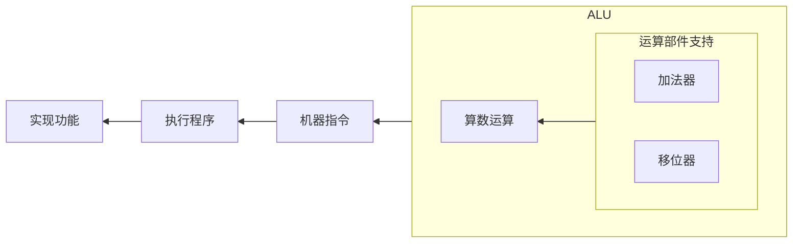

## 计算机组成原理

## 前言

学科地位：

| 主讲教师 | 学分配额 | 学科类别 |
| :------: | :------: | :------: |
|  闫文珠  |   3.5    |  自发课  |

成绩组成：

| 作业+实验 | 期末 |
| :-------: | :--: |
|    50%    | 50%  |

教材情况：

|    课程名称    |         选用教材         | 版次 |  作者  |     出版社     |      ISBN 号      |
| :------------: | :----------------------: | :--: | :----: | :------------: | :---------------: |
| 计算机组成原理 | 《计算机组成与系统结构》 |  3   | 袁春风 | 清华大学出版社 | 978-7-302-59988-3 |

最基本的知识普及：



- [【硬核科普】从零开始认识主板](https://www.bilibili.com/video/BV1xQ4y1b7JS/)
- [【硬核科普】从零开始认识显卡](https://www.bilibili.com/video/BV1xE421j7Uv/)

**主板（Motherboard）**

- **作用**：主板是所有硬件的连接平台，它连接并协调 CPU、内存、存储设备、显卡、网络设备和其他外部接口。主板上还包含芯片组，负责管理数据传输和设备间的通信。
- **与其他部分的关系**：主板是各个硬件组件的核心枢纽，确保数据能够在各个组件之间高效传输和通信。

**输入/输出设备（I/O Devices）**

- **作用**：输入设备（如键盘、鼠标、触摸屏）用于用户与计算机的交互。输出设备（如显示器、打印机）用于显示计算机的操作结果。网络设备（如网卡、Wi-Fi 模块）则允许电脑连接到网络。
- **与其他部分的关系**：输入设备通过主板将用户的操作传递给 CPU 进行处理，输出设备则从 CPU 或显卡接收处理后的数据进行展示。

**中央处理器（CPU）**

- **作用**：CPU 是电脑的大脑，负责执行计算任务和指令。它从内存中读取指令，进行运算，然后将结果写回内存。现代 CPU 具有多个核心，可以并行处理多项任务，提高计算效率。
- **与其他部分的关系**：CPU 与内存和存储设备密切配合。它从内存中获取数据和指令，然后进行处理，最终将结果写回内存或存储设备。

**内存（RAM）**

- **作用**：内存是计算机中的临时存储器，用于存储当前运行的程序和数据。它的访问速度极快，但数据在断电后会丢失。内存用于支持 CPU 的高速操作。
- **与其他部分的关系**：内存是 CPU 执行任务时的工作区域，存储从存储设备（如硬盘）中读取的数据和指令。内存的数据会在需要时被写回到存储设备中。

**显卡（GPU）**

- **作用**：显卡负责处理图形计算任务，特别是在图像和视频渲染、游戏以及某些并行计算任务中（如深度学习）。高性能显卡能够加速这些计算任务。
- **与其他部分的关系**：显卡通过主板与 CPU 和内存通信，从内存中读取图形数据，并进行处理，然后将渲染结果输出到显示器。

**存储设备（Storage Devices）**

- **作用**：存储设备如机械硬盘 hard disk (HDD)、固态硬盘 solid state disk (SSD)，用于长期保存数据和程序，即使在电脑断电后数据也不会丢失。SSD 的速度比传统硬盘更快，因此越来越常用。
- **与其他部分的关系**：存储设备保存操作系统、应用程序和用户数据。程序执行时，数据会从存储设备加载到内存中供 CPU 使用。

**网卡（Network Interface Card, NIC）**

- **作用**：网卡是计算机与网络之间的桥梁，负责处理计算机与网络间的数据通信。它将计算机的数据转换为网络信号，以太网网卡通过有线或无线方式连接局域网（LAN）或互联网。
- **与其他部分的关系**：网卡通过主板与南桥芯片组或 PCIe 总线连接，接收来自 CPU 的数据，经过处理后通过网络接口发送到外部网络。同时，它也接收来自网络的数据，传递给 CPU 进行处理，确保计算机能够与其他网络设备进行通信。

**南桥芯片组（Southbridge）**

- **作用**：南桥芯片组是主板上的一个重要芯片，为了避免过多的模块与 CPU 直连导致主板排线困难以及布局问题，产生了南桥芯片组用于负责管理较慢的外围设备的连接和数据传输。包括 USB 接口、SATA 接口、网络接口、音频设备和其他 I/O 设备。南桥还处理 BIOS、系统时钟、硬盘和光驱的控制。
- **与其他部分的关系**：南桥通过主板与 CPU 和北桥芯片组（或直接与 CPU）连接，接收来自 CPU 的指令，并将其转化为外设可以理解的信号。它还通过 I/O 总线连接各种外设，确保数据在外围设备与系统之间顺畅传输。

**BIOS（Basic Input/Output System）**

- **作用**：BIOS 是主板的固件程序，它存储在主板的 BIOS 芯片里。负责在计算机启动时进行硬件初始化，指导所有的硬件运行，并启动操作系统。
- **与其他部分的关系**：BIOS 在开机时检查并初始化硬件，然后引导操作系统，从而开始系统的工作。



为什么要学这门课？

> 上上学期学习了《数字逻辑电路》，云里雾里；上学期学习了《计算机系统基础》，继续云里雾里。本学期开始学习《计算机组成原理》？如果用一句话来概括我对数字逻辑电路的理解，大概可以这样说：原来计算机是一个由“门电路”、“导线”和“时钟脉冲”组成的机器。如果用一句话来概括我对计算机系统基础的理解，大概可以这样说：原来计算机所有的活动都是由翻译过来的 01 序列驱动的。
>
> 现在我们让 AI 模仿上面我对课程理解的概括逻辑，用一句话来概括计算机组成原理，ta 是这样回答的：**原来计算机的高效运作是通过硬件架构的精妙设计，将复杂的指令和数据流转化为有序的电子信号运动来实现的**。
>

会收获什么？

> 对计算机整体有一个宏观的把握，并且能够知道计算机各个模块之间是如何关联与调度的，以及每一个模块内部的工作原理。
>
> 最后能够从逻辑上实现一个单核 CPU。

## 第 1 章 计算机系统概述

注：本章与《计算机系统基础》的第 1 章重复，详见 <https://blog.dwj601.cn/GPA/4th-term/SysBasic/#第1章-计算机系统概述>

主要掌握 **冯诺依曼状态机** 和 **计算机性能度量** 两个知识点。

## 第 2 章 数据的机器级表示

注：本章与《计算机系统基础》的第 2 章重复，详见 <https://blog.dwj601.cn/GPA/4th-term/SysBasic/#第2章-数据的机器级表示与处理>

主要掌握 **数值/非数值数据的表示**、**数据宽度**、**存储对齐** 和 **纠/检错** 四个知识点。

数据的纠错/检错见 7.4 节。

## 第 3 章 运算方法和运算部件

本章我们讲讲 CPU 中的 Arithmetic and Logic Unit（算数逻辑单元，简称 ALU），大致逻辑如下图所示：

学习路线大约是：涉及运算的机器指令 $\to$ 运算部件支持 $\to$ 算数运算逻辑

### 3.1 涉及运算的机器指令

### 3.2 运算部件支持

### 3.3 算数运算逻辑

## 第 4 章 指令系统

## 第 5 章 中央处理器

## 第 6 章 指令流水线

## 第 7 章 存储器层次结构

### 7.4 存储器的数据校验

数据在信道传送的过程中，可能会因为各种噪声或者硬件原因出现错误，我们有必要进行数据的检错与纠错。本目我们主要介绍「**数据检错中的奇偶校验法**」策略。其实逻辑很简单，先看数据校验的流程图：

如上图所示，校验的根本逻辑就是：比对「信源和信宿数据的二进制码」在某种规则转换下的转换代码。而所谓的奇偶校验就是定义了「某种规则」为「比对数据的二进制码中 1 的个数」。即通过判断校验单元（校验位+原始数据）和传输后数据中 1 的个数的奇偶性是否相同，来判断数据传送是否正确，进而达到检错的功能。有两个问题：

1. **这合理吗**？显然不具备绝对正确性。如果出现了偶数个位数的错误，则会因为奇偶性相同导致无法检错。同时，仅仅比对 1 的个数是无法找到哪一位出错的，也就无法进行纠错功能。
2. **怎么计算二进制码中 1 的个数的奇偶性**？很简单，直接把所有的位异或起来即可。

**讲讲校验过程**？奇偶校验其实是两个东西，分别是奇校验和偶校验。两种校验的逻辑是一样的，我们以奇校验为例讲解一下过程。所谓奇校验就是通过增加 1 位校验位，使得校验单元（校验位+原始数据）中 1 的个数一定是奇数，校验单元在经过存储器或传输线路后得到传输后数据，我们对传输后数据重新计算 1 的个数，如果还是奇数个 1 则认为数据传输没有问题，如果变成了偶数个 1 则认为数据传输出现了问题。偶校验同理，让校验单元中 1 的个数一定是偶数，然后通过计算校验单元中 1 的数量是否还是偶数来判断数据传输是否正确。

**码距是什么**？所谓码距就是两个二进制代码（码字）中不同位的个数。在奇偶校验的码制下，两个合法码字的最小距离显然是 2。

参考：[什么是奇偶校验原理？奇校验、偶校验、校验位（单比特奇偶校验、两维奇偶校验（矩阵校验或交叉奇偶校验））](https://blog.csdn.net/Dontla/article/details/103627008)

## 第 8 章 系统互连及输入输出组织

## 第 9 章 并行处理系统 *

不做要求，略。
