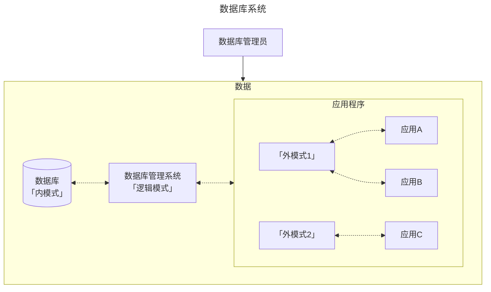

## 数据库

## 前言

学科地位：

| 主讲教师 | 学分配额 | 学科类别 |
| :------: | :------: | :------: |
|   孔力   |   3.5    |  自发课  |

成绩组成：

| 平时 | 作业+实验 | 期末（闭卷 or 开卷） |
| :--: | :-------: | :------------------: |
| 10%  |    40%    |         50%          |

教材情况：

|     课程名称     |      选用教材      | 版次 |  作者  |     出版社     |      ISBN 号       |
| :--------------: | :----------------: | :--: | :----: | :------------: | :---------------: |
| 数据库原理与应用 | 《数据库系统概论》 |  6   | 王珊等 | 高等教育出版社 | 978-7-04-059125-5 |

学习资源：

- 课程官网：[数据库系统概论 (ruc.edu.cn)](http://chinadb.ruc.edu.cn/home)

为什么要学这门课？

> 感觉没什么意义，毕竟只讲关系型数据库，而这个是再简单不过的数据模型了，哪怕加上了外键也不会很复杂。但我深知 db 的奥妙于深度绝不止于此，但是就目前上课情况来看应该是达不到这种程度了，毕竟最核心的数据库编程是不做要求的。

会收获什么？

> 熟悉一下关系型数据库的理论吧，顺便准备好被国产的 OpenGuass ex 一把。其余的数据库类型以及拓展知识就靠自学吧。

## 基础篇

### 一、绪论

数据库发展范式：人工系统 $\to$ 文件系统 $\to$ 数据库系统

数据库系统概念图：

**数据库的三级模式**：从硬件到应用将一个数据库抽象为三层。其中：

- 内模式：硬件存储数据的方式；
- 逻辑模式：数据库管理的方式，也就是数据存储方式的 **逻辑** 抽象。进而引出后续如何存储数据的「数据模型」概念；
- 外模式：不同的应用对全体数据有不同的访存权限。一个外模式可以对应多个应用程序，但是一个应用程序只能对应一个外模式。

**数据模型**：逻辑模式的具体实现策略。我们需要对现实世界的数据进行抽象进而便于虚拟化存储，以及后续对数据库进行增删改查等操作。从发展角度来看，数据模型一共经历了三个阶段，分别为 **层次模型** $\to$ **网状模型** $\to$ **关系模型** 三个阶段。其中关系模型是数据库「逻辑模式」的实现方式，有以下两个关键点：

- 三要素：数据结构（二维表）、数据操作（增删改查）和关系的完整性约束（每一个实体能通过主键唯一检索、外键引用必须存在、关系要根据业务需求设定完备）

- 名词对照：关系（一张表）、元组（一行数据）、属性（一个字段）和码（主键）。

### 二、关系模型

### 三、SQL

### 四、安全性

### 五、完整性

## 开发篇

### 六、关系数据理论

### 七、数据库设计

### 八、数据库编程 *

这一章不作考试要求。樂。

## 进阶篇

### 九、关系数据库存储管理

### 十、关系查询

怎么查询关系的？又可以怎么优化查询策略呢？

### 十一、数据库恢复技术

### 十二、并发