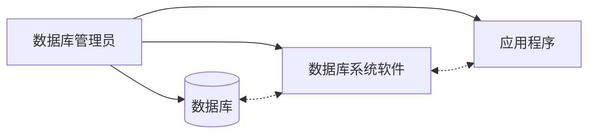

## 数据库

## 前言

学科地位：

| 主讲教师 | 学分配额 | 学科类别 |
| :------: | :------: | :------: |
|   孔力   |   3.5    |  自发课  |

成绩组成：

| 平时 | 作业+实验 | 期末（闭卷 or 开卷） |
| :--: | :-------: | :------------------: |
| 10%  |    40%    |         50%          |

教材情况：

|     课程名称     |      选用教材      | 版次 |  作者  |     出版社     |      ISBN号       |
| :--------------: | :----------------: | :--: | :----: | :------------: | :---------------: |
| 数据库原理与应用 | 《数据库系统概论》 |  6   | 王珊等 | 高等教育出版社 | 978-7-04-059125-5 |

学习资源：

- 课程官网：[数据库系统概论 (ruc.edu.cn)](http://chinadb.ruc.edu.cn/home)

## 基础篇

### 一、绪论

发展范式：人工系统 $\to$ 文件系统 $\to$ 数据库系统

数据库系统概念图：

### 二、关系模型

### 三、SQL

### 四、安全性

### 五、完整性

## 开发篇

### 六、关系数据理论

### 七、数据库设计

### 八、数据库编程 *

这一章不作考试要求。樂。

## 进阶篇

### 九、关系数据库存储管理

### 十、关系查询

怎么查询关系的？又可以怎么优化查询策略呢？

### 十一、数据库恢复技术

### 十二、并发