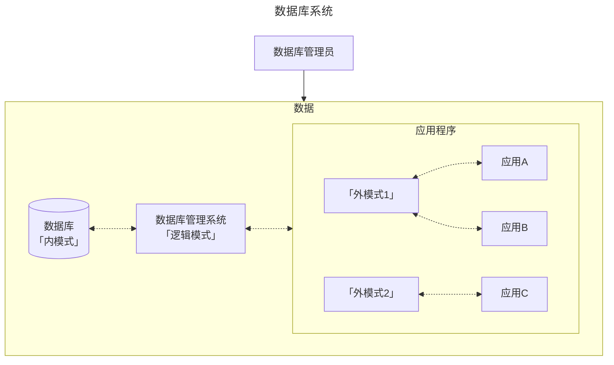

## 数据库

## 前言

学科地位：

| 主讲教师 | 学分配额 | 学科类别 |
| :------: | :------: | :------: |
|   孔力   |   3.5    |  自发课  |

成绩组成：

| 平时 | 作业+实验 | 期末（闭卷 or 开卷） |
| :--: | :-------: | :------------------: |
| 10%  |    40%    |         50%          |

教材情况：

|     课程名称     |      选用教材      | 版次 |  作者  |     出版社     |      ISBN 号       |
| :--------------: | :----------------: | :--: | :----: | :------------: | :---------------: |
| 数据库原理与应用 | 《数据库系统概论》 |  6   | 王珊等 | 高等教育出版社 | 978-7-04-059125-5 |

学习资源：

- 课程官网：[数据库系统概论 (ruc.edu.cn)](http://chinadb.ruc.edu.cn/home)

为什么要学这门课？

> 感觉没什么意义，毕竟只讲关系型数据库，而这个是再简单不过的数据模型了，哪怕加上了外键也不会很复杂。但我深知 db 的奥妙与深度绝不止于此，但是就目前上课情况来看应该是达不到这种程度了，毕竟连最基本的数据库编程都是不做要求的。

会收获什么？

> 熟悉一下关系型数据库的理论吧，顺便准备好被国产的 openGuass ex 一把。其余的数据库类型以及拓展知识就靠自学吧。

## 基础篇

### 1 绪论

数据库发展范式：人工系统 $\to$ 文件系统 $\to$ 数据库系统

数据库系统概念图：



**数据库的三级模式**：从硬件到应用将一个数据库抽象为三层。其中：

- 内模式：硬件存储数据的方式；
- 逻辑模式：数据库管理的方式，也就是数据存储方式的 **逻辑** 抽象。进而引出后续如何存储数据的「数据模型」概念；
- 外模式：不同的应用对全体数据有不同的访存权限。一个外模式可以对应多个应用程序，但是一个应用程序只能对应一个外模式。

**数据模型**：逻辑模式的具体实现策略。我们需要对现实世界的数据进行抽象进而便于虚拟化存储，以及后续对数据库进行增删改查等操作。从发展角度来看，数据模型一共经历了三个阶段，分别为 **层次模型** $\to$ **网状模型** $\to$ **关系模型** 三个阶段。其中关系模型是数据库「逻辑模式」的实现方式，有以下两个关键点：

- 三要素：数据结构（二维表）、数据操作（增删改查）和关系的完整性约束（每一个实体能通过主键唯一检索、外键引用必须存在、关系要根据业务需求设定完备）

- 名词对照：关系（一张表）、元组（一行数据）、属性（一个字段）和码（主键）。

### 2 关系模型

#### 2.1 基本概念

基本概念：$R = (A_1:D_1,A_2:D_2,...,A_n:D_n,)$。其中 R 表示关系，A 表示属性，D 表示域。


#### 2.2 关系操作

**关系操作的最小单位是什么**？所有的增删改查都是以集合为最小单位。

#### 2.3 关系的完整性

**外键是什么？有什么用**？一张表的外键必须是另一张表的主键以确保数据的完整性，因为主键是必须全部存在的。当然，外键也可以引用本表的主键。有了外键就可以实现表与表之间一对多或多对多的关系。

- 关于一对多。例如，一个客户可以购买很多商品，而一个被购买的商品只能隶属于一个客户；

    

    假设有两个表：`customers` 和 `orders`。`customers` 表保存客户的信息，`orders` 表保存订单信息。每个订单都应该对应一个客户，所以可以使用外键将这两个表关联起来。

    **创建表**

    ```sql
    -- 创建 customers 表
    CREATE TABLE customers (
        customer_id INT PRIMARY KEY,
        customer_name VARCHAR(100)
    );
    
    -- 创建 orders 表，order_id 是主键，customer_id 是外键，引用 customers 表中的 customer_id
    CREATE TABLE orders (
        order_id INT PRIMARY KEY,
        order_date DATE,
        customer_id INT,
        FOREIGN KEY (customer_id) REFERENCES customers(customer_id)
    );
    ```

    在上述示例中，`orders` 表中的 `customer_id` 是一个外键，它引用了 `customers` 表中的 `customer_id` 列。这样一来，只有在 `customers` 表中存在的 `customer_id` 才能在 `orders` 表中作为合法的 `customer_id`。这确保了每个订单都有有效的客户。

    **插入数据（增）**：当向 `orders` 表中插入一条新记录时，数据库会检查 `customer_id` 是否在 `customers` 表中存在。如果不存在，插入操作会失败。

    ```sql
    -- 插入一条合法记录
    INSERT INTO customers (customer_id, customer_name) VALUES (1, 'Alice');
    
    -- 插入订单记录，外键 customer_id 存在于 customers 表中
    INSERT INTO orders (order_id, order_date, customer_id) VALUES (101, '2024-09-26', 1);
    
    -- 尝试插入一个无效的订单记录（客户ID为2在 customers 表中不存在）
    INSERT INTO orders (order_id, order_date, customer_id) VALUES (102, '2024-09-26', 2); -- 会失败
    ```

    **删除或更新时（删 | 改）**：如果试图删除 `customers` 表中的某个 `customer_id`，而该 ID 在 `orders` 表中被引用，会引发外键约束错误。可以通过设置外键的级联操作（如 `ON DELETE CASCADE` 或 `ON UPDATE CASCADE`）来控制这种行为，使删除或更新操作可以自动级联到相关表。

    ```sql
    -- 定义外键时使用级联删除
    CREATE TABLE orders (
        order_id INT PRIMARY KEY,
        order_date DATE,
        customer_id INT,
        FOREIGN KEY (customer_id) REFERENCES customers(customer_id) ON DELETE CASCADE
    );
    
    -- 删除客户1时，orders 表中所有引用 customer_id = 1 的订单都会自动被删除
    DELETE FROM customers WHERE customer_id = 1;
    ```

    

- 关于多对多。例如，一门课程需要多门先修课，而一门课程也可以成为很多课程的选修课。

    

    这里课程与先修课之间的实体对象是相同的，并且一门课程可以有许多门先修课，而一门课程也可能成为很多课程的先修课，如果还是像一对多那样进行存储，即课程表中增加一列先修课，就会导致先修课列中可能出现多个信息的情况，这也就不符合关系型数据库中的第一范式：原子性。因此我们不得不创建一个新表，也就是**中间表**，来存储课程和先修课之间的关系。

    **创建表**

    ```sql
    -- 创建 courses 表
    CREATE TABLE courses (
        course_id INT PRIMARY KEY,
        course_name VARCHAR(100)
    );
    
    -- 创建 prerequisites 表，其中 course_id 和 prerequisite_id 都是外键
    CREATE TABLE prerequisites (
        course_id INT,  -- 课程ID
        prerequisite_id INT,  -- 先修课ID
        PRIMARY KEY (course_id, prerequisite_id),  -- 组合主键
        FOREIGN KEY (course_id) REFERENCES courses(course_id) ON DELETE CASCADE,  -- 课程ID外键
        FOREIGN KEY (prerequisite_id) REFERENCES courses(course_id) ON DELETE CASCADE  -- 先修课ID外键
    );
    ```

    在这个设计中：

    - `courses` 表保存所有课程的基本信息，每门课程都有唯一的 `course_id`。
    - `prerequisites` 表用于表示多对多的先修课关系，其中 `course_id` 是当前课程的 ID，`prerequisite_id` 是该课程的先修课程的 ID。两者都引用了 `courses` 表中的 `course_id` 列，构成多对多的关系。

    **插入数据（增）**

    插入课程记录：

    ```sql
    -- 插入一些课程记录
    INSERT INTO courses (course_id, course_name) VALUES (1, 'Mathematics');
    INSERT INTO courses (course_id, course_name) VALUES (2, 'Physics');
    INSERT INTO courses (course_id, course_name) VALUES (3, 'Computer Science');
    INSERT INTO courses (course_id, course_name) VALUES (4, 'Linear Algebra');
    ```

    插入先修课关系记录：

    ```sql
    -- 课程 Computer Science 需要 Mathematics 和 Physics 作为先修课
    INSERT INTO prerequisites (course_id, prerequisite_id) VALUES (3, 1);  -- Computer Science -> Mathematics
    INSERT INTO prerequisites (course_id, prerequisite_id) VALUES (3, 2);  -- Computer Science -> Physics
    
    -- 课程 Physics 需要 Linear Algebra 作为先修课
    INSERT INTO prerequisites (course_id, prerequisite_id) VALUES (2, 4);  -- Physics -> Linear Algebra
    ```

    在上述例子中：

    - `prerequisites` 表表示课程之间的先修关系。例如，`Computer Science` 课程的 `course_id` 是 3，它的先修课是 `Mathematics`（`prerequisite_id` 为 1）和 `Physics`（`prerequisite_id` 为 2）。
    - 通过这种方式，可以表示一门课程有多门先修课，同时一门课程也可以作为多门课程的先修课。
    - 插入的 `course_id` 和 `prerequisite_id` 必须都是 `courses` 表中已有的课程，否则会插入失败。

    **删除数据（删）**

    由于在创建表时设置了级联操作 `ON DELETE CASCADE`，因此当我们删除任何一个存在的课程时，与该课程相关的所有先修课信息也都会被级联删除。无论该课程是其他课程的先修课，还是它自身有先修课。

    

#### 2.4 关系代数

用符号表示所有的关系运算逻辑有助于在理论上进行化简，从而降低计算开销。

##### 传统的集合运算

并 $\cap$、差 $-$、交 $\cup$ 和笛卡尔积 $\times$ 都是针对两个关系中相同类型的属性组进行的集合运算。除了差，其余运算都有交换律。

##### 专门的关系运算

先补充几个必要的符号表示：

- 元组。在关系 R 中，$t \in R$ 表示 t 是关系 R 的一个元组。$t[A_i]$ 表示元组在 $A_i$ 属性上的分量。
- 取反。针对属性集合 X，取反就是属性全集 U 和属性集合 X 的差。
- 串接。将两个元组左右连接。
- 象集。对于关系 $R(A_1,A_2)$，$A_1$ 的象集就是 $A_1$ 所有取值对应的 $A_2$ 取值集合。

**选择** $\sigma_F(R)$。筛选出关系 R 中符合条件 $F\text{(Filter)}$ 的行。$F$ 按照优先级分别为：$()>\theta>\lnot>\land>\lor$。其中 $\theta=\{ >,<,\ge,\le,=,\ne \}$。


**投影** $\Pi_A(R)$。筛选出关系 R 中含有属性集合 $A\text{(Attribute)}$ 的列。筛完后可能需要再进一步删除重复的行。


**连接** $R \Join S$。筛选出两个关系 R 和 S 的笛卡尔积 $R\times S$ 中 R 的属性 A 和 S 的属性 S 符合条件 $\theta$ 的行。


- 一般连接。就是上述所述。
- 左外连接。当 R 的属性 A 的取值不在 S 的 B 中时，在结果中保留 R 的结果，S 对应的值填 NULL。
- 右外连接。当 S 的属性 B 的取值不在 R 的 A 中时，在结果中保留 S 的结果，R 对应的值填 NULL。

**除法** $R \div S$ 。对于两个关系 $R(X,Y)$ 和 $S(Y,Z)$。找到 R 符合「$R(X)$ 包含 $S(X)$」的元组在 X 上的投影。


### 3 SQL

### 4 安全性

### 5 完整性

## 开发篇

### 关系数据理论

### 数据库设计

### 数据库编程 *

这一章不作考试要求。樂。

## 进阶篇

### 关系数据库存储管理

### 关系查询

怎么查询关系的？又可以怎么优化查询策略呢？

### 数据库恢复技术

### 并发

