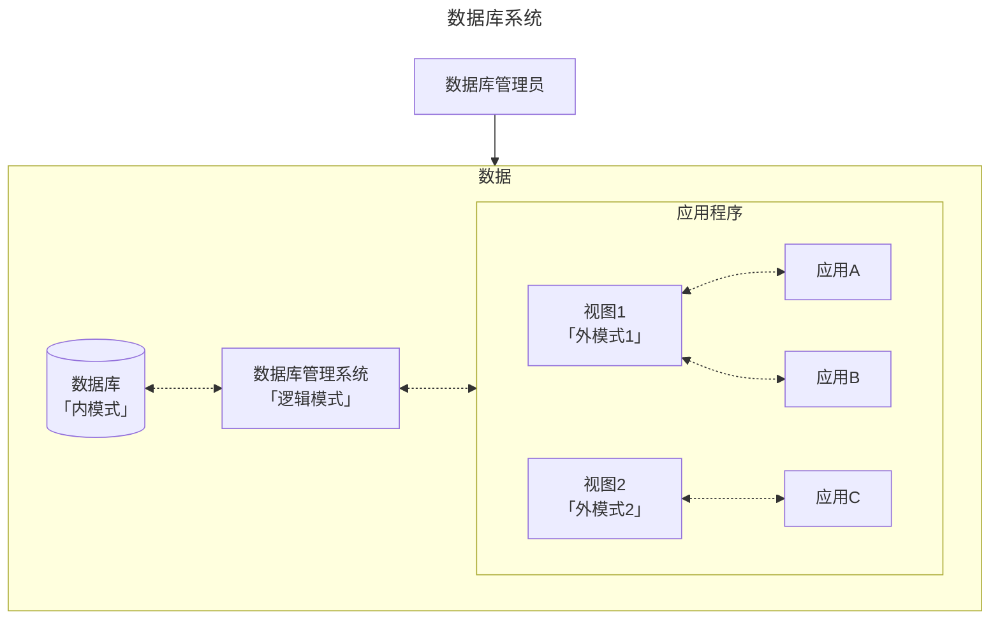

## 数据库

## 前言

学科地位：

| 主讲教师 | 学分配额 | 学科类别 |
| :------: | :------: | :------: |
|   孔力   |   3.5    |  自发课  |

成绩组成：

| 平时 | 作业+实验 | 期末（闭卷 or 开卷） |
| :--: | :-------: | :------------------: |
| 10%  |    40%    |         50%          |

教材情况：

|     课程名称     |      选用教材      | 版次 |  作者  |     出版社     |      ISBN 号       |
| :--------------: | :----------------: | :--: | :----: | :------------: | :---------------: |
| 数据库原理与应用 | 《数据库系统概论》 |  6   | 王珊等 | 高等教育出版社 | 978-7-04-059125-5 |

学习资源：

- 课程官网：[数据库系统概论 (ruc.edu.cn)](http://chinadb.ruc.edu.cn/home)

为什么要学这门课？

> 数据库是时代变迁的产物，掌握数据库对应的知识和技能很有必要。这门课主要学习关系数据库的相关理论并以 openGauss 作为实验平台进行实操。可以借这门课好好熟悉关系数据库的相关技能，如果想要深入 system，db 是需要好好学习甚至深入精通的。

会收获什么？

> 自顶向下理解关系数据库的架构与设计模式，熟悉数据库编程对应的技能。如果还有精力，就继续深入底层架构。

## 基础理论

### 1 绪论

数据库发展范式：人工系统 $\to$ 文件系统 $\to$ 数据库系统

数据库系统概念图：



**数据库的三级模式**：从硬件到应用将一个数据库抽象为三层。其中：

- 内模式：硬件存储数据的方式；
- 逻辑模式：数据库管理的方式，也就是数据存储方式的 **逻辑** 抽象。进而引出后续如何存储数据的「数据模型」概念；
- 外模式：不同的应用对全体数据有不同的访存权限。一个外模式可以对应多个应用程序，但是一个应用程序只能对应一个外模式。

**数据模型**：逻辑模式的具体实现策略。我们需要对现实世界的数据进行抽象进而便于虚拟化存储，以及后续对数据库进行增删改查等操作。从发展角度来看，数据模型一共经历了三个阶段，分别为 **层次模型** $\to$ **网状模型** $\to$ **关系模型** 三个阶段。其中关系模型是数据库「逻辑模式」的实现方式，有以下两个关键点：

- 三要素：数据结构（二维表）、数据操作（增删改查）和关系的完整性约束（每一个实体能通过主键唯一检索、外键引用必须存在、关系要根据业务需求设定完备）

- 名词对照：关系（一张表）、元组（一行数据）、属性（一个字段）和码（主键）。

### 2 关系模型

#### 2.1 基本概念

我们用 $R = (A_1:D_1,A_2:D_2,...,A_n:D_n,)$ 来逻辑表示一个关系。其中 $R$ 表示关系，$A$ 表示属性，$D$ 表示属性的取值域。以下关键词几乎涵盖了关系的大部分术语。


#### 2.2 关系操作

**关系操作的最小单位是什么**？所有的增删改查操作都是以「元组的集合」为最小单位进行的。

#### 2.3 关系的完整性

**外键是什么？有什么用**？一张表的外键必须是另一张表的主键以确保数据的完整性，因为主键是必须全部存在的。当然，外键也可以引用本表的主键。有了外键就可以实现表与表之间一对多或多对多的关系。

**关于一对多**。例如，一个客户可以购买很多商品，而一个被购买的商品只能隶属于一个客户；



假设有两个表：`customers` 和 `orders`。`customers` 表保存客户的信息，`orders` 表保存订单信息。每个订单都应该对应一个客户，所以可以使用外键将这两个表关联起来。

**创建表**

```sql
-- 创建 customers 表
CREATE TABLE customers (
    customer_id INT PRIMARY KEY,
    customer_name VARCHAR(100)
);

-- 创建 orders 表，order_id 是主键，customer_id 是外键，引用 customers 表中的 customer_id
CREATE TABLE orders (
    order_id INT PRIMARY KEY,
    order_date DATE,
    customer_id INT,
    FOREIGN KEY (customer_id) REFERENCES customers(customer_id)
);
```

在上述示例中，`orders` 表中的 `customer_id` 是一个外键，它引用了 `customers` 表中的 `customer_id` 列。这样一来，只有在 `customers` 表中存在的 `customer_id` 才能在 `orders` 表中作为合法的 `customer_id`。这确保了每个订单都有有效的客户。

**插入数据（增）**：当向 `orders` 表中插入一条新记录时，数据库会检查 `customer_id` 是否在 `customers` 表中存在。如果不存在，插入操作会失败。

```sql
-- 插入一条合法记录
INSERT INTO customers (customer_id, customer_name) VALUES (1, 'Alice');

-- 插入订单记录，外键 customer_id 存在于 customers 表中
INSERT INTO orders (order_id, order_date, customer_id) VALUES (101, '2024-09-26', 1);

-- 尝试插入一个无效的订单记录（客户ID为2在 customers 表中不存在）
INSERT INTO orders (order_id, order_date, customer_id) VALUES (102, '2024-09-26', 2); -- 会失败
```

**删除或更新时（删 | 改）**：如果试图删除 `customers` 表中的某个 `customer_id`，而该 ID 在 `orders` 表中被引用，会引发外键约束错误。可以通过设置外键的级联操作（如 `ON DELETE CASCADE` 或 `ON UPDATE CASCADE`）来控制这种行为，使删除或更新操作可以自动级联到相关表。

```sql
-- 定义外键时使用级联删除
CREATE TABLE orders (
    order_id INT PRIMARY KEY,
    order_date DATE,
    customer_id INT,
    FOREIGN KEY (customer_id) REFERENCES customers(customer_id) ON DELETE CASCADE
);

-- 删除客户1时，orders 表中所有引用 customer_id = 1 的订单都会自动被删除
DELETE FROM customers WHERE customer_id = 1;
```



**关于多对多**。例如，一门课程需要多门先修课，而一门课程也可以成为很多课程的选修课。



这里课程与先修课之间的实体对象是相同的，并且一门课程可以有许多门先修课，而一门课程也可能成为很多课程的先修课，如果还是像一对多那样进行存储，即课程表中增加一列先修课，就会导致先修课列中可能出现多个信息的情况，这也就不符合关系型数据库中的第一范式：原子性。因此我们不得不创建一个新表，也就是 **中间表**，来存储课程和先修课之间的关系。

**创建表**

```sql
-- 创建 courses 表
CREATE TABLE courses (
    course_id INT PRIMARY KEY,
    course_name VARCHAR(100)
);

-- 创建 prerequisites 表，其中 course_id 和 prerequisite_id 都是外键
CREATE TABLE prerequisites (
    course_id INT,  -- 课程ID
    prerequisite_id INT,  -- 先修课ID
    PRIMARY KEY (course_id, prerequisite_id),  -- 组合主键
    FOREIGN KEY (course_id) REFERENCES courses(course_id) ON DELETE CASCADE,  -- 课程ID外键
    FOREIGN KEY (prerequisite_id) REFERENCES courses(course_id) ON DELETE CASCADE  -- 先修课ID外键
);
```

在这个设计中：

- `courses` 表保存所有课程的基本信息，每门课程都有唯一的 `course_id`。
- `prerequisites` 表用于表示多对多的先修课关系，其中 `course_id` 是当前课程的 ID，`prerequisite_id` 是该课程的先修课程的 ID。两者都引用了 `courses` 表中的 `course_id` 列，构成多对多的关系。

**插入数据（增）**

插入课程记录：

```sql
-- 插入一些课程记录
INSERT INTO courses (course_id, course_name) VALUES (1, 'Mathematics');
INSERT INTO courses (course_id, course_name) VALUES (2, 'Physics');
INSERT INTO courses (course_id, course_name) VALUES (3, 'Computer Science');
INSERT INTO courses (course_id, course_name) VALUES (4, 'Linear Algebra');
```

插入先修课关系记录：

```sql
-- 课程 Computer Science 需要 Mathematics 和 Physics 作为先修课
INSERT INTO prerequisites (course_id, prerequisite_id) VALUES (3, 1);  -- Computer Science -> Mathematics
INSERT INTO prerequisites (course_id, prerequisite_id) VALUES (3, 2);  -- Computer Science -> Physics

-- 课程 Physics 需要 Linear Algebra 作为先修课
INSERT INTO prerequisites (course_id, prerequisite_id) VALUES (2, 4);  -- Physics -> Linear Algebra
```

在上述例子中：

- `prerequisites` 表表示课程之间的先修关系。例如，`Computer Science` 课程的 `course_id` 是 3，它的先修课是 `Mathematics`（`prerequisite_id` 为 1）和 `Physics`（`prerequisite_id` 为 2）。
- 通过这种方式，可以表示一门课程有多门先修课，同时一门课程也可以作为多门课程的先修课。
- 插入的 `course_id` 和 `prerequisite_id` 必须都是 `courses` 表中已有的课程，否则会插入失败。

**删除数据（删）**

由于在创建表时设置了级联操作 `ON DELETE CASCADE`，因此当我们删除任何一个存在的课程时，与该课程相关的所有先修课信息也都会被级联删除。无论该课程是其他课程的先修课，还是它自身有先修课。



#### 2.4 关系代数

所有的关系运算都可以用符号来表示，符号符合对应的算律。这么表示的目的有助于在理论上对表达式进行化简，从而降低计算开销。

##### 2.4.1 传统的集合运算

并 $\cap$、差 $-$、交 $\cup$ 和笛卡尔积 $\times$ 都是针对两个关系中相同类型的属性组进行的集合运算。除了差，其余运算都有交换律。

##### 2.4.2 专门的关系运算

先补充几个必要的符号表示：

- 元组。在关系 R 中，$t \in R$ 表示 t 是关系 R 的一个元组。$t[A_i]$ 表示元组在 $A_i$ 属性上的分量。
- 取反。针对属性集合 X，取反就是属性全集 U 和属性集合 X 的差。
- 串接。将两个元组左右连接。
- 象集。对于关系 $R(A_1,A_2)$，$A_1$ 的象集就是 $A_1$ 所有取值对应的 $A_2$ 取值集合。

**选择** $\sigma_F(R)$


- 筛选出关系 R 中符合条件 $F\text{(Filter)}$ 的行；
- 对应 SQL 中的 where 关键词；
- $F$ 按照优先级分别为：$()>\theta>\lnot>\land>\lor$。其中 $\theta=\{ >,<,\ge,\le,=,\ne \}$。

**投影** $\Pi_A(R)$


- 筛选出关系 R 中含有属性集合 $A\text{(Attribute)}$ 的列；
- 对应 SQL 中的 select 关键词；
- 筛完后可能需要再进一步删除重复的行。

**连接** $R \Join S$


- 一般连接。筛选出两个关系 R, S 的笛卡尔积 $R\times S$ 中「R 的属性 A 和 S 的属性 B」符合条件 $\theta$ 的行。当关系为取等时，被称为 **等值连接**；当关系为取等并且需要在连接结果中删除这两个相同属性中的一个时，就叫做 **自然连接**；
- 左外连接。当 R 的属性 A 的取值不在 S 的 B 中时，在结果中保留 R 的结果，S 对应的值填 NULL；
- 右外连接。当 S 的属性 B 的取值不在 R 的 A 中时，在结果中保留 S 的结果，R 对应的值填 NULL；
- 外连接。R 与 S 的都保留，另外一个不存在的都填 NULL。

**除法** $R \div S$


- 对于两个关系 $R(X,Y)$ 和 $S(Y,Z)$，$R\div S$ 的结果 $P(X)$ 是 R 满足下列条件的元组在 X 上的投影：R 在 X 上的象集包含 S 在 Y 上的投影。






### 3 SQL

本章我们学习 **结构化查询语言 (Structured Query Language, 简称 SQL)**。共有数据定义、数据操纵和数据控制三种操作类型。其中数据控制将在第 4 章的数据安全性和第 5 章的数据完整性分别展开。

在此之前，有必要知道 DMBS 的层次结构。从最开始的一个机器（例如服务器），机器中下载安装了 DBMS（例如 openGauss），DBMS 中创建了很多的数据库（例如 postgres、experiment 等等），每一个数据库中会有很多的 schema（例如默认的 public 等等），每一个 schema 中可以创建很多的表（例如 student 等等）。

练习网站：

- 相对容易但是后续需要付费：http://xuesql.cn/
- 相对困难但是全部免费：http://sqlmother.yupi.icu/#/learn
- 相对最困难但是更加综合：<https://leetcode.cn/problemset/database/?difficulty=EASY>

#### 3.1 数据定义

我们首先需要使用 `create database <db_name>` 创建一个数据库。

对于数据定义，一共有 **创建 (create)、删除 (drop)、修改 (alter)** 三种操作。按照定义对象的不同有下表所示的语句：

| 操作对象 |      创建       |     删除      |     修改      |
| :------: | :-------------: | :-----------: | :-----------: |
|   模式   | `create schema` | `drop schema` |       -       |
|    表    | `create table`  | `drop table`  | `alter table` |
|   视图   |  `create view`  |  `drop view`  |       -       |
|   索引   | `create index`  | `drop index`  | `alter index` |

**对于模式 `schema`**。可以理解为命名空间，不同的 schema 下可以创建同名但功能和用处不同的表。

**对于表 `table`**。就是关系数据库中最基本的存储单元。

**对于视图 `view`**。这是一种抽象的说法，本质上就是通过定义特定的视图，让特定的人看到数据库中特定的数据。命令格式如下：

```sql
create view <视图名>
as <子查询>
[with check option];
```

**对于索引 `index`**。就是通过某种数据结构对表中的某个字段建立索引从而加速查询过程。也就是通过空间换时间的理念，离线建索引，动态查询。常见的建索引的手段包括排序、哈希、B+索引等等。显然，由于是离线操作，每一次对数据的更新都需要重新建立索引，因此对于经常修改数据的场景，就不太适合建立索引。

#### 3.2 数据操纵

有了数据，就可以对其进行操纵。一共有 **增 (insert)、删 (delete)、改 (update)、查 (select)** 四种操作。

##### 3.2.1 insert

关于数据增加，命令格式如下：

```sql
insert into <表名> [(列1, 列2, ..., 列n)]

-- 插入单条数据 (如果 num 的数量 < 列的数量，则为 null 值)
values (num1, num2, ..., numn);

-- 插入子查询结果
[select ... from ...];
```

##### 3.2.2 delete

关于数据删除，命令格式如下：

```sql
delete from <表名>
[where <条件>];
```

- 删除一个；
- 删除多个；
- 根据子查询结果删除。

##### 3.2.3 update

关于数据修改，命令格式如下：

```sql
update <表名>
set <列名>=<表达式>
where <条件>;
```

- 修改一个；
- 修改多个；
- 根据子查询结果修改。

##### 3.2.4 select

关于数据查询，命令格式如下：

```sql
-- 选择最终表中需要展示的列。all(默认) 表示不去重，distinct 表示去重。
select [all | distinct] <列名> [别名] ...

-- 确定关系数据的来源具体是哪些表。
from <表名/视图名> [as] [别名] ...

-- 约束元组需要满足的条件。
[ where <条件表达式> ]

-- 按照指定的列进行聚合。having 等价于 where 语句，在聚合的条件下进行约束。
[ group by <列名1> [having <条件表达式>] ]

-- 按照指定的列进行排序。asc(默认) 表示升序，desc 表示降序。
[ order by <列名2> [asc | desc] ]

-- limit 表示限制返回的总行数。offset 表示跳过的行号。
[ limit <行数1> [offset <行数2>] ];
```

**单表查询**

我们在查询数据时，可以从最终需要什么样的数据这个角度来理解查询命令的意义。比如 `select` 是用来 **筛选列数据** 的，而 `where` 以及其他的条件限定语句都是根据元组在每一个字段上具体的取值来 **筛选行数据** 的。

`select`。后面都是跟的列名。1）可以对列名取别名，用 `as` 即可；2）可以在列名前加上 `all` 或 `distinct` 关键字，前者是默认的表示不对这一列执行去重操作，后者需要显式的指明表示对这一列进行去重操作。例如：

```sql
select title, distinct name, all time as t
...
```

`from`。后面跟的是表名或视图名。可以对表名或视图名取别名，用 `as` 即可。例如：

```sql
...
from movie as mv, people
...
```

`where`。后面跟的是条件表达式。可以简单的理解为高级语言中的 if 或 while 后面跟的内容，于是多个表达式之间就可以利用 `and` 或 `or` 进行连接。而既然是表达式，就是那些二元比较运算，如果是字符型还增加了诸如 `like` 的运算符（其中 `%` 表示模糊匹配，`_` 表示精确占位匹配，如果本身就有 `_` 或 `%` 符号，可以用 `\` 进行转义。例如：

```sql
...
where year >= 1990 and title like "%girl_\_and%"
...
```

`order by`。后面跟列名。表示按照某一列进行排序，如果是字符就按照字符对应的数字编码进行排序；例如：

```sql
...
order by year desc
...
```

`limit`。后面跟数字 $x$。表示限定输出 $x$ 行。`offset` 是可选的但是只能跟在 `limit` 的后面，后跟数字 $y$ 表示忽略前 $y$ 行。例如：

```sql
...
-- 若首行为第1行，下面的语句表示输出 [6,15] 行
limit 10 offset 5
...
```

**连接查询**

**嵌套查询**

子查询不能加 `order by` 语句，因为这只能用在最外一层。

- 带有 `in` 谓词的子查询；
- 带有 比较运算符 的子查询；
- 带有 `any(some)/all` 谓词的子查询；
- 带有 `exists` 谓词的子查询。实现逻辑表达：$(\forall y)p\to q \iff \lnot \exist y (p \land \lnot q)$

**集合查询**

对多个查询结果进行并 `union`、交 `intersect`、差 `except` 操作。

**基于派生表的查询**

嵌套在 `from` 中的派生表，属于一个临时表。

### 4 安全性

### 5 完整性

## 应用开发

### 6 关系数据理论

### 7 数据库设计

### 8 数据库编程 *

这一章不作考试要求。主要讲高级语言通过驱动与数据库进行交互的逻辑。

## 系统优化

### 9 存储管理

### 10 关系查询

可以怎么优化查询策略呢？

### 11 数据库恢复技术

### 12 并发

