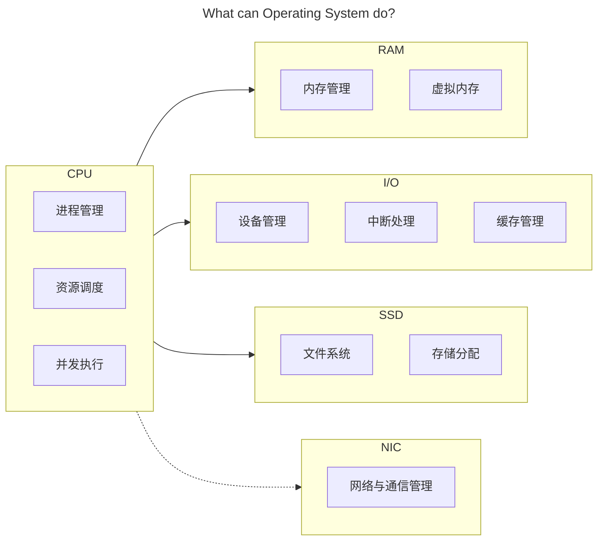
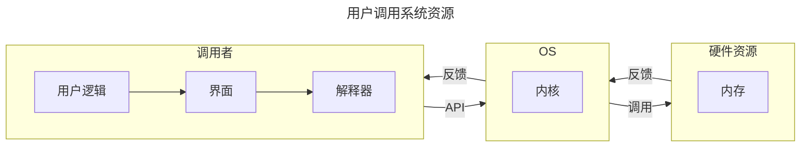
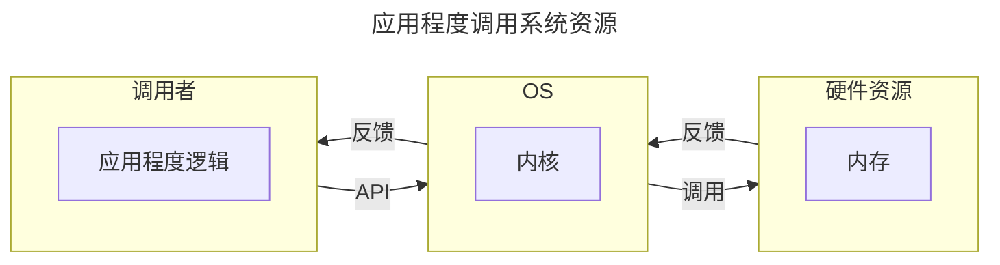
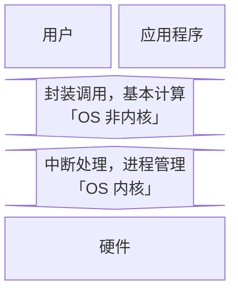

## 前言

学习资源：

- 🖥 [合集·[完结] 2024 南京大学 “操作系统：设计与实现” (蒋炎岩)](<https://space.bilibili.com/202224425/channel/collectiondetail?sid=2237004>)
- 📑 [蒋炎岩课程配套讲义](https://jyywiki.cn/OS/2024/)

最难崩的一集：


为什么要学这门课？

> 目前无论是考研还是互联网行业求职，操作系统似乎一直深受青睐。在对操作系统有了一点粗浅的认知后，我做出了这样的人机类比，尝试解释为什么操作系统会有如今这般重要的地位。
>
> 对于任何一种具备交互、计算功能的电子计算机而言。不同的 **模块** 就是不同的器官，承担了各自的责任和义务（毋庸置疑 CPU 就是心脏）；源源不断的 **电能** 就是循环不止的血液，确保所有的细胞能及时的进行呼吸以正常工作；**主板** 则承担了骨架与神经的指责，搭载了所有的模块并确保数据可以在不同的模块之间自由的流通；而 **操作系统** 则肩负起肌肉的责任，从 CPU 的心肌泵动开始让整台计算器健康地运作。

会收获什么？

> 能详细地解释下面的过程中电脑都发生了什么：按下电源键，网络连接，蓝牙连接，启动网易云音乐播放器软件并开始播放，启动谷歌浏览器并进入力扣网站，启动 Pycharm 集成开发环境软件编写代码并运行测试，关闭 Pycharm，关闭谷歌浏览器，关闭网易云，断开蓝牙，断开 WIFI 连接，关机。
>
> 记得多想想：是什么？为什么？会怎么样？当然也可以想想：可以比它更优吗？比如：什么是【操作系统】？为什么会有【操作系统】？有了【操作系统】会怎么样吗？可以用别的策略代替吗？上述的【操作系统】可以替换为任意一个名词或短语。

## 绪论

**硬件视角下 OS 是什么样的**？



**操作系统的定义是什么**？

- 对于硬件。操作系统封装所有的硬件资源，并抽象出系统调用接口供外部调用。
- 对于用户和软件。操作系统通过提供抽象好的 API 给软件和用户提供运行和计算服务。

**操作系统是怎么管理资源的**？

主要有三个技术。资源复用、资源虚拟化和资源抽象。后两个技术都是从第一个技术衍生而来，个人认为很多东西的解释都被复杂化了。

- 资源复用。其实根本没有复用，这只是相对于一开始的时候，一台计算机只能一次运行一个程序而言的。现在一台计算机需要同时运行很多程序，怎么办呢？既然程序运行需要计算资源，那我直接把计算机中的资源划分成很多份不就好了。当然了，除了内存进行空间上的划分，时间上也可以划分，比如 CPU，于是就有了资源复用中「空分复用」和「时分复用」两个理念。
- 资源虚拟。其实就是名词学术化的资源复用。比如，我将物理世界中的硬件，通过操作系统的划分与调度，将其转化为逻辑世界中的多个资源，也就是所谓的将「单一物理资源」虚拟化为「多个逻辑资源」的理念。
- 资源抽象。就是一种底层封装，顶层调用的思想。比如，对于每一个进程而言，都获得了操作系统为 ta 单独分配的 CPU 状态集和内存空间，而无需关心这些硬件资源是怎么分配给 ta 的。比如，对于每一个文件而言，都是对物理存储空间的抽象。

**操作系统有什么特点**？

并发性、共享性和异步性。都很好理解。并发就是多个进程任务同时进行，但其实是操作系统的一个小把戏，让 CPU 在极短的时间间隔内频繁地切换执行不同的进程；共享是并发的衍生，我们知道程序执行是需要消耗资源的，而资源有限，因此我们可以让所有的进程共享同一块资源；而异步就是指一个任务在等待其他任务执行时，不会阻塞整个系统，等到其他任务执行结束或者切换到当前任务时，可以继续 ta 的执行。**所以这么折腾到底是为了啥**？可以从两个角度出发：

1. 对于一个任务而言：这样做可以 **提升资源利用率**。因为一个进程在执行时，任务会有很多，不仅仅需要 CPU 的状态计算，可能还需要和别的设备进行数据交互，我们知道 CPU 的计算效率远高于诸如 I/O 之类的设备，这就会让系统停下来等待进程执行其他的任务。我们就可以利用系统停下来等待的这段时间，把这个进程的其他任务给执行了。同时，如果一个任务可以被划分为多个子任务，也可以并发以提升资源利用率。
2. 对于多个任务而言：可以 **提升系统响应效率**。多个用户同时提交请求？是一个一个响应，最快的极快，最慢的很慢。还是牺牲一点速度，大家都慢一点但是都没那么慢，同时响应？显然是后者。

**操作系统是怎么对上层提供服务的**？

一句话概括就是，操作系统将封装好的应用程序接口 (Application Program Interface, API) 给用户或应用程序调用。例如下面的两个流程图：





**为什么让操作系统对下层抽象进而为上层提供服务**？

因为下层的硬件电路十分繁杂，并且不同厂商生产的硬件可能会有使用上的不同。通过操作系统对下层硬件的封装，不仅可以隐藏复杂的硬件资源调度，还可以统一出一种普适性更高的接口规则供上层服务使用。

**操作系统的内核是什么？操作系统的其他部分是什么？为什么要这样区分？**

首先我们有必要了解「用户态」和「内核态」的概念。这两种状态定义了应用程序的指令执行权限，当程序运行在用户态时，不可以执行一些关键的指令，例如中断、网络通信等；但当程序运行在核心态时，可以执行所有指令。不难发现隔离化的运行模式相比于所有应用程序都有最高指令执行权限来说，可以进一步提升程序运行时系统的安全性。于是乎，操作系统的内核概念应运而生。

知道了指令执行权限隔离的程序运行理念后，再来理解操作系统的内核就很显然了。我们知道操作系统本质上就是一系列的系统软件，我们将操作系统中直接与硬件交互的软件划分到一起并称为「内核」，代表性内核软件可以实现的功能如「中断处理，进程管理」。操作系统剩余的部分就被划分为「非内核」部分，用于和应用程序直接交互，代表性非内核软件可以实现的功能形如「提供系统调用接口，基本计算」。当程序运行在用户态时，仅可以和操作系统的非内核部分交互；当切换到核心态时，就可以操作系统包括内核的所有部分交互。



## 并发

一开始人们写的都是顺序程序，例如先计算再打印，但是由于 CPU 的计算速度远高于其他设备的数据传输速度，这就导致了 CPU 计算资源的闲置浪费。不断进取的人类想出了并发程序，即允许一个进程运行到某一个状态然后暂停转而运行其他进程。

### 1 基本概念

首先介绍一些最基本的概念，为后面的进程调度和并发冒险做好铺垫。

#### 1.1 进程定义

**进程的定义**。进程可以理解为运行中的程序。我们知道程序都是一组 01 序列组成的指令集，而进程就是将程序加载到内存后的一种称呼。也就是说程序是静态的固定的，而进程是动态的可变的。

**进程的状态**。既然进程是动态的，那么就肯定不止一个存在状态，在不同的设计方案下，操作系统会将进程定义出各种状态，也就对应了不同的状态模型。常见的有三态模型、五态模型、七态模型等。五态模型和七态模型如下所示：

|  |  |
| :------: | :------: |
| 五态模型 | 七态模型 |

**进程的描述**。为了更精准的描述一个进程，我们引入「进程映象」的概念，其表示某一时刻的进程状态。下左图取自计算机组成原理教材，描述的相对宏观；下右图取自操作系统教材，描述的相对宏观。

|  |  |
| :----------------------------------------------------------: | :----------------------------------------------------------: |
|                       进程映象（计组）                       |                        进程映象（OS）                        |

**进程控制块**。知道了进程的定义、状态和映象描述后，感觉还是难以把握住进程的概念。其实，可以用面向对象的设计理念来具象化进程。具体的，在现代 OS 设计中，每一个进程都会有自己的一个对象实例，也就是所谓的进程控制块 (Process Control Block, PCB)，进程所有的核心信息全都存储在其对应的 PCB 中。那么一个 PCB 都存储了哪些信息呢？或者说一个进程需要存储哪些必要的信息？如下列表所示：

- 标识信息。如下：
    - 进程标识 PID。用于确定一个进程的名字，每一次创建进程时，操作系统都会在 PID 池分配一个给当前进程；
    - 进程组标识 ID。
- 现场信息。如下：
    - 程序计数器 Program Counter。存储当前进程执行到的指令地址；
    - 寄存器。包括栈指针、通用寄存器等。存储少量关键地址或数据。
- 控制信息。如下：
    - 进程状态。当前进程的状态位。例如五态中的哪一个状态等；
    - 调度信息。当前进程被 CPU 调度执行的程序，例如进程优先级、调度队列指针、调度参数、进程使用的 CPU 时间等；
    - 内存管理信息。当前进程占用的地址信息。例如基/限长寄存器、段/页表指针等；
    - I/O 状态信息。例如分配给该进程的 I/O 设备列表、打开文件列表等。

**进程队列**。有了进程的唯一表示，想要通过不同的调度策略来执行不同的进程就跃然纸上了。只需要调度进程对应的 PCB 即可。例如我们可以用各种优先级队列来存储并维护所有的 PCB 信息。

#### 1.2 进程切换

**进程的切换**。在绪论中我们学习到，一个进程需要通过「系统调用」发起中断请求，使得 CPU 进入核心态来执行固定的系统调用子程序，也就是所谓的「状态切换」。那么进程切换又是个什么原理呢？我们知道，在支持多道程序并发的系统中，会有多个进程在内存中利用同一个 CPU 核心 "同时" 工作。注意这里的同时加上了引号，因为其实并不是同时，只不过 CPU 在执行不同进程的指令时来回切换的太快，以至于人类无法分辨出多个进程的执行顺序而已。

这就引出了「进程切换」的概念。顾名思义，进程切换就是让 CPU 终止当前正在处理的进程，转而切换去执行另一个进程。可以发现进程切换其实就是一个进程打断另一个进程从而让自己占有 CPU 的一个过程。注意到这个阶段 CPU 是一定会被打断的，那么进程切换就与系统调用类似，也是一个发送中断请求从而让 CPU 进入核心态然后执行进程切换逻辑的一个过程。


以上图为例，展示了进程 0 和进程 1 之间切换的全过程逻辑：

1. 首先，进程 1 发起中断请求尝试占用 CPU；
2. 接着，OS 接受到进程 1 发起的中断请求后，确认可以中断，于是就中断当前正在执行进程 0 代码逻辑的 CPU；
3. 然后，CPU 在完整地执行完当前的一条指令后，将进程 0 的执行现场保存到进程 0 的 PCB 中，然后将进程 1 的 PCB 中的信息读取到寄存器中来执行进程 1 的指令逻辑；
4. 最后，进程 0 再主导上述 1-3 步的过程使得 CPU 转而来执行进程 0 的指令逻辑。

可以发现这个进程上下文切换的过程其实就是对所有寄存器做一个快照的过程。每一个进程都通过自己的寄存器组中保存的信息运行在自己的上下文环境中。这可以确保多道程序并发时，CPU 可以正确的拿到每一个进程的指令和数据从而执行。

**原语的定义**。那么问题来了：如果上图中 CPU 在将进程 0 的信息保存到进程 0 的 PCB 中时，又有别的进程发起中断请求并且 OS 响应了，那么这个保存现场的过程不就被打断了，那么以后重新执行进程 0 的指令逻辑时，CPU 读取到的不就是缺失或者错误的指令/数据了？并不会。为了保证数据或指令的正确性，很多操作是不允许被打断的。我们定义「进程的最小执行单元」，即「原语」，处理器在执行指令时，按照原语进行。常见的原语有：更新进程信息（修改 PCB 中的信息）、更新进程状态（修改 PCB 所在的状态队列）、分配/回收资源等等。

#### 1.3 线程定义

**线程的定义**。线程是从进程引申出来的概念与技术。进程是「资源分配的最小单位」，而线程是「CPU 调度的最小单位」。一个进程下可以有多个线程，每一个线程共享当前进程的所有资源，线程只拥有执行指令的最基本资源，例如 PC、寄存器等。

**线程的产生背景**。当一个进程的任务很复杂以至于也需要并发时，线程就可以充当更细力度的并发单元。也就是说线程的出现是为了解决越来越复杂的进程多任务并发问题的。

**线程的三种模式**。分别有用户级线程、内核级线程和混合级线程。其中用户级线程 (User Level Thread) 的多线程逻辑顾名思义，就是由程序开发者定义，便于解决「逻辑并行」的问题。内核级线程 (Kernel Level Thread) 的多线程则由系统调用决定，便于解决「物理并行」的问题。

### 2 进程调度

上一章在讲解进程切换时，埋下了一个伏笔：当 OS 接收到进程发起的中断请求后，就一定让 CPU 去处理发起中断请求的进程吗？其实不一定，OS 还有可能让 CPU 去处理别的处于等待态的进程。本章我们就来介绍 OS 是如何调度所有的进程，使得这些进程可以获得合理的 CPU 计算资源的。



注：各种名词说法没有统一，下列说法都是等价的：

- "作业" $\iff$ "刚启动的程序"
- "服务时间" $\iff$ "预计运行时间"
- "阻塞队列" $\iff$ "等待队列"



**三级调度模式**。如下列表：

- 高级调度。即七态模型中「无 $\to$ 创建态 $\to$ 就绪态」的转换。决定哪些作业从外存进入内存；
- 中级调度。即七态模型中「就绪态 $\rightleftharpoons$ 挂起就绪态、阻塞态 $\rightleftharpoons$ 挂起阻塞态」的转换。决定哪些内存中的进程挂起到外存，或者哪些外存中挂起的进程对换到内存；
- 低级调度。即七态模型中「就绪态 $\to$ 运行态」的转换。决定哪些内存中的进程可以获得 CPU 计算资源。

**调度度量指标**。如下图：


重点关注周转时间相关的度量指标。大部分题目中，作业周转的开始都会表述成 "作业到达时间"。由于「周转时间 $=$ 运行时间 $+$ 等待时间」，因此上述「带权」的含义可以理解为作业处理的效率，取值范围为 $[1,\infty]$。

**$7$ 种调度算法**。如下列表：

1. 先来先服务 (First Come First Serverd, FCFS)。非抢占式。按照进程进入就绪队列的时间顺序分配进程的计算资源；
2. 短作业优先 (Shortest Job First, SJF)。非抢占式。经典排队打水贪心算法的应用。根据就绪队列中所有进程的预估运行时间进行排序，每次给最小运行时间的进程分配计算资源。显然的，如果一直有很小的运行时间的进程进入就绪队列，就会造成已经存在于就绪队列中但是运行时间较长的进程 "饿死"；
3. 最短剩余时间优先 (Shortest Remaining Time First, SRTF)。短作业优先的抢占式版本。相比于非抢占式，所有的抢占式都需要在有其他进程进入内存时判断是否需要进行调度；
4. 最高响应比优先 (Highest Response Ratio First, HRRF)。非抢占式。每次给响应比最大的进程分配计算资源。响应比定义为 $\frac{\text{当前已等待时间}+\text{预期运行时间}}{\text{预期运行时间}}$；
5. 优先级调度 (Priority Scheduling)。既有抢占式，也有非抢占式。按照优先级的定义进行调度；
6. 轮转调度 (Round Robin Scheduling, RR)。抢占式。OS 每次从就绪队列中取出一个进程并执行最多一个时间片长度的时间，如果一个时间片结束后该进程还没执行结束，该进程就会发出时钟中断请求，OS 接收到该中断请求后会将该进程重新压入就绪队列；
7. 多级反馈队列调度 (Multi-Level Feedback Queue, MLFQ)。既有抢占式，也有非抢占式。就是将轮转调度中的等待队列多设置了几个并且每一个等待队列都被设置了一个优先级而已。具体的，新到达的进程首先进入最高优先级的就绪队列，每个就绪队列的调度策略为轮转调度。如果进程在该就绪队列的一个时间片内未能执行完毕，则被转移到下一级就绪队列等待运行。每个就绪队列的时间片通常比上一级就绪队列的时间片长，可以定义第 $i$ 层就绪队列的时间片长度为 $2^i$。

上述 $7$ 种进程调度算法总结如下表所示：

| 调度算法         | 调度思想                               |    抢占与否     |         饥饿与否         | 调度对象  | 调度特点                                                     |
| :--------------- | :------------------------------------- | :-------------: | :----------------------: | :-------: | :----------------------------------------------------------- |
| 先来先服务       | 选择到达内存的最早的分配 CPU           |    非抢占式     |         不会饥饿         | 作业/进程 | 有利于长作业不利于短作业                                     |
| 最短作业优先     | 选择运行时间最短的分配 CPU             |    非抢占式     |          会饥饿          | 作业/进程 | 对长作业不利                                                 |
| 最短剩余时间优先 | 选择剩余运行时间最短的分配 CPU         |     抢占式      |          会饥饿          | 作业/进程 | 算法 2 的抢占式版本；对长作业不利                            |
| 最高响应比优先   | 选择响应比最高的分配 CPU               |    非抢占式     |         不会饥饿         | 作业/进程 | 结合算法 1,2,3 的优势                                        |
| 最高优先级调度   | 选择优先级最高的分配 CPU               | 非抢占式/抢占式 | 静态优先级可能会导致饥饿 | 作业/进程 | 适用于实时操作系统                                           |
| 轮转调度         | 按照时间片长度分配 CPU                 |     抢占式      |         不会饥饿         |   进程    | 有利于多用户、多交互式进程；时间片太大，算法会退化为先来先服务；时间片太小，进程切换频繁，开销大 |
| 多级反馈队列调度 | 在多级就绪队列上按照时间片长度分配 CPU | 非抢占式/抢占式 |     长进程可能会饿死     |   进程    | 各种调度算法的权衡                                           |

**代码实现**。为了更好的理解上述 $7$ 种进程调度算法，尝试从「逻辑上」进行模拟。具体代码见：<https://github.com/Explorer-Dong/OS_Simulate/tree/main/Experiment5>。不难发现所有的调度逻辑都只有 3 步，括号内容表示代码没有模拟的部分，如下：

1. 取出就绪队列的队头进程（进入运行态并获得 CPU 的计算资源执行相关指令）；
2. 维护时钟信息和当前进程信息；
3. 更新就绪队列中其余进程信息。

值得注意的是，非抢占式调度算法的 2 和 3 步是顺序进行的，而抢占式调度算法的 2 和 3 是同时进行的。

### 3 并发冒险

讲了这么多基本的概念和进程调度策略，终于可以开始学习并发了，这一章十分有趣，尤其是并发编程。章节标题是我自己拟的，借鉴了计组中流水线 CPU 的标题，之前课堂上学习时，课件中将这一章叫做 "互斥、同步与死锁"，仅供参考。

#### 3.1 冒险产生

对于现代应用，往往一个程序会启动多个进程（例如 Chrome 中每一个标签页都是一个进程），并且一个进程下又会产生多个线程，这就会遇到一个很显然但又很严重的问题：**变量同时引用与修改**。这里的变量被称为「临界区」，对应到系统中的资源叫做「临界资源」，例如计算资源、存储资源、外设资源等等。

给出一个明确的并发冒险定义，引入 Brenstein 条件：对于两个进程对变量的引用集 $R_1,R_2$ 和改变集 $W_1,W_2$，如果 $R_1\bigcap W_2,R_2\bigcap W_1,W_1\bigcap W_2$ 均为空集，则两个进程不会发生并发冒险，反之就会发生并发冒险，需要我们在编写代码时做出一定的调整。

#### 3.2 冒险解决

**信号量与 PV 操作的定义**。并发冒险需要解决的问题，本质上就是定义一套规则，让不同的进程/线程在某种顺序下对临界区进行访问/修改。常见的并发管理规则有：Perterson 算法、信号量与 PV 操作、管程机制、进程通信机制等等，我们主要介绍信号量与 PV 操作。信号量与 PV 操作 是 Dijkstra 老爷子在上世纪七十年代设计出来的用来解决并发问题的策略，非常的巧妙。

当各进程在并发执行时全部都处于运行态，表示不缺任何资源。但是也有可能会因为某种资源的缺少而无法运行，从而转变到等待态，这种转变就是通过信号量与 PV 操作实现的。具体的：

- 信号量 semaphore 表示某种资源的「容量与使用情况」。每一种信号量代表了一种资源，常用下面的数据类型进行表示：

    ```python
    class Semaphore:
        def __init__(self, ini_value: int):
            self.value = ini_value   # 资源容量
            self.wait_que = deque()  # 等待队列
    ```

- P (Proberen) 操作表示申请资源，现在常用 semWait 表示；

- V (Verhogen) 操作表示释放资源，现在常用 semSignal 表示（注意 P, V 操作是原语）。

**并发编程**。介绍完了规则中定义的一些 "工具" 后，下面介绍如何利用这些工具来解决并发冒险问题，也就是执行顺序的问题。下面从并发编程的视角来学习常见的两种策略：

1. 面向单个进程进行并发编程。让一个进程一气呵成的完整对临界区的访问/修改操作，教科书称呼这种操作为互斥。对应的并发编程逻辑就是：定义一个互斥信号量 mutex 并将其中的资源容量 value 初始化为 1（当然如果允许 m 个进程访问该资源，就初始化为 m，一般都是 1），然后定义程序的并发逻辑，使得其在访问临界区前后分别申请和释放临界区资源，如果在当前进程正在访问临界区资源时，还有别的进程也尝试申请该资源，那么别的进程就会被阻塞然后进入当前资源的等待队列 wait_que 中，只有在当前临界区资源被释放后，其阻塞队列的进程才会出队，重新进入就绪态来争夺该资源。这样就可以确保同一时刻只有一个进程在访问临界区资源；
2. 面向多个进程进行并发编程。简单来说就是让一个进程带动另一个进程，比如让进程 A 访问完临界区之后显式的唤醒进程 B 去访问临界区资源，教科书称呼这种操作为同步。对应的并发编程逻辑就是：定义一个同步信号量 s 并将其中的资源容量 value 初始化为 0，然后定义多个进程的并发逻辑，假设只有 A 和 B 两个，使得 A 在执行完一定的代码逻辑后主动唤醒 B。这样也可以确保同一时刻只有一个进程在访问临界区资源。

下两图分别展示了上述两种操作下进程的执行逻辑：

|  |  |
| :--: | :--: |
| 面向单个进程进行并发编程（互斥） | 面向多个进程进行并发编程（同步） |

**死锁**。上述两种操作已经可以解决大部分的并发冒险问题了，但还是不够完全。最常见的反例就是哲学家就餐问题，如果没有设计好并发的逻辑，就会出现 5 个哲学家各拿一把叉子，然后全部被阻塞的情况。这种情况被称为死锁。死锁的书面化定义是：一个进程集合中的每个进程都在等待，且只能由此集合中的其他进程才能激活，而无限期陷入僵持的局面称为死锁。

死锁是并发编程中常见的一种逻辑漏洞，并且这种漏洞一般难以发现。为此人们又设计出了各种死锁避免、死锁检测、死锁解除等算法，尝试用程序来弥补逻辑漏洞。下面分别介绍「银行家算法」和「资源分配图算法」：

1. 银行家算法。该算法是 Dijkstra 在上世纪六十年代设计出来的（可以发现这早于他发明信号量与 PV 操作），主要用于死锁避免来确定是否需要给申请资源的进程分配资源。

    

    如上图示例，银行家算法一共有 4 个数据类型：1）资源总数向量 2）可用资源向量 3）资源需求矩阵 4）已分配资源矩阵。

    值得注意的是。该算法只适合用来教学，没有什么实际意义（至少在当下已经完全没有意义了）。从上述对算法的解析不难看出，银行家算法需要提前知道每一个进程所需的资源开销，就光凭这一点就很不切实际了，因为这很难提前预知（就和调度算法中提前知道进程的服务时间一样不切实际）。其次不难发现，银行家算法其实就是 dfs，这种试探性搜索算法会随着资源种类的增加而指数级上升；

2. 资源分配图算法。该算法是一种用于死锁检测和死锁解除的算法。在这种设计思路下， OS 允许发生死锁。OS 通过死锁检测算法来检测当前并发的进程是否发生了死锁，然后再应用死锁解除算法来解除死锁的局面。该算法将「资源」和「进程」抽象成图的两种结点，「进程请求资源」和「资源分配给进程」抽象成图的两种边，如下图所示：

    
    
    对于死锁检测。按照图中的请求和分配关系逐个结束未阻塞的进程并重新分配资源，如果图出现了环就表示无法继续分配资源了，即出现了死锁状态；对于死锁接触，有以下三种策略：1）将陷入死锁状态的进程全部结束 2）逐个结束陷入死锁状态的进程 3）剥夺陷入死锁状态的进程所占用的资源并重新分配直到死锁状态接触。
    
    这种算法也有一个很大的问题，其死锁解除的时间开销也是很大的。

## 虚拟化

本章展开虚拟化的学习。所谓虚拟化，与并发一样，是一种技术手段，通过将一个进程划分为不同的部分并按需调入内存，实现每个进程独占内存的假象。

### 1 产生背景

**连续存储**。我们首先学习古老的连续存储技术，以便更好的过渡到后面的页式存储。连续存储顾名思义，就是对于每一个进程，都需要完整的将其装入或移出内存，有以下三种连续存储策略：

1. 连续分区。一个进程占用整个用户内存空间（内存分为 OS 空间和用户空间）。这种策略显然不支持并发，同时也让内存浪费严重；
2. 固定分区。将用户内存空间划分为 $n$ 个固定大小的分区，其余逻辑与上述连续分区一致。这种策略的缺点依然很明显：1）虽然解决了只能一个进程执行的问题，但是由于一个进程只能占用一个分区，因此仍然限制了并发的进程数量上限为 $n$ 并且不支持超过最大分区容量的进程执行；2）同样会造成内存浪费；3）不利于进程的内存开销的动态变化；
3. 可变分区。可以理解为拼图，通过移动/紧凑技术将进程移动到地址相连的内存空间从而可以不浪费进程之间的小内存区域。设计者设计了「可分配分区表」和「被占用分区表」。OS 可以每次从可分配分区表的第一个可分配分区开始找，也可以按照上次寻找结束的分区开始找；也可以按照可分配空间大小降序排序开始找；也可以按照可分配空间大小升序排序开始找。这种策略解决了内存浪费的问题但缺点依然明显：1）同样不支持大作业进程；2）上述的移动/紧凑策略对于时间开销很大，不利于进程的高效执行。

**页式存储**。本章我们会以页式存储为例，展开虚拟化技术的学习（段式、段页式等虚拟化技术此处不予讨论）。但是在开始学习之前不妨问个问题：为什么会有虚拟化技术？从上面介绍的连续存储方法可以看出，如果将一个进程完整的调入调出内存，将会很大程度上约束程序员的编程空间，因为内存造价相对较高，并且现在程序的空间需求越来越大，完整的调入调出进程就变得不合适，再加上程序具有局部性这一天然的优势，我们完全可以将一个进程分割成小部分，然后按需调入内存即可。这不仅提升了编程空间，也可以让程序员不受限于不同主机内存大小不一的问题，而只需要关心每一个程序具体的运行逻辑。

**虚拟化技术的局限性**。虚拟化技术并不是万能的。对于程序空间要求高，但是计算速度要求不是很严格的应用场景（例如服务器、台式机、笔记本），虚拟化技术可谓是神来之笔，大大提升了程序空间开销的上限。但是虚拟化技术实现的代价就是需要一定的时间开销来完成虚拟地址到物理地址的转换，这对于计算实时性要求高并且计算资源有限的场景式无法容忍的，比如嵌入式，此时 CPU 访问的指令就直接对应了 cache 或内存中的物理地址。

### 2 页式存储

页式存储的 Python 模拟：https://github.com/Explorer-Dong/OS_Simulate/tree/main/Experiment_final

下面详细展开页式存储的实现细节。

#### 2.1 组织结构

**分块方式**。对于页式存储，设计者将内存和进程分别划分为等空间大小的子模块。其中内存中的子模块叫做 frame/实页/页框，进程中的子模块叫做 page/虚页/页面。

**映射关系**。对于页式存储，实页和虚页之间是全相联映射的关系，即进程中任意一个虚页可以对换到内存中任意一个实页中。值得注意的是，这里的对换与内存和 cache 的对换并不是一个意思。在内存和 cache 中，存储的都是实际的物理地址，因此内存和 cache 的对换就是信息的复制与拷贝并通过一个标记位来表示存储是否有效。但是在外存虚页和内存实页的对换中，由于进程的虚页地址和内存的实页地址并不是基于同一个空间，因此我们不能像内存和 cache 一样把所有信息进行对换，于是「页表」应运而生。


如上图所示，我们通过页表建立起了「进程的虚页」与「内存的实页」之间的对应关系。在页表中每一行数据被称为页表项，对应一个虚页的映射信息。例如上图所示一共有 8 个虚页，那么页表就一共有 8 个页表项。每一个进程都有自己的一个页表用来记录其每一个虚页在实页中的映射关系。为了节省空间，每一个进程只会在其 PCB 中存储对应页表的首地址与偏移量。

#### 2.2 基本功能

**地址转换**。在虚拟化技术下，CPU 从进程加载到的地址都是虚拟地址，需要将其转化为物理地址才能正确访问到存储在内存中的信息，这一般交给存储器管理单元 (Memory Management Unit, MMU) 来完成。


如上图所示。MMU 首先会根据页表基址寄存器中的地址找到内存中当前进程对应的页表，接着根据虚拟地址中的高位字段得到虚页号，然后根据虚页号定位到页表中的一个页表项：

- 如果当前页表项的「装入位」字段为 $0$。说明发生了缺页异常，此时进程会发出缺页中断请求，操作系统会采用对应的页面替换算法将缺失的页面装入内存同时维护页表等信息，然后重新开始最初的指令执行过程；
- 如果当前页表项的「装入位」字段为 $1$。则表明对应的虚页已经被加载到内存中了，实页号就存放在当前页表项的「存放位置」字段中。由于虚页和实页的大小是一样的，因此地址在虚页的偏移量和在实页的偏移量也是一样的，故直接将此时「实页号」和「虚页对应的偏移量」进行拼接即可得到实际地址。

**页面替换**。页面替换算法和 [缓存的替换算法](<https://blog.dwj601.cn/GPA/5th-term/ComputerOrganization/#缓存的替换算法>) 完全一致，这里不再赘述。

**写回机制**。也就是读写的一致性策略，页表中有一项叫做修改位，如果在读写或被替换时发现修改位为 $1$，则表明对应实页的数据被修改了，此时一般采用 write back 策略来保持一致性，也就是撤回到外存时更新外存信息。

#### 2.3 优化改进

**快表机制**。由于每一个进程的页表都会被加载到内存中，这就意味着每次做地址转换访问页表时都需要访问内存，那为什么不能访问 cache 呢？设计者将经常访问到的页表项拿出来放到 cache 中组成了新的页表叫做后备转换缓冲器 (Translation Lookaside Buffer, TLB)，通常称其为快表（在快表的概念下内存的页表就被称为慢表）。这样一来在地址转换时就会首先查询 cache 中 TLB 的页表项，如果没找到就再去访问内存中的页表。

|  |  |
| :----------------------------: | :----------------------------: |
| 快表机制下的一次访存（逻辑图） | 快表机制下的一次访存（结构图） |

如上两图所示，分别展示了逻辑框架和结构框架下，使用了快表机制虚拟化技术的地址转换逻辑。一共有以下 3 种访问情况：

- 快表命中：快表（物理地址）$\to$ 内存（存储的信息）；
- 内存命中：快表 $\to$ 内存（物理地址）$\to$ 内存（存储的信息）；
- 均未命中：快表 $\to$ 内存 $\to$ 缺页中断 $\to$ 快表（物理地址）$\to$ 内存（存储的信息）。

**多级页表**。在现代程序的需求下，虚拟空间越来越大，对应的页表项也会越来越多。由于页表（慢表）是连续存储在内存中的，而一个内存实页的存储容量有限，如果一个页表的物理空间超过了一个实页的物理空间怎么办呢？我们引入多级页表这个概念。很容易理解，就是将一个大页表拆分成更多的小页表，然后用页表的索引将所有的小页表连接起来即可。


如上图所示，展示了一个二级页表下的地址转换流程。具体的：

1. 首先根据虚拟地址的高 $p_1$ 位访问一次内存找到一级页表对应的项，从而得到二级页表所在的内存块号；
2. 然后再访问一次内存并偏移 $p_2$ 位得到物理地址所在的内存块号；
3. 最后将内存块号和页内偏移 $d$ 拼接就得到了最终的物理地址。

**反置页表**。也可以不用每个进程都有一个页表，而是一个内存对应一个页表，这个内存页表中记录了所有活动中进程的页表项。每次根据逻辑地址寻找物理地址时，只需要根据进程 $pid$ 和虚页号 $p$ 在内存页表中查找即可，查找到后在内存页表中的偏移量 $i$ 就是实页号，将其与页内偏移 $d$ 拼接即可得到最终的物理地址。由于 $pid$ 是唯一的，那么 $pid$ 和 $p$ 的联合就一定是可哈希的，可以利用哈希表加速上述的查找匹配过程。


## 持久化

### 1 设备管理

本章开始学习设备。一般而言，设备就是 I/O 设备，即输入输出设备/外设。可以根据数据的传输方向将 I/O 设备分为三大类：输入设备（键盘、鼠标、扫描仪）、输出设备（显示器、打印机）和输入输出设备（磁盘、网卡）。设备管理的概念已在计算机组成原理的 [系统互连与 I/O 设备](<https://blog.dwj601.cn/GPA/5th-term/ComputerOrganization/#8-系统互连与-I-O-设备>) 中详细介绍，这里不再赘述。我们重点学习外设中的磁盘模块。

|  |  |
| :----------------------------------------------------------: | :----------------------------------------------------------: |
|                        磁盘（立体图）                        |                        磁盘（截面图）                        |

如上两图所示，一个磁盘设备主要由三部分组成：柱面、磁头和扇区。其中磁头可以平移，柱面可以旋转，每次都是通过两者的协同让磁头可以正确的读取到扇区的数据。

**地址转换**。逻辑块号和物理块号有一个简单的映射关系，一般按照柱面、磁头和扇区顺序编号。对于柱面、磁头和扇区都从 $0$ 开始编号的情况，假设一个磁盘中有 $m$ 个磁头，每个磁头有 $k$ 个扇区，逻辑块号 $x$ 对应的柱面号为 $a$，磁头号为 $b$，扇区号为 $c$，则有以下转换公式：
$$
\begin{aligned}
x &= m \times k \times a + k \times b + c\\
a &= \frac{x}{m \times k}\\
b &= \frac{x \% (m\times k)}{k} \\
c &= x \% (m\times k) \% k \\
\end{aligned}
$$
如果有不是从 $0$ 开始编号的，就用换元法将上述对应的变量替换掉即可，例如假设磁头和扇区都从 $1$ 开始编号，那么就将 $c'=c-1,x'=x-1$ 代入上式即可。

**移臂调度**。通过移动臂的平移，读出合适的柱面信息，为了降低移动臂的移动时间开销，面对大量 I/O 请求时，需要设计一个合理的移动算法。用一个例子来说明就再清晰不过了，假设当前移动臂所在柱面为 53 号，柱面的取值范围为 0-199，现在有一个柱面请求序列为 98, 183, 37, 122, 14, 124, 65, 67，五种调度算法如下所示：


**旋转调度**。对于同一个柱面，我们希望在尽可能少的旋转圈数内完成所有请求扇区的读写，有两种策略：

1. 循环排序。即优化扇区请求序列的顺序，这个可以从软件上实现；
2. 优化分布。即优化扇区的数据分布，这需要从硬件上实现，即需要根据磁盘转速和数据处理速度两者联合定夺扇区的数据分布。

给优化分布举个例子。假设旋转一周时间为 20ms，读出每个扇区后的处理时间为 4ms，则右边的优化分布能提高信息处理速度：


### 2 文件系统

#### 2.1 文件定义

**索引文件**。在类 Unix 操作系统中，文件由「索引结点」和「文件数据」两部分组成。具体的，索引结点 `inode` 用来存储「文件的元数据」和「文件的数据所在物理存储块指针」，而文件数据就是文件的原始信息。可以简单的理解为如下的结构体：

```cpp
// 直接索引块数目
#define CNT 12

// 定义文件系统的块
typedef char block_t[4096];

// 定义文件元数据的结构
typedef struct {
    uint32_t mode;   // 文件权限
    uint32_t size;   // 文件大小
    uint32_t uid;    // 文件拥有者
    uint32_t atime;  // 最后访问时间
    uint32_t mtime;  // 最后修改时间
} finfo_t;

// 定义索引结点的结构
struct inode {
    finfo_t file_info;         // 文件元数据
    block_t* direct[CNT];      // 直接索引（最多 CNT 个）
    block_t* single_indirect;  // 一次间接索引
    block_t* double_indirect;  // 二次间接索引
    block_t* triple_indirect;  // 三次间接索引
};
```

其中的索引都是指向具体物理存储块的指针：

- 对于直接索引。其指向的物理存储块存储的就是文件数据；
- 对于间接索引。其指向的物理存储块存储的都是指针，只不过其中存储的不是文件信息，而是「索引指针」，而由于一个物理块的存储空间对应存储的指针个数远大于一个结点中存储的直接指针个数，因此可以通过间接索引的方式极大的提升文件的存储空间。

因此文件系统管理文件的方式，就可以通过管理每一个文件的 `inode` 来实现。更一般的来说，`inode` 就是文件控制块 (File Control Block, FCB) 的具体实现。可以发现操作系统中的文件管理系统对于文件的管理并非针对一整个文件，而是将每一个文件抽象为一个 FCB，并基于此进行管理。读到这里其实就和前面的进程管理串上了，操作系统中的进程管理也是将进程抽象为 PCB，并基于此进行管理。两者的区别就在于，文件是在外存中，而进程是在内存中，但是管理的方式都是类似的，均采用相关的软件算法来实现。

#### 2.2 文件组织

**文件目录**。大量的文件需要我们进行合理的管理，以树形文件目录为例。为了便于管理，设计者将每一个 `inode` 进行唯一性编号（记作 `inode_id`），这样用户打开一个文件其实是发送一个 `inode_id` 给操作系统，操作系统会根据 `inode_id` 查询到对应的 `inode` 并基于此 `inode` 将对应的文件加载到内存。

所以为什么要把目录设置成树形结构？从开发者角度来说，树形目录没有任何作用，他们只需要关心什么 `inode_id`，别的都不操心。但是从用户角度来说，树形目录的意义就很大了。具体的，对于用户来说，树形目录可以让我们分级分类管理多而杂的文件，并且在不同的树路径下，我们可以取相同名称的文件。与此同时，不同的子树存储的数据可以被划分到不同的硬件存储器中，这就方便了用户从物理意义上将数据进行迁移。下面展示一个可重名的树形文件目录在不同视角下存储的信息：


**文件共享**。下面介绍两种文件链接以达到共享目的的方式：

- 硬链接。可以理解为拷贝文件的 `inode` 而非拷贝文件；
- 软链接。也可以称为符号链接，可以理解为创建一个新的文件，只不过这个文件存储的是被链接文件的路径。


对于上图的示例：

1. 创建了一份名为 `origin.txt` 的原始文件，占用 $4502$ 个字节，其对应的 `inode_id` 为 $1047884$；
2. 使用两次硬链接分别创建了 `file_hard.txt` 和 `file_hard2.txt`，可以看到 `inode_id` 均为 $1047884$ 并且 `inode` 的计数变成了 $3$；
3. 使用符号链接创建了 `file_symbol.txt` 文件，其 `inode_id` 发生了变化（递增为 $3$ 可以表明当前系统可能是增量使用 `inode_id` 的并且此时没有产生额外的文件）。与此同时，其文件内容变成了一个路径指向。

**文件加载**。下面详细介绍在类 Unix 系统中，文件加载的逻辑如下：

1. 发送。用户或程序需要向操作系统发送字符串形式的文件路径。例如 `'/home/learn/file.txt'`；
2. 解析。操作系统会将上述的字符串进行解析并从根目录开始向下查找。每一层目录其实就是一个目录文件，目录文件存储了其下所有的目录项以及访问权限，只有当前用户具备访问权限的前提下才能继续访问，查找逻辑就是匹配解析出来的字符串；
3. 递归。重复 2 中的匹配直到异常终止或者匹配到最终的文件名；
4. 获取 `inode` 编号。匹配成功后就可以拿到当前目录文件中对应文件的 inode 编号信息；
5. 打开文件。操作系统根据第 4 步的 `inode` 编号加载对应的文件数据到内存中供后续操作。至此一个文件就被成功打开并加载到内存中了。
