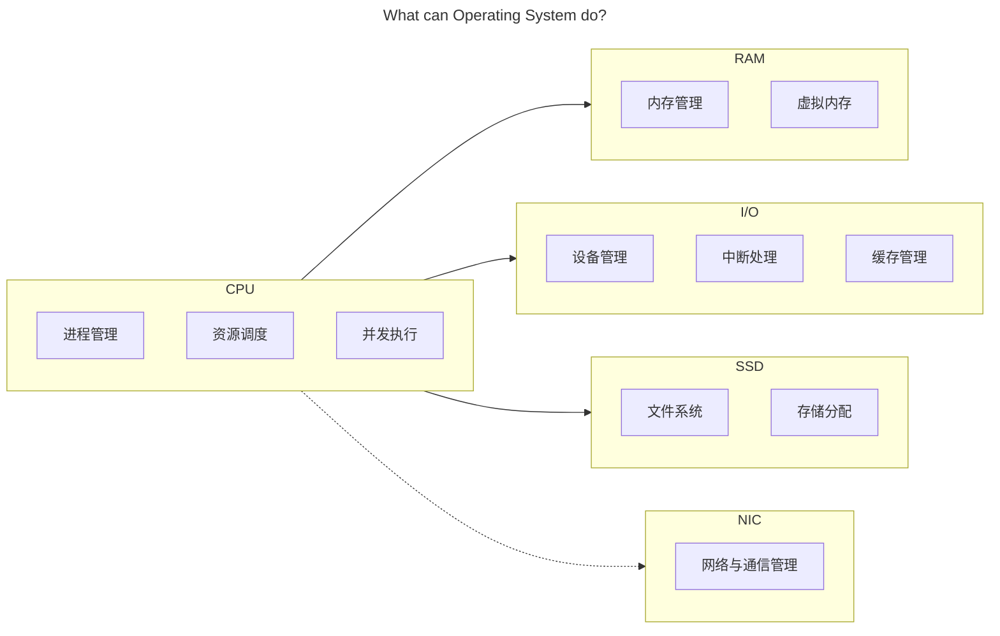

## 操作系统

## 前言

学科地位：

| 主讲教师 | 学分配额 | 学科类别 |
| :------: | :------: | :------: |
|  段博佳  |   4+1    |  专业课  |

成绩组成：

| 理论课 |      |  实验课  |      |
| :----: | :--: | :------: | :--: |
|  平时  | 10%  | 小组作业 | 100% |
|  期中  | 30%  |          |      |
|  期末  | 60%  |          |      |

教材情况：

|   课程名称   |     选用教材     | 版次 |        作者        |     出版社     |      ISBN 号       |
| :----------: | :--------------: | :--: | :----------------: | :------------: | :---------------: |
| 操作系统原理 | 《操作系统教程》 |  6   | 骆斌 葛季栋 费翔林 | 高等教育出版社 | 978-7-04-055304-8 |

学习资源：

- 🖥 [合集·[完结] 2024 南京大学 “操作系统：设计与实现” (蒋炎岩)](https://space.bilibili.com/202224425/channel/collectiondetail?sid = 2237004)
- 📑 [蒋炎岩课程配套讲义](https://jyywiki.cn/OS/2024/)

最难崩的一集：

为什么要学这门课？

> 目前无论是考研还是互联网行业求职，操作系统似乎一直深受青睐。在对操作系统有了一点粗浅的认知后，我做出了这样的人机类比，尝试解释为什么操作系统会有如今这般重要的地位。
>
> 对于任何一种具备交互、计算功能的电子计算机而言。不同的 **模块** 就是不同的器官，承担了各自的责任和义务（毋庸置疑 CPU 就是心脏）；源源不断的 **电能** 就是循环不止的血液，确保所有的细胞能及时的进行呼吸以正常工作；**主板** 则承担了骨架与神经的指责，搭载了所有的模块并确保数据可以在不同的模块之间自由的流通；而 **操作系统** 则肩负起肌肉的责任，从 CPU 的心肌泵动开始让整台计算器健康地运作。

会收获什么？

> 能详细地解释下面的过程中电脑都发生了什么：按下电源键，网络连接，蓝牙连接，启动网易云音乐播放器软件并开始播放，启动谷歌浏览器并进入力扣网站，启动 Pycharm 集成开发环境软件编写代码并运行测试，关闭 Pycharm，关闭谷歌浏览器，关闭网易云，断开蓝牙，断开 WIFI 连接，按下电源键。
>
> 记得多想想：是什么？为什么？会怎么样？当然也可以想想：可以比它更优吗？比如：什么是【操作系统】？为什么会有【操作系统】？有了【操作系统】会怎么样吗？可以用别的策略代替吗？上述的【操作系统】可以替换为任意一个名词或短语。

## 绪论

本文的行文大纲是基于硬件进行的。毕竟操作系统并非实体，本质是一个运行在硬件之上的软件，只不过这个软件的权限比较高可以直接调用分配硬件资源而已。全文围绕以下 4 个硬件模块的 **各自功能** 以及 **之间的交互** 展开：

**操作系统的定义是什么**？对于硬件。操作系统封装所有的硬件资源；对于用户和软件。操作系统将封装好的硬件资源分配给软件调用，同时为用户提供可视化界面。

**操作系统是怎么管理资源的**？主要有三个技术。资源复用、资源虚拟化和资源抽象。后两个技术都是从第一个资源复用衍生而来，个人认为很多东西的解释都被复杂化了。

- 比如，资源复用。其实根本没有复用，这只是相对于一开始的时候，一台计算机只能一次运行一个程序而言的。现在一台计算机需要同时运行很多程序，怎么办呢？既然程序运行需要计算资源，那我直接把计算机中的资源划分成很多份不就好了。当然了，除了空间上的划分，时间上也可以划分，于是就有了资源复用中「空分复用」和「时分复用」两个理念。
- 资源虚拟化听着玄乎，其实就是名词学术化的资源复用。比如，我将物理世界中的硬件，通过操作系统的划分与调度，将其转化为逻辑世界中的多个资源，也就是所谓的将「单一物理资源」虚拟化为「多个逻辑资源」的理念。
- 资源抽象也很好理解，就是一种底层封装，顶层调用的思想。比如，对于每一个进程而言，都获得了操作系统为 ta 单独分配的 CPU 状态集和内存空间，而无需关心这些硬件资源是怎么分配给 ta 的。比如，对于每一个文件而言，都是对物理存储空间的抽象。

**操作系统有什么特点**？并发性、共享性和异步性，都很好理解。并发就是多个进程任务同时进行，但其实是操作系统的一个小把戏，让 CPU 在极短的时间间隔内频繁地切换执行不同的进程；共享是并发的衍生，我们知道程序执行是需要消耗资源的，而资源有限，因此我们可以让所有的进程共享同一块资源；而异步就是指一个任务在等待其他任务执行时，不会阻塞整个系统，等到其他任务执行结束或者切换到当前任务时，可以继续 ta 的执行。**所以这么折腾到底是为了啥**？可以从两个角度出发：

1. 对于一个任务而言：这样做可以提升资源利用率。因为一个进程在执行时，任务会有很多，不仅仅需要 CPU 的状态计算，可能还需要和别的设备进行数据交互，我们知道 CPU 的计算效率远高于诸如 I/O 之类的设备，这就会让系统停下来等待进程执行其他的任务。我们就可以利用系统停下来等待的这段时间，把这个进程的其他任务给执行了。同时，如果一个任务可以被划分为多个子任务，也可以并发以提升资源利用率。
2. 对于多个任务而言：可以提升系统的响应效率。多个用户同时提交请求？是一个一个响应，最快的极快，最慢的很慢。还是牺牲一点速度，大家都慢一点但是都没那么慢，同时响应？显然是后者。

## CPU

### 一、进程管理

### 二、资源调度

### 三、并发程序

## RAM

### 四、内存管理

### 五、虚拟内存

## I/O

### 六、设备管理

## SSD

### 七、文件系统

## 后记

除了上述的 4 个模块，还有很多模块都没有涉及，有机会一定会补。例如：显卡、网卡、BIOS、南桥北桥芯片组……
