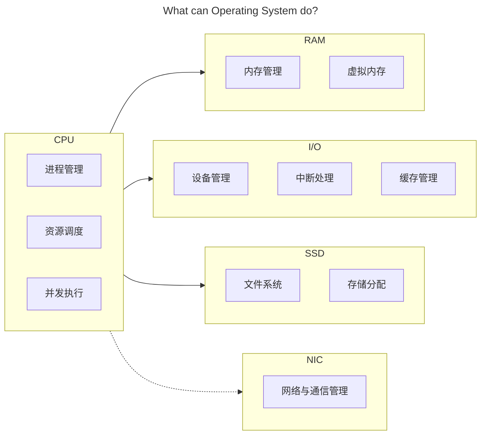
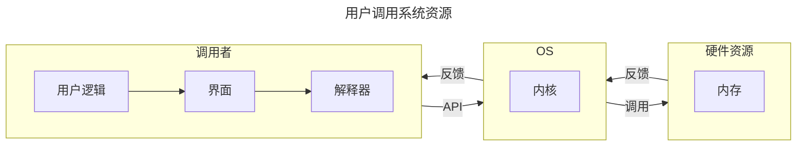
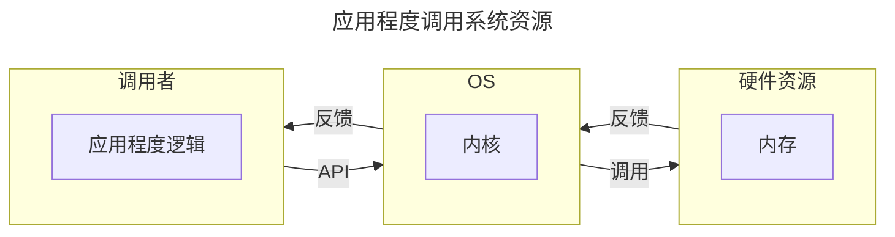
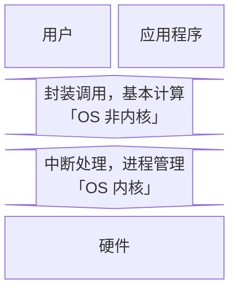

## 操作系统

## 前言

学科地位：

| 主讲教师 | 学分配额 | 学科类别 |
| :------: | :------: | :------: |
|  段博佳  |   4+1    |  专业课  |

成绩组成：

| 理论课 |      |  实验课  |      |
| :----: | :--: | :------: | :--: |
|  平时  | 10%  | 小组作业 | 100% |
|  期中  | 30%  |          |      |
|  期末  | 60%  |          |      |

教材情况：

|   课程名称   |     选用教材     | 版次 |        作者        |     出版社     |      ISBN 号       |
| :----------: | :--------------: | :--: | :----------------: | :------------: | :---------------: |
| 操作系统原理 | 《操作系统教程》 |  6   | 骆斌 葛季栋 费翔林 | 高等教育出版社 | 978-7-04-055304-8 |

学习资源：

- 🖥 [合集·[完结] 2024 南京大学 “操作系统：设计与实现” (蒋炎岩)](<https://space.bilibili.com/202224425/channel/collectiondetail?sid=2237004>)
- 📑 [蒋炎岩课程配套讲义](https://jyywiki.cn/OS/2024/)

最难崩的一集：

为什么要学这门课？

> 目前无论是考研还是互联网行业求职，操作系统似乎一直深受青睐。在对操作系统有了一点粗浅的认知后，我做出了这样的人机类比，尝试解释为什么操作系统会有如今这般重要的地位。
>
> 对于任何一种具备交互、计算功能的电子计算机而言。不同的 **模块** 就是不同的器官，承担了各自的责任和义务（毋庸置疑 CPU 就是心脏）；源源不断的 **电能** 就是循环不止的血液，确保所有的细胞能及时的进行呼吸以正常工作；**主板** 则承担了骨架与神经的指责，搭载了所有的模块并确保数据可以在不同的模块之间自由的流通；而 **操作系统** 则肩负起肌肉的责任，从 CPU 的心肌泵动开始让整台计算器健康地运作。

会收获什么？

> 能详细地解释下面的过程中电脑都发生了什么：按下电源键，网络连接，蓝牙连接，启动网易云音乐播放器软件并开始播放，启动谷歌浏览器并进入力扣网站，启动 Pycharm 集成开发环境软件编写代码并运行测试，关闭 Pycharm，关闭谷歌浏览器，关闭网易云，断开蓝牙，断开 WIFI 连接，关机。
>
> 记得多想想：是什么？为什么？会怎么样？当然也可以想想：可以比它更优吗？比如：什么是【操作系统】？为什么会有【操作系统】？有了【操作系统】会怎么样吗？可以用别的策略代替吗？上述的【操作系统】可以替换为任意一个名词或短语。

## 绪论

**硬件视角下 OS 是什么样的**？

**操作系统的定义是什么**？

- 对于硬件。操作系统封装所有的硬件资源，并抽象出系统调用接口供外部调用。
- 对于用户和软件。操作系统通过提供抽象好的 API 给软件和用户提供运行和计算服务。

**操作系统是怎么管理资源的**？

主要有三个技术。资源复用、资源虚拟化和资源抽象。后两个技术都是从第一个技术衍生而来，个人认为很多东西的解释都被复杂化了。

- 资源复用。其实根本没有复用，这只是相对于一开始的时候，一台计算机只能一次运行一个程序而言的。现在一台计算机需要同时运行很多程序，怎么办呢？既然程序运行需要计算资源，那我直接把计算机中的资源划分成很多份不就好了。当然了，除了内存进行空间上的划分，时间上也可以划分，比如 CPU，于是就有了资源复用中「空分复用」和「时分复用」两个理念。
- 资源虚拟。其实就是名词学术化的资源复用。比如，我将物理世界中的硬件，通过操作系统的划分与调度，将其转化为逻辑世界中的多个资源，也就是所谓的将「单一物理资源」虚拟化为「多个逻辑资源」的理念。
- 资源抽象。就是一种底层封装，顶层调用的思想。比如，对于每一个进程而言，都获得了操作系统为 ta 单独分配的 CPU 状态集和内存空间，而无需关心这些硬件资源是怎么分配给 ta 的。比如，对于每一个文件而言，都是对物理存储空间的抽象。

**操作系统有什么特点**？

并发性、共享性和异步性。都很好理解。并发就是多个进程任务同时进行，但其实是操作系统的一个小把戏，让 CPU 在极短的时间间隔内频繁地切换执行不同的进程；共享是并发的衍生，我们知道程序执行是需要消耗资源的，而资源有限，因此我们可以让所有的进程共享同一块资源；而异步就是指一个任务在等待其他任务执行时，不会阻塞整个系统，等到其他任务执行结束或者切换到当前任务时，可以继续 ta 的执行。**所以这么折腾到底是为了啥**？可以从两个角度出发：

1. 对于一个任务而言：这样做可以 **提升资源利用率**。因为一个进程在执行时，任务会有很多，不仅仅需要 CPU 的状态计算，可能还需要和别的设备进行数据交互，我们知道 CPU 的计算效率远高于诸如 I/O 之类的设备，这就会让系统停下来等待进程执行其他的任务。我们就可以利用系统停下来等待的这段时间，把这个进程的其他任务给执行了。同时，如果一个任务可以被划分为多个子任务，也可以并发以提升资源利用率。
2. 对于多个任务而言：可以 **提升系统响应效率**。多个用户同时提交请求？是一个一个响应，最快的极快，最慢的很慢。还是牺牲一点速度，大家都慢一点但是都没那么慢，同时响应？显然是后者。

**操作系统是怎么对上层提供服务的**？

一句话概括就是，操作系统将封装好的应用程序接口 (Application Program Interface, 简称 API) 给用户或应用程序调用。例如下面的两个流程图：

**为什么让操作系统对下层抽象进而为上层提供服务**？

因为下层的硬件电路十分繁杂，并且不同厂商生产的硬件可能会有使用上的不同。通过操作系统对下层硬件的封装，不仅可以隐藏复杂的硬件资源调度，还可以统一出一种普适性更高的接口规则供上层服务使用。

**操作系统的内核是什么？操作系统的其他部分是什么？为什么要这样区分？**

- 首先我们有必要了解「用户态」和「内核态」的概念。这两种状态定义了应用程序的指令执行权限，当程序运行在用户态时，不可以执行一些关键的指令，例如中断、网络通信等；但当程序运行在核心态时，可以执行所有指令。不难发现隔离化的运行模式相比于所有应用程序都有最高指令执行权限来说，可以进一步提升程序运行时系统的安全性。于是乎，操作系统的内核概念应运而生。
- 知道了指令执行权限隔离的程序运行理念后，再来理解操作系统的内核就很显然了。我们知道操作系统本质上就是一系列的系统软件，我们将操作系统中直接与硬件交互的软件划分到一起并称为「内核」，代表性内核软件可以实现的功能如「中断处理，进程管理」。操作系统剩余的部分就被划分为「非内核」部分，用于和应用程序直接交互，代表性非内核软件可以实现的功能形如「提供系统调用接口，基本计算」。当程序运行在用户态时，仅可以和操作系统的非内核部分交互；当切换到核心态时，就可以操作系统包括内核的所有部分交互。

## 并发

### 1 进程控制与管理

CPU 的核心关键是并发程序，为此每一个硬件设计与相应 OS 的运行逻辑，都和 **进程管理、资源调度、并发** 息息相关。

#### 1.1 进程的定义

**进程和程序的区别是什么？动态性**。程序是一个指令序列，当程序载入进程时就转换为了进程。

#### 1.2 进程的状态

五态模型：

七态模型：

#### 1.3 进程的描述

**如何准确描述一个进程？通过进程映象**。我们引入进程映象的概念。所谓进程映象就是某一时刻的进程状态，可以描述为以下 4 个部分：

#### 1.4 进程的组织

**操作系统如何跟踪每一个进程？通过 PCB**。每一个进程都会有很多信息，OS 设计者将其统一存储在进程控制块 (Process Control Block, 简称 PCB) 中。每一个进程都有自己的 PCB，只要是跟进程管理相关的数据信息一定都存储于 PCB 中。PCB 中存储的内容主要有以下内容：

- 标识信息
    - 进程标识 PID
    - 进程组标识 ID

- 现场信息
    - 程序计数器 Program Counter
    - CPU 寄存器：包括栈指针、通用寄存器等

- 控制信息
    - 进程状态：三态、五态等等
    - CPU 调度信息：如优先级、调度队列指针、调度参数等
    - 内存管理信息：依据内存管理的方式不同而不同，如基/限长寄存器、段/页表指针等
    - 计费信息：如进程使用的 CPU 时间
    - I/O 状态信息：包括分配给该进程的 I/O 设备列表、打开文件列表等

**当有多个进程处于同一个状态时，操作系统如何访存不同的进程呢？通过等待队列存储 PCB 以及优先级调度算法实现**。我们将状态相同的进程存放到同一个容器（如链表队列）中，操作系统拥有每一个容器的指针。容器中相同状态的不同进程可能会按照优先级的顺序链接。那么容器中存的是什么呢？从上文可以知道，每一个 PCB 都可以唯一确定一个进程，因此等待队列中只需要存储 PCB 即可。

#### 1.5 进程的切换

**并发执行程序时，如何切换状态？如何继续运行原进程呢？通过中断/系统调用切换状态，通过 PCB 保存现场数据**。PCB 中的寄存器可以在切换进程时保存必要的数据，确保进程在中断获得运行权后能够从刚才的状态继续运行。这个「触发中断、保存现场、处理中断、恢复现场、结束中断」的过程被称为进程上下文切换。如下图所示：

#### 1.6 进程的最小执行单元

**如果在执行中断任务时又中断了呢？这是不会发生的**。进程在执行/切换时，很多操作是不允许被打断的，我们就需要进程的最小执行单元，这被称作「原语」操作。例如更新进程信息（修改 PCB 中的信息）、更新进程状态（修改 PCB 所在的状态队列）、分配/回收资源等等。

#### 1.7 线程

**线程是什么**？线程是从进程引申出来的概念与技术。进程是「资源分配的最小单位」，而线程是「CPU 调度的最小单位」。一个进程下可以有多个线程，每一个线程共享当前进程的所有资源，线程只拥有执行指令的最基本资源，例如 PC、寄存器等。

**为什么会有线程**？当一个进程的任务很复杂以至于也需要并发时，线程就可以充当更细力度的并发单元。也就是说线程的出现是为了解决越来越复杂的进程多任务并发问题的。

**多线程的几种模式是什么？分别有用户级线程、内核级线程和混合级线程**。其中用户级线程 (User Level Thread) 的多线程逻辑顾名思义，就是由程序开发者定义，便于解决「逻辑并行」的问题。内核级线程 (Kernel Level Thread) 的多线程则由系统调用决定，便于解决「物理并行」的问题。

### 2 处理器调度

#### 2.1 三级模式

分为高级调度、中级调度和低级调度。其中：

- **高级调度（作业调度）** 是决定哪些进程从外存对换到内存中，也就是 **分配内存** 资源。
- **中级调度** 是决定哪些进程从内存对换到外存中，也就是 **取消分配内存** 资源。
- **低级调度（进程调度）** 是决定哪些内存中的进程可以获得合适的 CPU 计算资源，也就是 **分配计算** 资源。

#### 2.2 评价指标

显然周转时间 $\iff$ 运行时间+等待时间，因此上述「带权」的含义可以理解为作业处理效率，取值范围为 $[1,\infty]$。

#### 2.3 七种调度算法

##### 先来先服务

- 先来先服务 (First Come First Serverd, FCFS)。
- 非抢占式。
- 按照进程进入就绪队列的时间顺序分配进程的计算资源。

##### 最短作业优先

- 最短作业优先 (Shortest Job First, SJF)。
- 非抢占式。
- 经典排队打水贪心算法的应用。根据就绪队列中所有进程的预估运行时间进行排序，每次给最小运行时间的进程分配计算资源。
- 显然如果一直有很小的运行时间的进程进入就绪队列，就会造成已经存在于就绪队列中但是运行时间较长的进程“饿死”。

##### 最短剩余时间优先

- 最短剩余时间优先 (Shortest Remaining Time First, SRTF)。
- 就是最短作业优先 (Shortest Job First, SJF) 的抢占式版本。
- 抢占式。

##### 最高响应比优先

- 最高响应比优先 (Highest Response Ratio First, HRRF)。
- 非抢占式。
- 每次给响应比最大的进程分配计算资源。
- 响应比定义为 $\displaystyle \frac{\text{当前已经等待的时间}+\text{服务时间}}{\text{服务时间}}$。

##### 优先级调度算法

- 非抢占式。注意优先数和优先级的对应关系。

- 抢占式。

##### 轮转调度

- 轮转调度 (Round Robin, RR)。
- 非抢占式。
- 每次从就绪队列中拿出最近的进程，然后执行最多时间片长度。如果还没执行结束则重新入队。

##### 多级反馈队列调度

- 多级反馈队列调度 (Multi-Level Feedback Queue, MLFQ)。
- 非抢占式与抢占式都有。
- 新到达的进程首先进入最高优先级的就绪队列，每个就绪队列的调度策略为轮转调度。如果进程在该就绪队列的时间片内未能完成，则被转移到下一级就绪队列等待运行。每个就绪队列的时间片通常比上一级就绪队列的时间片长，可以定义第 $i$ 层就绪队列的时间片长度为 $2^i$。

##### 小结 *

| 序号 | 算法             | 算法思想                                                     |    抢占与否     |         饥饿与否         | 调度范围  | 特点                                                         |
| :--: | :--------------- | :----------------------------------------------------------- | :-------------: | :----------------------: | :-------: | :----------------------------------------------------------- |
|  1   | 先来先服务       | 按照作业/进程到达的先后顺序进行服务                          |    非抢占式     |         不会饥饿         | 作业/进程 | 有利于长作业不利于短作业                                     |
|  2   | 最短作业优先     | 当前进程停止执行时，选择预计所需的 CPU 运行时间最小的进程执行 |    非抢占式     |          会饥饿          | 作业/进程 | 对长作业不利                                                 |
|  3   | 最短剩余时间优先 | 当一个新进程加入就绪队列时，它可能具有比当前运行进程更短的剩余运行时间，此时调度器将让该就绪进程抢占当前运行的进程 |     抢占式      |          会饥饿          | 作业/进程 | 算法 2 的抢占式版本；对长作业不利                            |
|  4   | 最高响应比优先   | 当前运行的进程结束或阻塞时，选择响应比最大的进程执行         |    非抢占式     |         不会饥饿         | 作业/进程 | 结合算法 1,2,3 的优势                                        |
|  5   | 最高优先级调度   | 优先级调度算法根据确定的优先级来选择进程/线程，总是选择就绪队列中优先级最高者投入运行。 | 非抢占式/抢占式 | 静态优先级可能会导致饥饿 | 作业/进程 | 适用于实时操作系统                                           |
|  6   | 轮转调度         | 将时间切分成定长的时间片，当时间片用完后，产生时钟中断。     |     抢占式      |         不会饥饿         | 进程调度  | 有利于多用户、多交互式进程；时间片太大，算法会退化为先来先服务；时间片太小，进程切换频繁，开销大 |
|  7   | 多级反馈队列调度 | 对各种调度算法的权衡。设置多级就绪队列，各级队列优先级从高到低，时间片从小到大。 | 非抢占式/抢占式 |     长进程可能会饿死     | 进程调度  |                                                              |

### 3 互斥与同步

#### 3.1 并发进程

**两个进程什么时候可以并发执行**？引入 Brenstein 条件：对于两个进程对变量的引用集 $R_1,R_2$ 和改变集 $W_1,W_2$，如果 $R_1\bigcap W_2,R_2\bigcap W_1,W_1\bigcap W_2$ 均为空集，则可以并发执行。

#### 3.2 临界区管理

注：由于所有的进程逻辑都取决于指令，指令又对应高级语言，因此我们以高级语言的逻辑代表进程的逻辑。

**如何避免进程的并发错误**？我们引入 **临界区** 的概念。显然的，并发程序的错误一定源于对变量「同时但错误」的引用与改变（资源分配错误的本质还是高级语言在并发逻辑上的错误），因此我们对于并发程序中同时引用或修改的变量需要格外注意。我们定义并发程序中与共享变量有关的程序段叫做「临界区」，共享变量对应的资源就叫做「临界资源」。而并发程序为了确保正确性和安全性，需要做的就是需要避免并发程序对「临界资源」的同时使用。于是就有了临界区管理的策略。

Perterson 算法。

#### 3.3 信号量与 PV 操作

### 4 死锁

## 虚拟化

## 持久化

### 存储管理

### 设备管理

### 文件系统
