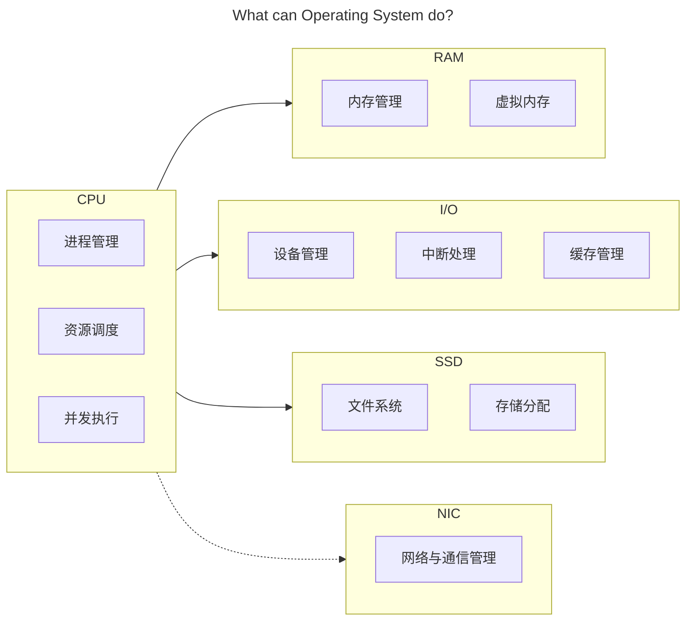
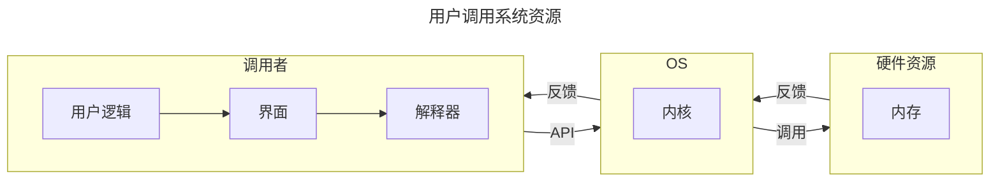
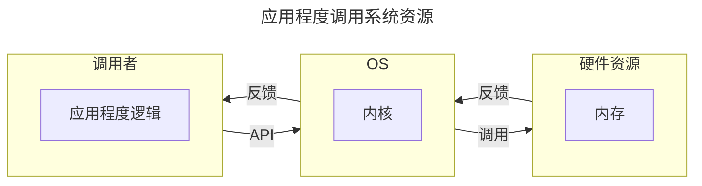
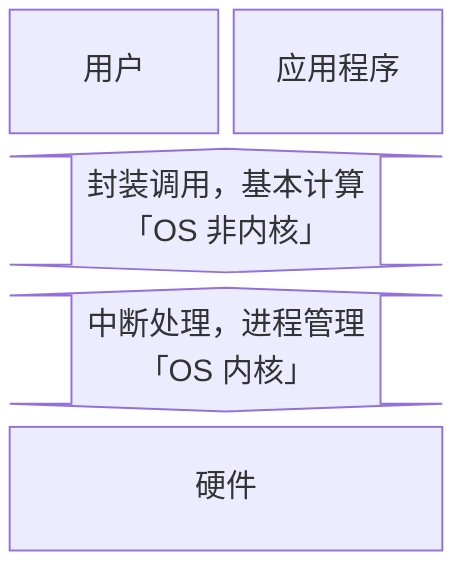

## 操作系统

## 前言

学科地位：

| 主讲教师 | 学分配额 | 学科类别 |
| :------: | :------: | :------: |
|  段博佳  |   4+1    |  专业课  |

成绩组成：

| 理论课 |      |  实验课  |      |
| :----: | :--: | :------: | :--: |
|  平时  | 30%  | 小组作业 | 100% |
|  期中  | 10%  |          |      |
|  期末  | 60%  |          |      |

教材情况：

|   课程名称   |     选用教材     | 版次 |        作者        |     出版社     |      ISBN 号       |
| :----------: | :--------------: | :--: | :----------------: | :------------: | :---------------: |
| 操作系统原理 | 《操作系统教程》 |  6   | 骆斌 葛季栋 费翔林 | 高等教育出版社 | 978-7-04-055304-8 |

学习资源：

- 🖥 [合集·[完结] 2024 南京大学 “操作系统：设计与实现” (蒋炎岩)](<https://space.bilibili.com/202224425/channel/collectiondetail?sid=2237004>)
- 📑 [蒋炎岩课程配套讲义](https://jyywiki.cn/OS/2024/)

最难崩的一集：


为什么要学这门课？

> 目前无论是考研还是互联网行业求职，操作系统似乎一直深受青睐。在对操作系统有了一点粗浅的认知后，我做出了这样的人机类比，尝试解释为什么操作系统会有如今这般重要的地位。
>
> 对于任何一种具备交互、计算功能的电子计算机而言。不同的 **模块** 就是不同的器官，承担了各自的责任和义务（毋庸置疑 CPU 就是心脏）；源源不断的 **电能** 就是循环不止的血液，确保所有的细胞能及时的进行呼吸以正常工作；**主板** 则承担了骨架与神经的指责，搭载了所有的模块并确保数据可以在不同的模块之间自由的流通；而 **操作系统** 则肩负起肌肉的责任，从 CPU 的心肌泵动开始让整台计算器健康地运作。

会收获什么？

> 能详细地解释下面的过程中电脑都发生了什么：按下电源键，网络连接，蓝牙连接，启动网易云音乐播放器软件并开始播放，启动谷歌浏览器并进入力扣网站，启动 Pycharm 集成开发环境软件编写代码并运行测试，关闭 Pycharm，关闭谷歌浏览器，关闭网易云，断开蓝牙，断开 WIFI 连接，关机。
>
> 记得多想想：是什么？为什么？会怎么样？当然也可以想想：可以比它更优吗？比如：什么是【操作系统】？为什么会有【操作系统】？有了【操作系统】会怎么样吗？可以用别的策略代替吗？上述的【操作系统】可以替换为任意一个名词或短语。

## 绪论

**硬件视角下 OS 是什么样的**？



**操作系统的定义是什么**？

- 对于硬件。操作系统封装所有的硬件资源，并抽象出系统调用接口供外部调用。
- 对于用户和软件。操作系统通过提供抽象好的 API 给软件和用户提供运行和计算服务。

**操作系统是怎么管理资源的**？

主要有三个技术。资源复用、资源虚拟化和资源抽象。后两个技术都是从第一个技术衍生而来，个人认为很多东西的解释都被复杂化了。

- 资源复用。其实根本没有复用，这只是相对于一开始的时候，一台计算机只能一次运行一个程序而言的。现在一台计算机需要同时运行很多程序，怎么办呢？既然程序运行需要计算资源，那我直接把计算机中的资源划分成很多份不就好了。当然了，除了内存进行空间上的划分，时间上也可以划分，比如 CPU，于是就有了资源复用中「空分复用」和「时分复用」两个理念。
- 资源虚拟。其实就是名词学术化的资源复用。比如，我将物理世界中的硬件，通过操作系统的划分与调度，将其转化为逻辑世界中的多个资源，也就是所谓的将「单一物理资源」虚拟化为「多个逻辑资源」的理念。
- 资源抽象。就是一种底层封装，顶层调用的思想。比如，对于每一个进程而言，都获得了操作系统为 ta 单独分配的 CPU 状态集和内存空间，而无需关心这些硬件资源是怎么分配给 ta 的。比如，对于每一个文件而言，都是对物理存储空间的抽象。

**操作系统有什么特点**？

并发性、共享性和异步性。都很好理解。并发就是多个进程任务同时进行，但其实是操作系统的一个小把戏，让 CPU 在极短的时间间隔内频繁地切换执行不同的进程；共享是并发的衍生，我们知道程序执行是需要消耗资源的，而资源有限，因此我们可以让所有的进程共享同一块资源；而异步就是指一个任务在等待其他任务执行时，不会阻塞整个系统，等到其他任务执行结束或者切换到当前任务时，可以继续 ta 的执行。**所以这么折腾到底是为了啥**？可以从两个角度出发：

1. 对于一个任务而言：这样做可以 **提升资源利用率**。因为一个进程在执行时，任务会有很多，不仅仅需要 CPU 的状态计算，可能还需要和别的设备进行数据交互，我们知道 CPU 的计算效率远高于诸如 I/O 之类的设备，这就会让系统停下来等待进程执行其他的任务。我们就可以利用系统停下来等待的这段时间，把这个进程的其他任务给执行了。同时，如果一个任务可以被划分为多个子任务，也可以并发以提升资源利用率。
2. 对于多个任务而言：可以 **提升系统响应效率**。多个用户同时提交请求？是一个一个响应，最快的极快，最慢的很慢。还是牺牲一点速度，大家都慢一点但是都没那么慢，同时响应？显然是后者。

**操作系统是怎么对上层提供服务的**？

一句话概括就是，操作系统将封装好的应用程序接口 (Application Program Interface, 简称 API) 给用户或应用程序调用。例如下面的两个流程图：





**为什么让操作系统对下层抽象进而为上层提供服务**？

因为下层的硬件电路十分繁杂，并且不同厂商生产的硬件可能会有使用上的不同。通过操作系统对下层硬件的封装，不仅可以隐藏复杂的硬件资源调度，还可以统一出一种普适性更高的接口规则供上层服务使用。

**操作系统的内核是什么？操作系统的其他部分是什么？为什么要这样区分？**

首先我们有必要了解「用户态」和「内核态」的概念。这两种状态定义了应用程序的指令执行权限，当程序运行在用户态时，不可以执行一些关键的指令，例如中断、网络通信等；但当程序运行在核心态时，可以执行所有指令。不难发现隔离化的运行模式相比于所有应用程序都有最高指令执行权限来说，可以进一步提升程序运行时系统的安全性。于是乎，操作系统的内核概念应运而生。

知道了指令执行权限隔离的程序运行理念后，再来理解操作系统的内核就很显然了。我们知道操作系统本质上就是一系列的系统软件，我们将操作系统中直接与硬件交互的软件划分到一起并称为「内核」，代表性内核软件可以实现的功能如「中断处理，进程管理」。操作系统剩余的部分就被划分为「非内核」部分，用于和应用程序直接交互，代表性非内核软件可以实现的功能形如「提供系统调用接口，基本计算」。当程序运行在用户态时，仅可以和操作系统的非内核部分交互；当切换到核心态时，就可以操作系统包括内核的所有部分交互。



## 并发

### 1 进程管理

CPU 的核心关键是能够并发执行程序。因此硬件设计与 OS 运行逻辑，都和 **进程管理、资源调度、并发** 息息相关。

#### 1.1 进程的定义

**进程和程序的区别是什么？动态性**。程序是一个指令序列，当程序载入进程时就转换为了进程。

#### 1.2 进程的状态

五态模型：


七态模型：


#### 1.3 进程的描述

**如何准确描述一个进程？通过进程映象**。我们引入进程映象的概念。所谓进程映象就是某一时刻的进程状态，可以描述为以下 4 个部分：


#### 1.4 进程的组织

**操作系统如何跟踪每一个进程？通过进程控制块 (Process Control Block, 简称 PCB)**。每一个进程都会有很多信息，OS 设计者将其统一存储在 PCB 中。每一个进程都有自己的 PCB，只要是跟进程管理相关的数据信息一定都存储于 PCB 中。PCB 中存储的内容主要有以下内容：

- 标识信息
    - 进程标识 PID
    - 进程组标识 ID
- 现场信息
    - 程序计数器 Program Counter
    - CPU 寄存器：包括栈指针、通用寄存器等
- 控制信息
    - 进程状态：三态、五态等等
    - CPU 调度信息：如优先级、调度队列指针、调度参数、进程使用的 CPU 时间等
    - 内存管理信息：依据内存管理的方式不同而不同，如基/限长寄存器、段/页表指针等
    - I/O 状态信息：包括分配给该进程的 I/O 设备列表、打开文件列表等

**当有多个进程处于同一个状态时，操作系统如何访存不同的进程呢？通过等待队列存储 PCB 以及优先级调度算法实现**。我们将状态相同的进程存放到同一个容器（如链表队列）中，操作系统拥有每一个容器的指针。容器中相同状态的不同进程可能会按照优先级的顺序链接。那么容器中存的是什么呢？从上文可以知道，每一个 PCB 都可以唯一确定一个进程，因此等待队列中只需要存储 PCB 即可。

#### 1.5 进程的切换

**并发执行程序时，如何切换状态？如何继续运行原进程呢？**通过「中断/系统调用」切换状态，通过 PCB 保存现场数据。

以下图两个进程，进程 0 和进程 1 为例。操作系统会在进程切换的中断信号发生时，首先保存进程 0 的诸如「通用寄存器的值、程序计数器、状态寄存器」等寄存器信息到其 PCB 中，然后将待处理进程 1 的 PCB 中保存的各种寄存器信息加载到 CPU 的寄存器中执行。等进程 1 执行完后，再将进程 0 的 PCB 中存储的寄存器信息加载到 CPU 的寄存器中即可恢复进行 0 的执行。

可以发现这个进程上下文切换的过程其实就是对所有寄存器做一个快照的过程。总结一下就是「触发中断、保存现场、处理中断、恢复现场、结束中断」。如下图所示：


#### 1.6 原语

**如果在执行中断任务时又中断了呢**？这是不会发生的。进程在执行/切换时，很多操作是不允许被打断的，我们就需要进程的最小执行单元，这被称作「原语」操作。例如更新进程信息（修改 PCB 中的信息）、更新进程状态（修改 PCB 所在的状态队列）、分配/回收资源等等。

#### 1.7 线程

**线程是什么**？线程是从进程引申出来的概念与技术。进程是「资源分配的最小单位」，而线程是「CPU 调度的最小单位」。一个进程下可以有多个线程，每一个线程共享当前进程的所有资源，线程只拥有执行指令的最基本资源，例如 PC、寄存器等。

**为什么会有线程**？当一个进程的任务很复杂以至于也需要并发时，线程就可以充当更细力度的并发单元。也就是说线程的出现是为了解决越来越复杂的进程多任务并发问题的。

**多线程的几种模式是什么**？分别有用户级线程、内核级线程和混合级线程。其中用户级线程 (User Level Thread) 的多线程逻辑顾名思义，就是由程序开发者定义，便于解决「逻辑并行」的问题。内核级线程 (Kernel Level Thread) 的多线程则由系统调用决定，便于解决「物理并行」的问题。

### 2 处理器调度

本章我们介绍处理器关于进程调度的基本理念、评价指标和常见算法。

#### 2.1 三级模式

分为高级调度、中级调度和低级调度。其中：

- **高级调度（作业调度）** 是决定哪些进程从外存对换到内存中，也就是 **分配内存** 资源，即七态模型中「挂起就绪态 $\rightarrow$ 就绪态」的转换。
- **中级调度** 是决定哪些进程从内存对换到外存中，也就是 **取消分配内存** 资源，即七态模型中「挂起就绪态 $\leftarrow$ 就绪态」的转换。
- **低级调度（进程调度）** 是决定哪些内存中的进程可以获得合适的 CPU 计算资源，也就是 **分配计算** 资源，即五态模型中「就绪态 $\rightleftharpoons$ 运行态」之间的转换。

#### 2.2 评价指标


显然周转时间 $\iff$ 运行时间+等待时间，因此上述「带权」的含义可以理解为作业处理效率，取值范围为 $[1,\infty]$。

#### 2.3 调度算法

##### 先来先服务 FCFS


- 先来先服务 (First Come First Serverd, FCFS)。
- 非抢占式。
- 按照进程进入就绪队列的时间顺序分配进程的计算资源。

##### 短作业优先 SJF


- 最短作业优先 (Shortest Job First, SJF)。
- 非抢占式。
- 经典排队打水贪心算法的应用。根据就绪队列中所有进程的预估运行时间进行排序，每次给最小运行时间的进程分配计算资源。
- 显然如果一直有很小的运行时间的进程进入就绪队列，就会造成已经存在于就绪队列中但是运行时间较长的进程“饿死”。

##### 最短剩余时间优先 SRTF


- 最短剩余时间优先 (Shortest Remaining Time First, SRTF)。
- 短作业优先的抢占式版本。

##### 最高响应比优先 HRRF


- 最高响应比优先 (Highest Response Ratio First, HRRF)。
- 非抢占式。
- 每次给响应比最大的进程分配计算资源。
- 响应比定义为 $\displaystyle \frac{\text{当前已经等待的时间}+\text{服务时间}}{\text{服务时间}}$。

##### 优先级调度 Pr

- 优先级调度 (Priority Scheduling, Pr)
- 分为抢占式和非抢占式。


- 非抢占式。注意优先数和优先级的对应关系。


- 抢占式。

##### 轮转调度 RR


- 轮转调度 (Round Robin Scheduling, RR)。
- 抢占式。一个时间片结束后如果进程没有执行完毕，OS 会产生时钟中断从而切换进程进行服务。
- 每次从就绪队列中取出进程后，执行最多时间片长度的时间，如果还没执行结束则重新入队。

##### 多级反馈队列调度 MLFQ


- 多级反馈队列调度 (Multi-Level Feedback Queue, MLFQ)。
- 非抢占式与抢占式都有。
- 新到达的进程首先进入最高优先级的就绪队列，每个就绪队列的调度策略为轮转调度。如果进程在该就绪队列的时间片内未能完成，则被转移到下一级就绪队列等待运行。每个就绪队列的时间片通常比上一级就绪队列的时间片长，可以定义第 $i$ 层就绪队列的时间片长度为 $2^i$。

##### 小结

对上述 7 种处理器调度算法进行总结，如下表所示。

| 序号 | 算法             | 算法思想                                                   |    抢占与否     |         饥饿与否         | 调度范围  | 特点                                                         |
| :--: | :--------------- | :--------------------------------------------------------- | :-------------: | :----------------------: | :-------: | :----------------------------------------------------------- |
|  1   | 先来先服务       | 按照到达的先后顺序进行服务                                 |    非抢占式     |         不会饥饿         | 作业/进程 | 有利于长作业不利于短作业                                     |
|  2   | 最短作业优先     | 选择运行时间最小的进行服务                                 |    非抢占式     |          会饥饿          | 作业/进程 | 对长作业不利                                                 |
|  3   | 最短剩余时间优先 | 选择剩余运行时间最小的进行服务                             |     抢占式      |          会饥饿          | 作业/进程 | 算法 2 的抢占式版本；对长作业不利                            |
|  4   | 最高响应比优先   | 选择响应比最高的进行服务                                   |    非抢占式     |         不会饥饿         | 作业/进程 | 结合算法 1,2,3 的优势                                        |
|  5   | 最高优先级调度   | 选择优先级最高的进行服务                                   | 非抢占式/抢占式 | 静态优先级可能会导致饥饿 | 作业/进程 | 适用于实时操作系统                                           |
|  6   | 轮转调度         | 按照时间片进行服务                                         |     抢占式      |         不会饥饿         |   进程    | 有利于多用户、多交互式进程；时间片太大，算法会退化为先来先服务；时间片太小，进程切换频繁，开销大 |
|  7   | 多级反馈队列调度 | 设置多级就绪队列。各级队列优先级从高到低，时间片从小到大。 | 非抢占式/抢占式 |     长进程可能会饿死     |   进程    | 各种调度算法的权衡                                           |

##### 代码实现

为了更好的理解上述 7 种 CPU 调度算法，我们从「逻辑上」进行模拟。不难发现所有的调度逻辑都只有 3 步：(1) 取出就绪队列的队头进程、(2) 维护时钟和进程信息、(3) 更新就绪队列信息。值得注意的是，非抢占式调度算法的 2 和 3 是顺序进行的，而抢占式调度算法的 2 和 3 是同时进行的。具体代码见：https://github.com/Explorer-Dong/OS_Simulate/tree/main/Experiment5

### 3 互斥与同步

本章我们学习计算机史上“最伟大”的发明之一：并发。从五态模型来看的话，就是「运行态 $\rightleftharpoons$ 等待态」之间的转换策略。

#### 3.1 为什么会有并发

为什么会有并发？一开始人们写的都是顺序程序，但是由于 CPU 的计算速度远高于其他设备的数据传输速度，这就导致了 CPU 计算资源的闲置浪费，不断进取的人类想出了并发程序，走向了并发编程的道路。

什么时候可以并发？引入 **Brenstein 条件**：对于两个进程对变量的引用集 $R_1,R_2$ 和改变集 $W_1,W_2$，如果 $R_1\bigcap W_2,R_2\bigcap W_1,W_1\bigcap W_2$ 均为空集，则可以并发执行。这似乎非常的显然。

#### 3.2 并发有什么特征

注：由于所有的进程逻辑都取决于指令，指令又对应高级语言，因此我们以高级语言的逻辑代表进程的逻辑。

并发编程随之带来了很多问题，正如上面所说的对共享变量的引用和修改操作，如果不加以管理就会很容易出现因为计算顺序错误导致的意想不到的错误计算结果。主要有「进程对资源的竞争」引起的 **互斥** 错误以及「进程之间相互协调」引起的 **同步** 错误。

那如何避免上述两种进程并发错误呢？我们引入 **临界区** 的概念。显然的，并发程序的错误一定源于程序对变量「同时但错误」的引用与改变（资源分配错误的本质还是高级语言在并发逻辑上的错误），因此我们对于并发程序中同时引用或修改的变量需要格外注意。我们定义并发程序中与共享变量有关的程序段叫做「临界区」，共享变量对应的资源就叫做「临界资源」。而并发程序为了确保正确性和安全性，需要做的就是需要避免并发程序对「临界资源」的同时使用。而接下来要介绍的并发管理，本质上就是针对程序对于临界区的引用和修改，设计出来的一系列算法策略。

#### 3.3 并发应如何管理

常见的并发管理算法策略有：Perterson 算法、信号量与 PV 操作、管程机制、进程通信机制等等，我们主要介绍信号量与 PV 操作。

信号量与 PV 操作是 Dijkstra 老爷子在上世纪七十年代设计出来的用来解决并发问题的策略，非常的巧妙。信号量 semaphore 表示某种资源的「容量与使用情况」。每一种信号量都会用一个类似于下面的数据类型进行表示：

```python
class Semaphore:
    def __init__(self, ini_value: int) -> None:
        self.value = ini_value   # 资源容量
        self.wait_que = deque()  # 等待队列
```

当各进程在并发执行时全部都处于运行态，表示不缺任何资源。但是也有可能会因为某种资源的缺少而无法运行，从而转变到等待态。上述从「运行态 $\to$ 等待态」的转变就是通过「信号量与 PV 操作」的逻辑实现的。所谓的 PV 操作如下（注意 P, V 操作是原语操作）：

- **P (Proberen) 操作** 表示 **申请** 资源，现在常用 **semWait** 表示；
- **V (Verhogen) 操作** 表示 **释放** 资源，现在常用 **semSignal** 表示。

对于 **互斥** 问题。我们一般设定初始信号量为 `ini_value = m`，其中 $m$ 表示临界区允许并发的最大进程量，一般都是 $1$。每一个进程在申请资源时，首先执行 P 操作检查当前资源申请的资源是否可用，然后执行临界区的关键代码，最后执行 V 操作释放资源。即每一个进程中同时含有 P 原语和 V 原语。


对于 **同步** 问题。我们一般设定初始信号量为 `ini_value = 0`。对于一个 DAG 式的同步逻辑，起点释放资源后，终点才能申请到资源并执行代码逻辑。




给出四个涉及到互斥和同步的问题：1）5 位哲学家就餐问题；2）生产者-消费者问题；3）读者-写者问题；4）睡眠理发师问题。

综合来看，何时使用互斥信号，何时使用同步信号，从逻辑上可以有如下解释：

- 对于一个原语操作，即只允许一个进程对某个资源操作时，就是一个典型的互斥操作。此时需要在该原语操作的前面添加 $P$ 操作，后面添加 $V$ 操作；
- 对于一个先后关系，即需要某个进程执行完后才能执行另一个进程，就是一个典型的同步操作。此时需要在先执行进程的代码逻辑段后添加 $V$ 操作，在后执行进程的代码逻辑段前添加 $P$ 操作。

对于同步和互斥都有的情况，一般先同步，再互斥。



### 4 死锁

死锁是并发程序中相对常见的一种错误，因此单独拿出来进行讲解。我们将先认识死锁以及死锁产生的原因，然后介绍 3 种越来越宽松的策略来解决程序并发执行时可能出现的死锁问题。

#### 4.1 产生原因

死锁的定义。一个进程集合中的每个进程都在等待，且只能由此集合中的其他进程才能激活，而无限期陷入僵持的局面称为死锁。

产生死锁的原因。互斥访问、占有和等待、不可被剥夺以及循环等待。

#### 4.2 解决策略

**策略一：破坏上述死锁产生原因中的任意一个**

- 破坏互斥访问。让资源不再共享，而是每个进程独享；
- 破坏占有和等待。让进程同时拿到所有资源、同时释放所有资源；
- 破坏不可被剥夺。不允许进程持有某种资源而不释放；
- 破坏循环等待。让进程按照某种顺序执行。

**策略二：允许前三种错误发生并通过设计算法来避免第四种错误发生**

我们以 Dijkstra 在上世纪六十年代设计出来的 **银行家算法** 为例。（没错又是他）


如上图示例，银行家算法一共有 4 个数据类型：1）资源总数向量 2）可用资源向量 3）资源需求矩阵 4）已分配资源矩阵。

值得注意的是。该算法只适合用来教学，没有什么实际意义（至少在当下已经完全没有意义了）。从上述对算法的解析不难看出，银行家算法需要提前知道每一个进程所需的资源开销，就光凭这一点就很不切实际了，因为这很难提前预知（就和调度算法中提前知道进程的服务时间一样不切实际）。其次不难发现，银行家算法其实就是 dfs，这种试探性搜索算法会随着资源种类的增加而指数级上升，因此现代往往都采用即将介绍的策略三。

**策略三：允许死锁发生但是通过检测来解除死锁**

我们将「资源」和「进程」抽象成图中的两种结点，「进程请求资源」和「资源分配给进程」抽象成图中的两种边，如下图所示：


现在我们需要解决两个问题：死锁检测和死锁接触。

**对于死锁检测**。按照图中的请求和分配关系逐个结束未阻塞的进程并重新分配资源，如果图出现了环就表示无法继续分配资源了，即出现了死锁状态。

**对于死锁接触**。1）将陷入死锁状态的进程全部结束 2）逐个结束陷入死锁状态的进程 3）剥夺陷入死锁状态的进程所占用的资源进行重新分配直到死锁状态接触。

#### 小结


## 虚拟化

### 5 虚拟存储

本章展开虚拟化技术的学习。主要介绍虚拟存储的 4 种策略，分别为「连续存储」、「分页存储」、「分段存储」和「段页式存储」。后三个策略以及虚拟内存的产生背景、工作逻辑已经在计算机组成原理中详细展开，此处就不多赘述。主要展开连续存储的虚拟化存储策略。

#### 5.1 连续存储管理

虽然这种技术早就已经过时了，但是学习老技术有助于理解现代虚拟化技术的产生背景以及设计理念。下面将介绍 3 种逐渐迭代优化的连续存储管理策略。分别为「单用户连续」、「固定分区」和「可变分区」。

##### 5.1.1 单用户连续分区

内存分配策略。一个进程占用整个用户内存空间（内存分为 OS 空间和用户空间）。

地址转换和存储保护。直接将虚拟地址+基地址即可得到绝对地址；至于存储保护，只需要检查一下绝对地址是否越界即可。如下图所示：


这种策略的缺点很明显：1）不能并发执行进程 2）内存浪费严重。

##### 5.1.2 固定分区

内存分配策略。将用户内存空间划分为 n 个固定大小的分区，其余逻辑与上述单用户连续分区一致。

地址转换和存储保护。如下图所示：


这种策略的缺点依然很明显：1）虽然解决了只能一个进程执行的问题，但是由于一个进程只能占用一个分区，因此仍然限制了并发的进程数量上限为 n 并且不支持超过最大分区容量的进程执行；2）同样会造成内存浪费；3）不利于进程的内存开销的动态变化。

##### 5.1.3 可变分区

内存分配策略。可变分区存储管理可以理解为拼图，通过移动/紧凑技术将进程移动到地址相连的内存空间从而可以不浪费进程之间的小内存区域。设计者设计了两个表，**可分配分区表**和**被占用分区表**。可以每次从可分配分区表的第一个可分配分区开始找，也可以按照上次寻找结束的分区开始找；也可以按照可分配空间大小降序排序开始找；也可以按照可分配空间大小升序排序开始找。各有各的优势和劣势。如下图所示：


地址转换和存储保护。同样的用虚拟地址+基地址可以得到绝对地址。同样的绝对地址不要超过对应分区的界限即可。只需要存储每一个分区的起始地址以及分区长度/分区终点地址即可。

这种策略解决了内存浪费的问题但缺点依然明显：1）同样不支持大作业进程；2）上述的移动/紧凑策略对于时间开销很大，不利于进程的高效执行。

#### 5.2 分页/分段/段页式存储管理

参见：<https://blog.dwj601.cn/GPA/5th-term/ComputerOrganization/#7-4-虚存>

## 持久化

### 存储管理

### 设备管理

### 文件系统
