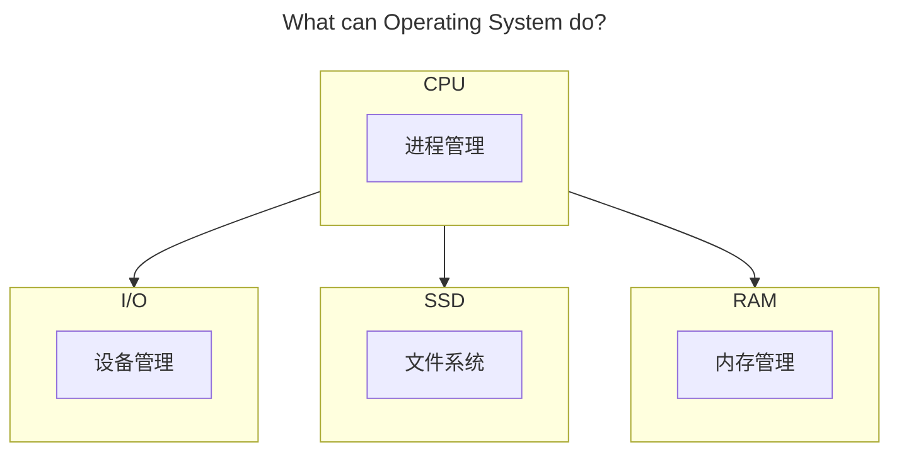

## 操作系统

## 前言

学科地位：

| 主讲教师 | 学分配额 | 学科类别 |
| :------: | :------: | :------: |
|  段博佳  |   4+1    |  专业课  |

成绩组成：

| 理论课 |      |  实验课  |      |
| :----: | :--: | :------: | :--: |
|  平时  | 10%  | 小组作业 | 100% |
|  期中  | 30%  |          |      |
|  期末  | 60%  |          |      |

教材情况：

|   课程名称   |     选用教材     | 版次 |        作者        |     出版社     |      ISBN 号       |
| :----------: | :--------------: | :--: | :----------------: | :------------: | :---------------: |
| 操作系统原理 | 《操作系统教程》 |  6   | 骆斌 葛季栋 费翔林 | 高等教育出版社 | 978-7-04-055304-8 |

学习资源：

- 🖥 [合集·[完结] 2024 南京大学 “操作系统：设计与实现” (蒋炎岩)](https://space.bilibili.com/202224425/channel/collectiondetail?sid = 2237004)
- 📑 [蒋炎岩课程配套讲义](https://jyywiki.cn/OS/2024/)

最难崩的一集：

为什么要学这门课？

> 目前无论是考研还是互联网行业求职，操作系统似乎一直深受青睐。在对操作系统有了一点粗浅的认知后，我做出了这样的人机类比，尝试解释为什么操作系统会有如今这般重要的地位。
>
> 对于任何一种具备交互、计算功能的电子计算机而言。不同的 **模块** 就是不同的器官，承担了各自的责任和义务（毋庸置疑 CPU 就是心脏）；源源不断的 **电能** 就是循环不止的血液，确保所有的细胞能及时的进行呼吸以正常工作；**主板** 则承担了骨架与神经的指责，搭载了所有的模块并确保数据可以在不同的模块之间自由的流通；而 **操作系统** 则肩负起肌肉的责任，从 CPU 的心肌泵动开始让整台计算器健康地运作。

会收获什么？

> 能详细地解释下面的过程中电脑都发生了什么：按下电源键，网络连接，蓝牙连接，启动网易云音乐播放器软件并开始播放，启动谷歌浏览器并进入力扣网站，启动 Pycharm 集成开发环境软件编写代码并运行测试，关闭 Pycharm，关闭谷歌浏览器，关闭网易云，断开蓝牙，断开 WIFI 连接，按下电源键。
>
> 记得多想想：是什么？为什么？会怎么样？当然也可以想想：可以比它更优吗？比如：什么是【操作系统】？为什么会有【操作系统】？有了【操作系统】会怎么样吗？可以用别的策略代替吗？上述的【操作系统】可以替换为任意一个名词或短语。

## 绪论

本文的行文大纲是基于硬件进行的。毕竟操作系统并非实体，本质是一个运行在硬件之上的软件，只不过这个软件的权限比较高可以直接调用分配硬件资源而已。全文围绕以下 4 个硬件模块的 **各自功能** 以及 **之间的交互** 展开：

## 一、CPU

### 1.1 进程

### 1.2 调度

### 1.3 并发

## 二、RAM

### 2.1 内存分配

### 2.2 虚拟内存

## 三、I/O

### 3.1 设备管理

## 四、SSD

### 4.1 文件系统

## 后记

除了上述的 4 个模块，还有很多模块都没有涉及，有机会一定会补。例如：显卡、网卡、BIOS、南桥北桥芯片组……
